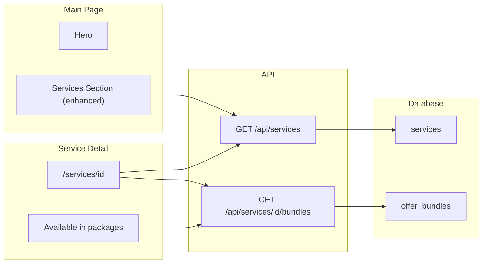

# AI Builds: Main Page Representation and Bundle Context

## TLDR
Enhance the **existing Services section** so services feel differentiated rather than "all the same." Add individual service detail pages, bundle context links, and varied visual treatment. Service content is admin-manageable.

## Admin Dashboard: Service Content Management

**Services are already fully manageable from the admin dashboard.**

- **Admin Content Hub** → **Services** card links to `/admin/content/services`
- **Services Management Page** (`app/admin/content/services/page.tsx`) supports:
  - Create, edit, delete services
  - Reorder (move up/down)
  - All fields: title, description, service_type, delivery_method, duration_hours, duration_description, price, is_quote_based, min/max participants, deliverables, topics, image_url, is_active, is_featured, display_order
- **API**: `GET/POST /api/services` and `GET/PUT/DELETE /api/services/[id]`

**If we add `is_build_deliverable`** (or similar) to distinguish AI build services for the "What We Build" section:
- Add the field to the admin services form so admins can toggle which services appear in the AI Builds section
- No new admin page needed — extend the existing Services Management page

---

## Current State

- **Main page** ([app/page.tsx](app/page.tsx)): Store (products only) and Services sections. Services section shows 6 services; all cards use the same `handleCardClick` and route to `/services` (not individual pages).
- **Services feel "all the same"**: Identical card layout, same cyan accent, same badge treatment. Many services are `service_type: 'consulting'` (AI builds, chatbots, workflows) so they look indistinguishable. All cards funnel to the same `/services` page.
- **Services page** ([app/services/page.tsx](app/services/page.tsx)): Full grid of ServiceCards. No service detail page exists.
- **Pricing page** ([app/pricing/page.tsx](app/pricing/page.tsx)): Tiers from `offer_bundles` via `/api/pricing/tiers`. No deep-link support for specific tiers.
- **Bundles**: `offer_bundles.bundle_items` is JSONB with `content_type` and `content_id`. Services are referenced by UUID.

## Target Experience

1. **Differentiated Services section**: Services grouped or styled so they don't feel "all the same" — e.g. subsections (What We Build | Advisory & Training), varied accents by category, or individual links so each card goes somewhere specific.
2. **Individual content**: Each service has its own detail page at `/services/[id]`.
3. **Bundle context**: Each service shows "Available in: [Quick Win] [Accelerator] …" with links to the pricing page.

---

## Implementation Plan

### 1. Enhance Services Section — Differentiation

Update [components/Services.tsx](components/Services.tsx) so services don't feel "all the same":

**Option A — Grouped subsections** (recommended):
- Split into subsections with headers: **"What We Build"** (AI builds: chatbots, workflows, voice agents, etc.) | **"Advisory & Training"** (workshops, coaching, retainers).
- Use `is_build_deliverable` flag (migration + admin toggle) or filter by `service_type` + `display_order` to assign services to groups.
- Each subsection has its own header and optional accent (e.g. build services = cyan, advisory = amber).
- Cards in each subsection link to `/services/[id]`.

**Option B — Varied card treatment**:
- Vary accent color by `service_type`: consulting = cyan, training = green, workshop = amber, coaching = purple, warranty = gray.
- Add type-specific icons or badges so consulting (build) vs training vs workshop feel distinct.
- Each card links to `/services/[id]`.

**Option C — Hero + grid layout**:
- First 1–2 featured services get a larger hero card; rest in a compact grid.
- Breaks monotony without schema changes.

**Common changes**:
- Change `handleCardClick` from `router.push('/services')` to `router.push(\`/services/${service.id}\`)` so each card links to its detail page.
- Keep "View All Services" and "See Pricing & Packages" links.

### 2. Service Detail Page

Create [app/services/[id]/page.tsx](app/services/[id]/page.tsx):

- Fetch service by ID from `/api/services/[id]` (or add route if missing).
- Display: title, description, price, deliverables, topics, delivery method, duration.
- Add to cart / Request quote actions (reuse ServiceCard behavior).
- **"Available in packages"** section: list of bundles that include this service, with links to pricing.

### 3. API: Which Bundles Contain a Service

Add an endpoint or extend services API to return bundle context:

- **Option A**: New route `GET /api/services/[id]/bundles` — returns `{ bundles: [{ name, slug, segment, pricingUrl }] }`.
- **Option B**: Extend `GET /api/services/[id]` to include `available_in_bundles` in the response.

Logic: Query `offer_bundles` where `bundle_items` (JSONB) contains an item with `content_type = 'service'` and `content_id = serviceId`. Use `expandBundleItems` so base-bundle items are included. Map to `pricing_tier_slug`, `pricing_page_segments`, and build URLs like `/pricing?segment=smb#quick-win`.

### 4. Pricing Page Deep Links

Update [app/pricing/page.tsx](app/pricing/page.tsx):

- Support `?segment=smb&tier=quick-win` (or `#quick-win`) to:
  - Set the active segment tab.
  - Scroll to and/or highlight the matching tier card.
- Use `pricing_tier_slug` from bundles (e.g. `quick-win`, `accelerator`, `growth-engine`) for URLs like `/pricing?segment=smb#accelerator`.

### 5. Service Detail: "Available in Packages"

On the service detail page, call `/api/services/[id]/bundles` (or use `available_in_bundles` from the service response):

- Render: "Available in: [Quick Win] [Accelerator] [Growth Engine]" (or whatever bundles contain this service).
- Each item links to `/pricing?segment=smb#quick-win` (or the correct segment/slug).

### 6. Services Page

Update [app/services/page.tsx](app/services/page.tsx):

- Make each ServiceCard clickable to `/services/[id]` instead of only Add to Cart / Request Quote. Or add a "View details" link that routes to the detail page.

---

## Data Flow

---

## Files to Create or Modify

| File | Action |
|------|--------|
| `components/Services.tsx` | Modify — enhance with subsections/varied treatment, link each card to `/services/[id]` |
| `app/services/[id]/page.tsx` | Create — service detail page with "Available in packages" |
| `app/api/services/[id]/route.ts` | Create or extend — return service + optionally `available_in_bundles` |
| `app/api/services/[id]/bundles/route.ts` | Create — return bundles that contain this service |
| `app/services/page.tsx` | Modify — add "View details" link to ServiceCard or make card route to detail |
| `app/pricing/page.tsx` | Modify — support `?segment=&tier=` or `#tier-slug` for deep links |
| `migrations/YYYY_MM_DD_services_is_build_deliverable.sql` | Optional — add `is_build_deliverable` for subsection grouping (Option A) |
| `app/admin/content/services/page.tsx` | Optional — add `is_build_deliverable` toggle if migration added |

---

## Key Decision: Enhance Existing Section

Rather than adding a separate "AI Builds" section, we **enhance the existing Services section** to address "they are all the same." Options: grouped subsections (What We Build | Advisory & Training), varied card accents by service_type, or hero + grid layout. Each card links to `/services/[id]` for individual detail pages.

## Naming Clarification

"AI Automation Build Services" remains the internal/seed label. For subsection headers (if using Option A), candidate names:

- **What We Build** — Outcome-focused
- **AI Builds** — Short, technical
- **Deployed Solutions** — Emphasizes delivered systems
- **AI Deliverables** — Matches your doc language

Choose one for the section header and any navigation labels.
