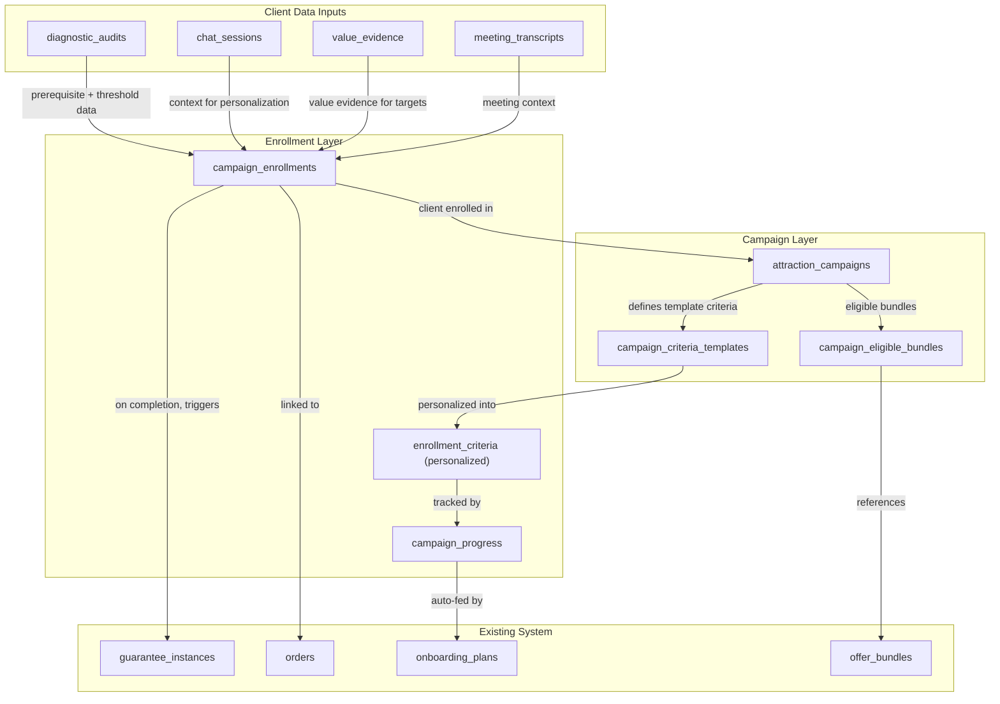

# Attraction Campaigns System

## Architecture Overview

Campaigns are a **higher-level promotional wrapper** that sit above the existing guarantee and bundle systems. A campaign defines time-bound offers with template criteria that get personalized per client using their audit data, chat history, and value evidence. Progress is tracked automatically for anything in our database and manually for external goals. On completion, the system triggers guarantee-style payouts.

### Key Design Decisions

- **Criteria are template-based with personalized thresholds.** A campaign defines template criteria (e.g. "Achieve revenue milestone", "Complete onboarding"). When a client enrolls, the system uses their audit data, chat history, and value evidence to fill in specific targets (e.g. "Achieve $50K/mo revenue"). This keeps automation standardized while making the offer feel personal.
- **Audit prerequisite.** Every enrollment requires the client to have completed the AI Audit Calculator (or have equivalent data entered manually by admin). This ensures enough context exists to populate personalized thresholds and recommend relevant bundles.
- **Dual enrollment triggers.** Auto-enroll on purchase (if audit data exists and bundle is eligible), OR admin can manually enroll (e.g. for in-person sales where data was collected offline).
- **Eligible bundles are set globally per campaign, but surfaced contextually.** Admin selects which bundles qualify. The client sees only the ones relevant to their audit results.

## Phase 1: Database Schema (6 new tables)

### `attraction_campaigns` -- campaign definitions

- `id` UUID PK
- `name` TEXT (e.g. "Win Your Money Back Challenge")
- `slug` TEXT UNIQUE (URL-friendly)
- `description` TEXT (client-facing)
- `campaign_type` TEXT (`win_money_back`, `free_challenge`, `bonus_credit` -- extensible)
- `status` TEXT (`draft`, `active`, `paused`, `completed`, `archived`)
- `starts_at` / `ends_at` TIMESTAMPTZ (campaign window)
- `enrollment_deadline` TIMESTAMPTZ (optional, can differ from ends_at)
- `completion_window_days` INTEGER (how long after enrollment to complete criteria)
- `min_purchase_amount` NUMERIC (minimum spend to qualify)
- `payout_type` TEXT (reuses `refund | credit | rollover_upsell | rollover_continuity`)
- `payout_amount_type` TEXT (`full | partial | fixed`), `payout_amount_value` NUMERIC
- `rollover_bonus_multiplier` NUMERIC
- `hero_image_url` TEXT, `promo_copy` TEXT (marketing assets)
- `created_by` UUID FK, timestamps

### `campaign_eligible_bundles` -- which bundles/tiers qualify

- `campaign_id` UUID FK -> attraction_campaigns
- `bundle_id` UUID FK -> offer_bundles
- `override_min_amount` NUMERIC (optional per-bundle override)
- UNIQUE(campaign_id, bundle_id)

### `campaign_criteria_templates` -- template criteria at the campaign level

- `id` UUID PK
- `campaign_id` UUID FK -> attraction_campaigns
- `label_template` TEXT (e.g. "Achieve {{revenue_target}} monthly revenue") -- supports `{{variable}}` placeholders
- `description_template` TEXT
- `criteria_type` TEXT (`action` or `result` per Hormozi's framework)
- `tracking_source` TEXT (`manual`, `onboarding_milestone`, `chat_session`, `video_watch`, `diagnostic_completion`, `custom_webhook`)
- `tracking_config` JSONB (source-specific config)
- `threshold_source` TEXT (which audit/evidence field populates the target, e.g. `audit.desired_monthly_revenue`)
- `threshold_default` TEXT (fallback if no audit data for this field)
- `required` BOOLEAN, `display_order` INTEGER

### `campaign_enrollments` -- client enrollment in a campaign

- `id` UUID PK
- `campaign_id` UUID FK, `client_email` TEXT NOT NULL, `client_name` TEXT, `user_id` UUID FK
- `order_id` BIGINT FK -> orders (nullable for manual enrollment before purchase)
- `bundle_id` UUID FK -> offer_bundles
- `purchase_amount` NUMERIC
- `enrollment_source` TEXT (`auto_purchase`, `admin_manual`, `sales_conversation`)
- `status` TEXT (`active`, `criteria_met`, `payout_pending`, `refund_issued`, `credit_issued`, `rollover_applied`, `expired`, `withdrawn`)
- `enrolled_at` / `deadline_at` / `resolved_at` TIMESTAMPTZ
- `guarantee_instance_id` UUID FK -> guarantee_instances (created on resolution)
- `diagnostic_audit_id` UUID FK -> diagnostic_audits (the audit that qualifies them)
- `personalization_context` JSONB (snapshot of audit data, value evidence, chat insights used to personalize)
- `resolution_notes` TEXT, timestamps

### `enrollment_criteria` -- personalized criteria per enrollment (materialized from templates + client data)

- `id` UUID PK
- `enrollment_id` UUID FK -> campaign_enrollments
- `template_criterion_id` UUID FK -> campaign_criteria_templates
- `label` TEXT (personalized, e.g. "Achieve $50K/mo monthly revenue")
- `description` TEXT (personalized)
- `criteria_type`, `tracking_source`, `tracking_config` (inherited from template, may have personalized values)
- `target_value` TEXT (the personalized threshold)
- `required` BOOLEAN, `display_order` INTEGER

### `campaign_progress` -- per-criterion progress for each enrollment

- `enrollment_id` UUID FK -> campaign_enrollments
- `criterion_id` UUID FK -> enrollment_criteria
- `status` TEXT (`pending`, `in_progress`, `met`, `not_met`, `waived`)
- `progress_value` NUMERIC (0-100), `current_value` TEXT (measured value toward target)
- `auto_tracked` BOOLEAN, `auto_source_ref` TEXT
- `client_evidence` TEXT, `client_submitted_at` TIMESTAMPTZ
- `admin_verified_by` UUID FK, `admin_verified_at` TIMESTAMPTZ, `admin_notes` TEXT
- UNIQUE(enrollment_id, criterion_id)

### Enrollment Flow

1. **Prerequisite check:** Client must have a `diagnostic_audits` record (AI Audit Calculator) or equivalent data entered by admin.
2. **Auto-enrollment (on purchase):** Stripe webhook -> order created -> check: active campaign? eligible bundle? audit data exists? If yes -> create enrollment + materialize `enrollment_criteria` from templates using client's audit/evidence data.
3. **Manual enrollment (admin):** Admin selects client, confirms audit data, picks campaign, enrolls. Criteria materialized the same way.
4. **Criteria personalization:** For each template, read `threshold_source` (e.g. `audit.desired_monthly_revenue`), look up value in client's data, substitute into `label_template`, set `target_value`. Fall back to `threshold_default` if missing.

### Relationship to Existing Guarantee System

On resolution (all criteria met), the system creates a `guarantee_instance` linked to the enrollment, reusing existing payout mechanics (Stripe refund, discount code, rollover credit).

## Phase 2: Shared Library

Create `[lib/campaigns.ts](lib/campaigns.ts)` with:

- TypeScript types for all 6 tables
- Input/validation types for API requests
- `materializeCriteria(templates, auditData, evidenceData)` -- personalizes template criteria with client data
- `checkEnrollmentPrerequisite(clientEmail)` -- verifies audit data exists
- Status labels, colors, and display helpers (matching pattern in `[lib/guarantees.ts](lib/guarantees.ts)`)
- Payout integration helpers (delegates to existing `calculatePayoutAmount` / `calculateRolloverCredit`)

## Phase 3: API Routes

### Admin Campaign Management

- `GET/POST /api/admin/campaigns` -- list/create
- `GET/PUT/DELETE /api/admin/campaigns/[id]` -- CRUD
- `GET/POST/PUT/DELETE /api/admin/campaigns/[id]/criteria` -- criteria templates
- `GET/POST/DELETE /api/admin/campaigns/[id]/eligible-bundles` -- eligible bundles
- `GET /api/admin/campaigns/[id]/enrollments` -- list enrollments with progress
- `POST /api/admin/campaigns/[id]/enrollments` -- manual enroll (audit prerequisite check + criteria materialization)
- `GET /api/admin/campaigns/[id]/enrollments/[enrollmentId]` -- enrollment detail
- `PUT /api/admin/campaigns/[id]/enrollments/[enrollmentId]/progress/[criterionId]` -- admin verify/update
- `POST /api/admin/campaigns/[id]/enrollments/[enrollmentId]/resolve` -- trigger payout

### Client-Facing

- `GET /api/campaigns/active` -- public active campaigns
- `GET /api/campaigns/[slug]` -- campaign detail
- `GET /api/campaigns/my-enrollments` -- client's enrollments + progress
- `POST /api/campaigns/enrollments/[enrollmentId]/progress/[criterionId]/submit` -- self-report evidence
- `POST /api/campaigns/enrollments/[enrollmentId]/choose-payout` -- choose payout type

### Enrollment Hooks

- Modify `[app/api/payments/webhook/route.ts](app/api/payments/webhook/route.ts)` -- auto-enroll on purchase (check active campaign + eligible bundle + audit data)

## Phase 4: Auto-Progress Tracking

Each `tracking_source` determines how progress updates:

- `**manual**` -- client self-reports or admin marks. For goals in client's internal systems we don't have access to.
- `**onboarding_milestone**` -- hook into `[app/api/client-projects/[id]/milestones/route.ts](app/api/client-projects/[id]/milestones/route.ts)`. Covers: onboarding steps, training, session attendance.
- `**chat_session**` -- hook into `[app/api/chat/route.ts](app/api/chat/route.ts)`. Covers: communication/engagement.
- `**video_watch**` -- hook into analytics events. Covers: training video requirements.
- `**diagnostic_completion**` -- hook into diagnostic flow. Covers: assessment criteria.
- `**custom_webhook**` -- n8n or external POST. Covers: any external source.

Pattern: after tracked event -> query `campaign_progress` for matching active enrollment criteria -> update status. All trackable criteria auto-update on the client dashboard.

## Phase 5: Admin UI

### Campaign Management (`/app/admin/campaigns/page.tsx`)

- Campaign list with status badges, dates, enrollment counts
- Create/edit form: name, type, dates, payout config, promo assets
- Criteria template builder (add/remove/reorder, set tracking source, threshold source, placeholders)
- Eligible bundles multi-select + min amount config

### Enrollment Dashboard (`/app/admin/campaigns/[id]/page.tsx`)

- Stats: total enrollments, active, completed, expired
- Enrollment list with progress bars
- Click into individual enrollment

### Enrollment Detail (`/app/admin/campaigns/[id]/enrollments/[enrollmentId]/page.tsx`)

- Client info, purchase details, audit summary, deadline countdown
- Personalized criteria checklist with status per criterion
- Admin verify/waive/reject each criterion
- Communication panel (message client via existing chat/notification)
- Resolve button to trigger payout

## Phase 6: Client-Facing UI

### Campaign Landing Page (`/app/campaigns/[slug]/page.tsx`)

- Public marketing page with hero, description, criteria preview
- Eligible bundles with pricing (filtered by audit relevance if logged in)
- CTA to purchase with campaign context

### Client Progress Dashboard

- Add "Campaign Progress" section to `[app/client/dashboard/[token]/page.tsx](app/client/dashboard/[token]/page.tsx)`
- Visual progress tracker with personalized criteria checklist
- Deadline countdown, submit evidence buttons for manual criteria
- Choose payout option when all criteria met

## Phase 7: Homepage Offers Section

Add an `ActiveCampaigns` component to `[app/page.tsx](app/page.tsx)` as the **first product offering** on the homepage, placed between `<Hero />` and `<Store section="products" />`.

Current homepage order: Hero -> Products -> Services -> Merchandise -> Publications -> About -> Contact
New order: Hero -> **ActiveCampaigns** -> Products -> Services -> Merchandise -> Publications -> About -> Contact

### Component: `ActiveCampaigns` (`components/ActiveCampaigns.tsx`)
- Fetches active campaigns from `GET /api/campaigns/active`
- When campaigns exist: renders a visually prominent section with campaign cards (name, promo copy, hero image, CTA to campaign landing page)
- When no active campaigns: **collapses entirely** (renders null / zero height) -- no empty state, no placeholder text
- Add `'campaigns'` to the IntersectionObserver sections array in `app/page.tsx` for scroll analytics tracking
- Style to be eye-catching and distinct from the regular product sections (campaign-specific branding, urgency indicators like countdown timers if campaign has an end date)

## Phase 8: Channel Integration

### Chat

- Add campaign context to `[lib/chatbot-knowledge-content.generated.ts](lib/chatbot-knowledge-content.generated.ts)`
- Chatbot can discuss active campaigns during lead engagement

### In-Person Sales

- Surface active campaigns in `[app/admin/sales/conversation/[sessionId]/page.tsx](app/admin/sales/conversation/[sessionId]/page.tsx)`
- Proposals can reference qualifying campaigns

### Online Checkout

- Campaign badges on eligible products/bundles in store
- Auto-enroll on purchase completion via Stripe webhook

## Key Files

### New (approx. 27 files)

- `migrations/2026_02_21_attraction_campaigns.sql`
- `lib/campaigns.ts`
- 10 admin API route files under `app/api/admin/campaigns/`
- 5 client API route files under `app/api/campaigns/`
- 3 admin UI pages under `app/admin/campaigns/`
- 1 public landing page `app/campaigns/[slug]/page.tsx`
- 1 homepage section `components/ActiveCampaigns.tsx`
- 5-6 shared components (`CampaignProgressTracker`, `CriteriaChecklist`, `CampaignBadge`, `EnrollmentCard`, `CriteriaTemplateBuilder`, `CampaignCard`)

### Modified (approx. 8 files)

- `app/page.tsx` -- add ActiveCampaigns section after Hero, add to scroll analytics
- `app/api/payments/webhook/route.ts` -- auto-enrollment
- `app/api/client-projects/[id]/milestones/route.ts` -- auto-progress for onboarding
- `app/api/chat/route.ts` -- auto-progress for chat engagement
- `app/client/dashboard/[token]/page.tsx` -- campaign progress section
- `lib/chatbot-knowledge-content.generated.ts` -- campaign awareness
- `app/admin/sales/conversation/[sessionId]/page.tsx` -- campaign in sales flow
- Store/checkout components -- campaign badges

