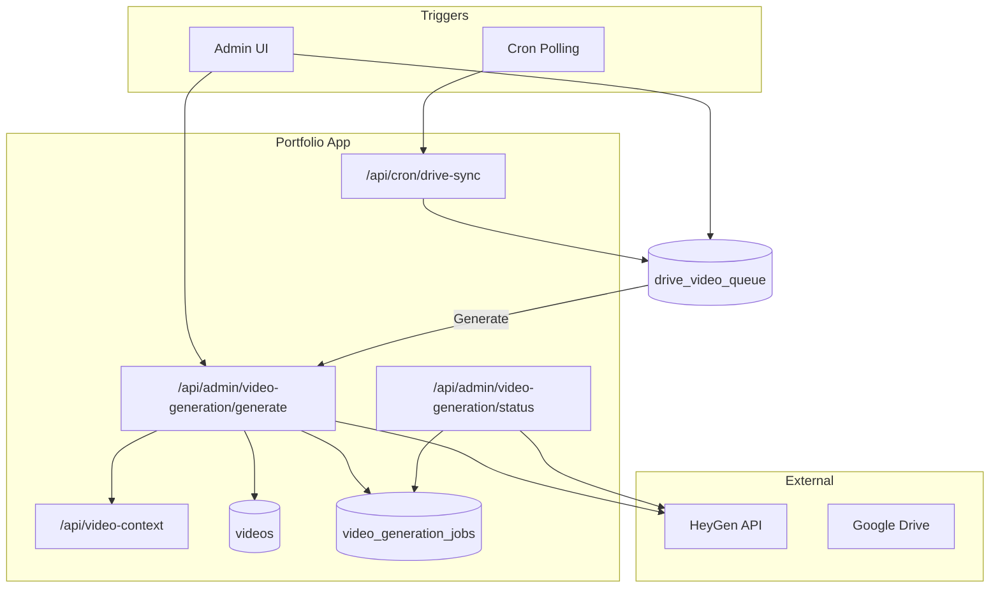

# HeyGen Video Pipeline Integration Plan

## Context

The shared Claude conversation explored external automation for YouTube videos (HeyGen avatar + audio + Google Drive scripts/B-roll). The goal is to **bake this into the portfolio** so it can use:

- **Products, bundles, proposals** — for offer-specific messaging
- **Client projects, sales sessions, diagnostics** — for personalized client videos
- **Meeting records, value evidence, outreach** — for pain-point and outcome context
- **Content calendar, social content queue** — for campaign/YouTube scripts

Additionally, **Google Drive changes** (scripts, B-roll) should trigger video generation, similar to GitHub repo automation (push → build).

**Voice:** HeyGen supports ElevenLabs voice IDs natively. Define `voice_id` in config (e.g. `HEYGEN_VOICE_ID`) — no separate ElevenLabs API integration needed.

**Format and channel flexibility:** Support video shorts (YouTube Shorts, LinkedIn) and standard formats. Allow per-job selection of aspect ratio and target channel for metadata, naming, and export.

---

## Architecture Overview



---

## Phase 1: Personalization API and Video Generation Core

### 1.1 Video Personalization Context API

**New route:** `GET /api/video-context` (admin or ingest-secret auth)

**Purpose:** Aggregate portfolio data into a single payload for script personalization.

**Inputs:** `?target=client_project|lead|campaign&id=<uuid>` or `?email=<client_email>`

**Output shape (extend existing patterns):**

- **Client/lead:** Reuse and extend [app/api/client-email-context/route.ts](app/api/client-email-context/route.ts) — project, milestones, last meeting, action items, plus:
  - `diagnostic_audits` (pain points, recommendations)
  - `proposals` (bundle, line items)
  - `sales_sessions` (funnel stage, objections)
  - `value_reports` / `pain_point_evidence`
- **Campaign:** Products, services, bundles, content calendar reference, social_content_queue topics

**Implementation:** New `lib/video-context.ts` that composes `client-email-context` logic with diagnostic, proposal, and value-evidence queries. Return JSON suitable for LLM prompt injection.

### 1.2 Video Generation Job Table

**Migration:** `migrations/YYYY_MM_DD_video_generation_jobs.sql`

```sql
CREATE TABLE video_generation_jobs (
  id UUID PRIMARY KEY DEFAULT gen_random_uuid(),
  script_source TEXT NOT NULL,           -- 'manual' | 'drive_script' | 'drive_broll' | 'campaign'
  script_text TEXT NOT NULL,
  drive_file_id TEXT,                   -- Google Drive file ID if from Drive
  drive_file_name TEXT,
  target_type TEXT,                     -- 'client_project' | 'lead' | 'campaign'
  target_id UUID,                       -- client_project_id, contact_submission_id, or null
  avatar_id TEXT NOT NULL,
  voice_id TEXT NOT NULL,               -- HeyGen voice ID (supports ElevenLabs voice IDs via HeyGen)
  aspect_ratio TEXT NOT NULL DEFAULT '16:9',  -- '16:9' (standard) | '9:16' (shorts)
  channel TEXT NOT NULL DEFAULT 'youtube',    -- 'youtube' | 'youtube_shorts' | 'linkedin' | 'linkedin_video'
  heygen_video_id TEXT,                 -- HeyGen task/video ID
  heygen_status TEXT,                   -- pending, processing, completed, failed
  error_message TEXT,                   -- on failure, for debugging and retry
  video_url TEXT,                       -- final URL when completed
  video_record_id BIGINT REFERENCES videos(id),
  created_by UUID REFERENCES user_profiles(id),
  created_at TIMESTAMPTZ DEFAULT NOW(),
  updated_at TIMESTAMPTZ DEFAULT NOW()
);
```

**Rationale:** Track each generation for status polling, Drive-trigger correlation, and linking to `videos` when complete. On failure: set `heygen_status = 'failed'`, store `error_message`; allow retry; do not auto-delete (CTO).

**Videos linkage:** Add `video_generation_job_id UUID REFERENCES video_generation_jobs(id)` to `videos` table (migration) for traceability.

### 1.3 HeyGen Integration

**New lib:** `lib/heygen.ts`

- `createAvatarVideo(params: { avatarId, script, voiceId, title?, aspectRatio?, channel? })` — call HeyGen API (MCP is Cursor-side; server must use REST)
- `getVideoStatus(videoId)` — poll HeyGen for completion
- Use `HEYGEN_API_KEY`, `HEYGEN_AVATAR_ID`, `HEYGEN_VOICE_ID` from env

**Voice:** HeyGen accepts voice IDs that can be ElevenLabs voice IDs (configured in HeyGen). No separate ElevenLabs API or `lib/elevenlabs.ts` needed — define `HEYGEN_VOICE_ID` in env.

**Format and channel:** HeyGen API supports `aspect_ratio`: `"16:9"` (standard) or `"9:16"` (shorts). Map `channel` to defaults:
- `youtube` → 16:9
- `youtube_shorts` → 9:16
- `linkedin` → 16:9 (feed) or 9:16 (stories/native video)
- `linkedin_video` → 9:16 (vertical native video)

### 1.4 Admin API Routes

| Route                                           | Method | Purpose |
| ----------------------------------------------- | ------ | ------- |
| `POST /api/admin/video-generation/generate`     | POST   | Start generation: body = `{ scriptSource, scriptText?, targetType, targetId?, driveFileId?, avatarId, voiceId, aspectRatio?, channel? }`; `aspectRatio` (16:9 \| 9:16), `channel` (youtube \| youtube_shorts \| linkedin \| linkedin_video); fetches personalization context if target provided; calls HeyGen; inserts `video_generation_jobs` |
| `GET /api/admin/video-generation/status?jobId=` | GET    | Return job status + HeyGen status; if completed, optionally create/update `videos` row and return `video_url` |
| `GET /api/admin/video-generation/jobs`          | GET    | List jobs (filter by status, target, date) |

### 1.5 Admin UI: Video Generation Hub

**New page:** `app/admin/content/video-generation/page.tsx`

- **Nav:** Add under Configuration → Content Hub children in [lib/admin-nav.ts](lib/admin-nav.ts) (e.g. "Video Generation")
- **Features:**
  - Form: paste script or select target (client/lead/campaign) to auto-fill context; LLM draft script (optional, via prompt API)
  - **Format selector:** Aspect ratio — 16:9 (standard) or 9:16 (shorts)
  - **Channel selector:** YouTube, YouTube Shorts, LinkedIn, LinkedIn Video — affects default aspect ratio and metadata
  - Avatar + voice selectors (fetch from HeyGen API or use config defaults)
  - "Generate" button → POST to generate API
  - Jobs table: status, format, channel, link to video when done, retry/fail actions
- **Icon:** Add to `NAV_ITEM_ICONS` in [components/admin/AdminSidebar.tsx](components/admin/AdminSidebar.tsx)

### 1.6 Format and Channel Flexibility

**Aspect ratios (HeyGen API):**

| Value | Use case |
| ----- | -------- |
| `16:9` | YouTube standard, LinkedIn feed, web |
| `9:16` | YouTube Shorts, LinkedIn native video, TikTok, Instagram Reels |

**Channels (metadata + defaults):**

| Channel | Default aspect | Typical length | Notes |
| ------- | -------------- | -------------- | ----- |
| `youtube` | 16:9 | Any | Standard YouTube video |
| `youtube_shorts` | 9:16 | 15–60 sec | YouTube Shorts |
| `linkedin` | 16:9 | 30–90 sec | LinkedIn feed post |
| `linkedin_video` | 9:16 | 30–90 sec | LinkedIn native vertical video |

**Implementation:** Add `lib/constants/video-channel.ts` with `VIDEO_CHANNELS`, `VIDEO_ASPECT_RATIOS`, and `channelToAspectRatio(channel)`. Admin UI shows channel selector; selecting a channel can auto-set aspect ratio (user can override). Script length hints (e.g. "Shorts: 15–60 sec") in UI for guidance.

---

## Phase 2: Google Drive Integration (Queue-First, No Circular Reference)

**Design decisions:**
- **Queue instead of auto-generate:** Drive changes add items to a queue; admin reviews and manually triggers generation. Avoids premature generation.
- **Separate output folder:** Generated videos are saved to a distinct folder (`GOOGLE_DRIVE_VIDEOS_FOLDER_ID`). Never poll this folder — prevents circular reference when saving outputs back to Drive.

### 2.1 Google Drive Setup

**Requirements:**

- Google Cloud project with Drive API enabled
- OAuth 2.0 or Service Account for Drive access
- **Folder separation (critical):**
  - **Scripts folder:** Source scripts only (`.txt`, `.md`, `.docx`). Poll this folder for changes.
  - **Videos/output folder:** Where generated videos are saved. Never poll this folder.

**Env vars:** `GOOGLE_DRIVE_CLIENT_ID`, `GOOGLE_DRIVE_CLIENT_SECRET` (or service account JSON path), `GOOGLE_DRIVE_SCRIPTS_FOLDER_ID`, `GOOGLE_DRIVE_VIDEOS_FOLDER_ID` (output), `GOOGLE_DRIVE_BROLL_FOLDER_ID` (optional)

### 2.2 Drive Polling → Queue (Not Auto-Generate)

- **Cron** (GitHub Actions, Vercel Cron, or n8n schedule) every 15 min
- **Route:** `GET/POST /api/cron/drive-sync` (auth: cron secret or `N8N_INGEST_SECRET`)
- Store `last_modified` in `drive_sync_state` table
- Call Drive API `files.list` with `q: modifiedTime > '...'` for the **scripts folder only**
- For each changed script file (`.txt`, `.md`, `.docx`): download current content, **insert into `drive_video_queue`** — do NOT create `video_generation_job` or trigger HeyGen
- Populate `effective_at` from Drive `modifiedTime` (when the file was actually last modified)
- **Prior vs current (Cursor-style diff):** Store `script_text_prior` (previous version) and `script_text` (current version). For new files, `script_text_prior` is NULL. For modified files: use Drive Revisions API — `revisions.list` to get revision history, then `revisions.get` with `alt=media` for the previous revision to fetch prior content. Admin sees side-by-side or diff view. (For `.docx`, prior content may require export; start with `.txt`/`.md` for full diff support.)

**New table:** `drive_sync_state` — `folder_id`, `last_modified`, `last_sync_at`

**New table:** `drive_video_queue` — `id`, `drive_file_id`, `drive_file_name`, `script_text_prior` (TEXT — previous version, NULL for new files), `script_text` (TEXT — current version), `effective_at` (TIMESTAMPTZ, from Drive modifiedTime), `detected_at` (when we polled), `status` ('pending' | 'generated' | 'dismissed'), `video_generation_job_id` (nullable)

### 2.3 Admin UI: Queue Review

- **Queue section** in Video Generation hub (or dedicated page): list of pending Drive queue items
- Each item: file name, **effective_at**, detected date, **prior vs current** — two columns (or side-by-side / diff view): `script_text_prior` and `script_text`, similar to Cursor line-item changes. Admin sees exactly what changed.
- Actions: **Generate** (creates job using `script_text`, links to queue item) or **Dismiss**
- "Generate" → POST to generate API with `scriptSource: 'drive_script'`, `driveFileId`, `driveFileName`, `scriptText`; update queue item status to `generated`, set `video_generation_job_id`

### 2.4 Saving Generated Videos to Drive

- When a job completes: optionally upload `video_url` to `GOOGLE_DRIVE_VIDEOS_FOLDER_ID`
- **Never poll the videos folder** — it is output-only, never a source for new queue items

### 2.5 B-roll Changes

- When B-roll folder has changes: config-based approach — "re-run jobs created in last N days that used that folder" (stored in job metadata), or queue for manual review
- Define B-roll dependency model before implementing (CTO: non-trivial)

### 2.6 Drive Push (Optional, Later)

- Only if polling is insufficient
- `files.watch` expires in **24 hours**; `changes.watch` up to 7 days — plan renewal accordingly
- Webhook: `POST /api/webhooks/google-drive`; verify `X-Goog-Channel-Token`

---

## Phase 3: Script Personalization and LLM Integration

### 3.1 Script Templates

- Store templates in DB (`script_templates` table) or in config/docs
- Placeholders: `{{client_name}}`, `{{product_name}}`, `{{pain_point_summary}}`, `{{next_milestone}}`, etc.
- `lib/video-context.ts` returns a context object; a small `lib/script-renderer.ts` replaces placeholders or passes context to LLM for dynamic script generation

### 3.2 Optional LLM Script Draft

- Reuse existing prompt pattern ([app/api/prompts/](app/api/prompts/)) or add `video_script_draft` prompt
- Input: video context + template + brand guidelines (from CLAUDE.md)
- Output: draft script for review/edit before generation

---

## Phase 4: n8n Integration (Optional)

**CTO:** Keep HeyGen calls in-app for observability and cost tracking. Use n8n only for side effects (Slack notify, publish to YouTube, etc.).

---

## CTO Recommendations (Incorporated)

| Area                | Recommendation |
| ------------------- | -------------- |
| **Phased rollout**  | Phase 1a (APIs + jobs) → Phase 1b (Admin UI) → Phase 2a (Drive polling → queue) → Phase 2b (Queue UI) → Phase 2c (Drive push optional) |
| **Drive**           | Queue-first (no auto-generate); separate scripts folder (poll) vs videos folder (output only); push only if polling insufficient |
| **HeyGen async**    | Job queue, poll status every 30s, timeout 2h, clear failure handling |
| **Cost**            | Ingest into `cost_events` (provider `heygen`); show cost estimate in Admin before generate |
| **Rate limits**     | Queue jobs; process sequentially or with small concurrency cap |
| **Auth**            | Mirror `client-email-context`: admin session or `N8N_INGEST_SECRET` for `/api/video-context` |
| **Observability**   | Log job start/end, duration, status, cost; Admin "Video Jobs" view with filters |
| **Database health** | Add `video_generation_jobs` to `CRITICAL_TABLES` if it becomes core |
| **Docs**            | Update `docs/admin-sales-lead-pipeline-sop.md` when feature ships |

---

## File and Schema Summary

| Layer         | Files |
| ------------- | ----- |
| **Migration** | `migrations/YYYY_MM_DD_video_generation_jobs.sql`, `migrations/YYYY_MM_DD_drive_sync_state.sql`, `migrations/YYYY_MM_DD_drive_video_queue.sql` |
| **Lib**       | `lib/video-context.ts`, `lib/heygen.ts`, `lib/script-renderer.ts`, `lib/google-drive.ts`, `lib/constants/video-channel.ts` |
| **API**       | `app/api/video-context/route.ts`, `app/api/admin/video-generation/generate/route.ts`, `app/api/admin/video-generation/status/route.ts`, `app/api/admin/video-generation/jobs/route.ts`, `app/api/cron/drive-sync/route.ts` |
| **Admin UI**  | `app/admin/content/video-generation/page.tsx` |
| **Nav**       | `lib/admin-nav.ts`, `components/admin/AdminSidebar.tsx` |

---

## Environment Variables

| Variable                         | Purpose |
| -------------------------------- | ------- |
| `HEYGEN_API_KEY`                 | HeyGen API authentication |
| `HEYGEN_AVATAR_ID`               | Default avatar (from CLAUDE.md) |
| `HEYGEN_VOICE_ID`                | HeyGen voice ID (supports ElevenLabs voice IDs via HeyGen) |
| `GOOGLE_DRIVE_CLIENT_ID`         | OAuth or service account (Phase 2) |
| `GOOGLE_DRIVE_CLIENT_SECRET`     | OAuth (Phase 2) |
| `GOOGLE_DRIVE_SCRIPTS_FOLDER_ID` | Folder to poll for scripts (source only) |
| `GOOGLE_DRIVE_VIDEOS_FOLDER_ID` | Folder to save generated videos (output only, never polled) |
| `GOOGLE_DRIVE_BROLL_FOLDER_ID`   | Folder to poll for B-roll (optional) |

---

## Execution Order

1. **Phase 1a:** Video context API + jobs table + HeyGen lib + admin API routes
2. **Phase 1b:** Admin UI (Video Generation hub)
3. **Phase 2a:** Drive polling → queue — cron + `drive_sync_state` + `drive_video_queue` + `/api/cron/drive-sync`
4. **Phase 2b:** Queue review UI (Generate/Dismiss) in Video Generation hub
5. **Phase 2c:** Drive push (optional, only if polling insufficient)
6. **Phase 3:** Script templates + placeholder rendering → optional LLM draft
7. **Phase 4:** n8n for Slack/YouTube side effects (optional)

---

## Your Follow-up Steps

1. **HeyGen:** Obtain API key, avatar ID, and voice ID (ElevenLabs voice ID works via HeyGen)
2. **Apply migrations:** Run `video_generation_jobs` and `videos.video_generation_job_id` migration
3. **Phase 2 (when ready):** Google Cloud project, Drive API, OAuth credentials
4. **Drive folders:** Create separate scripts folder (source) and videos folder (output); never poll the videos folder
5. **Cron:** Set up GitHub Actions or Vercel Cron for Drive sync (every 15 min)
