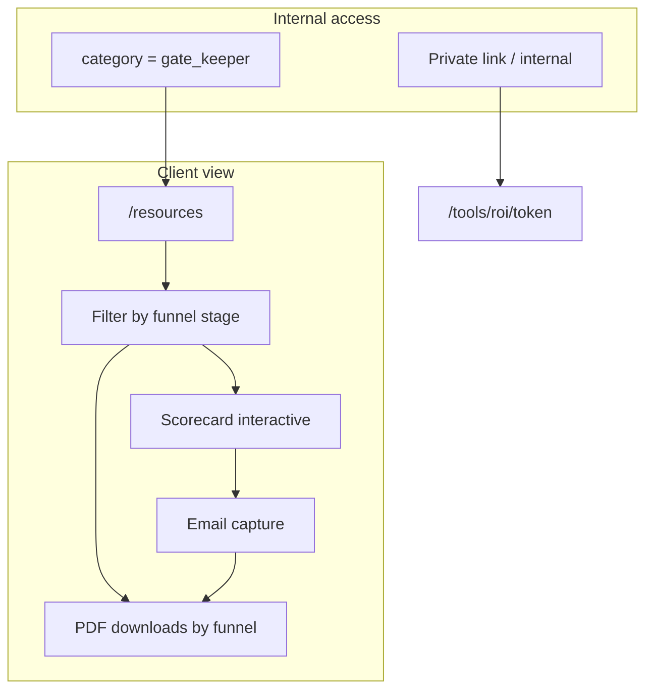

# Lead Magnets & Resources Page Plan

## Scope

- **Client-facing:** Resources are organized and filtered by **resource funnel stage** (where the client is in their journey). Clients see labels like "Attention & Capture," "Scheduling & Show Rate," "Sales Call Process," etc. — never "Gate Keepers" or "Deal Closers."
- **Internal (access control):** We use three **categories** only for where something lives: **Gate Keepers** (capture the lead → Resources page), **Deal Closers** (sales process → private link or internal), **Retention Engines** (client portal, Phase 2). These terms are not shown to clients.
- **Reuse:** [`lib/value-calculations.ts`](lib/value-calculations.ts) for ROI; existing auth and download flow for PDFs.

---

## 1. Two dimensions: funnel (client) vs category (internal)

### Resource funnel stage (client-facing)

Used for **organization and filter** on the Resources page and anywhere we show resources to clients. Single source of truth in constants (e.g. `lib/constants/lead-magnet-funnel.ts`).

| Stage key (DB/API)       | Display label (client-facing)     |
| ------------------------ | --------------------------------- |
| `attention_capture`      | Attention & Capture               |
| `scheduling_show_rate`   | Scheduling & Show Rate            |
| `sales_call_process`     | Sales Call Process                |
| `close_onboarding`       | Close & Onboarding                |
| `delivery_results`       | Delivery & Results                |
| `flywheel_reinvestment`  | Flywheel & Reinvestment           |

### Category (internal only)

Used for **access control** — which page/link shows the resource. Not displayed to clients.

| Category key   | Meaning (internal)                    | Where it appears                          |
| -------------- | ------------------------------------ | ----------------------------------------- |
| `gate_keeper`  | Capture the lead; exchange for contact | Resources page (auth-gated)               |
| `deal_closer`  | Support the sales process            | Private link only, or internal playbooks  |
| `retention`    | Keep clients winning                 | Phase 2 client portal                     |

### Mapping assets (internal reference)

- **Gate Keepers** (on Resources page, organized by funnel): AI Readiness Scorecard, Hook Library, VSL Script Template, Retargeting Roadmap, Referral Playbook → funnel stages **Attention & Capture** (and optionally No-Show Eliminator → **Scheduling & Show Rate**).
- **Deal Closers** (private link or internal): ROI Calculator (private link, funnel: Sales Call Process), Expectations Alignment Doc (private link or sales-sent). Discovery Cheatsheet, Objection Handler → **internal only**, not on site.
- **Retention** (Phase 2 client portal): Activation Tracker, Automation Audit, Win Tracker, Case Study Builder, Renewal Guide → funnel stages Delivery & Results / Flywheel & Reinvestment.

---

## 2. Data model

**Table:** `lead_magnets`

- **`category`** `TEXT NOT NULL` — internal only. CHECK: `'gate_keeper' | 'deal_closer' | 'retention'`. Drives *where* the resource appears (Resources page vs private link vs client portal).
- **`funnel_stage`** `TEXT NOT NULL` — client-facing. CHECK: the 6 funnel stage keys above. Drives *how* we organize and filter for clients (e.g. "Attention & Capture").
- **`access_type`** `TEXT NOT NULL` — CHECK: `'public_gated' | 'private_link' | 'internal' | 'client_portal'`.
- **`display_order`** `INTEGER NOT NULL` — ordering within funnel_stage (when listing). On INSERT use next sequential (max+1) per funnel_stage, not default 0 (ordering-rank-defaults rule).
- **`private_link_token`** — nullable, unique, ≥32 chars; for Deal Closers that use a private link (ROI Calculator, optionally Expectations Doc).
- Scorecard: `category = gate_keeper`, `access_type = public_gated`, `funnel_stage = attention_capture`, plus flag/slug (e.g. `is_interactive = true` or `slug = 'scorecard'`) so the page renders the React component instead of a download card.

**Constants**

- **`lib/constants/lead-magnet-funnel.ts`** — funnel stage keys and **display labels** (Attention & Capture, etc.). Used in: migration CHECK, API, Resources page filter, admin (for funnel dropdown). Do not expose category labels to the Resources page UI.
- **`lib/constants/lead-magnet-category.ts`** (or same file, internal section) — category and access_type for migration and admin only.

---

## 3. Resources page (client-facing)

- **Route:** `/resources`. Auth-gated (login required).
- **What we show:** Only resources with `category = gate_keeper` and `access_type = public_gated`, but **organized and filterable by resource funnel stage** (Attention & Capture, Scheduling & Show Rate, etc.). Clients never see the word "Gate Keepers."
- **Layout:**
  - **Hero:** "Resources" or "Free tools & downloads" with subline, e.g. "Assess your AI readiness and get templates that help you close more deals."
  - **Filter:** Dropdown or tabs: **"All"** plus the six **funnel stage labels** (Attention & Capture, Scheduling & Show Rate, …). "All" = no filter on funnel_stage (filter-all-option). API: `GET /api/lead-magnets?category=gate_keeper&access_type=public_gated&funnel_stage=<stage|all>`.
  - **Scorecard:** One prominent block for "AI Readiness Scorecard" (funnel: Attention & Capture) — interactive component; score then email gate for full results (see UX section).
  - **Download cards:** Remaining Gate Keeper PDFs, grouped or listed by funnel_stage, reusing `LeadMagnetCard` pattern.
- **Ordering:** By funnel stage (canonical order from constants), then `display_order`, then `created_at`.

---

## 4. Gate Keepers: Scorecard and PDFs (internal)

- **AI Readiness Scorecard:** Interactive tool; score on page; **detailed results gated behind email capture** (immediate inline unlock after submit; store in `contact_submissions` with `source = 'scorecard'`). Funnel stage: Attention & Capture.
- **Other Gate Keepers:** Hook Library, VSL Script, Retargeting Roadmap, Referral Playbook (and optionally No-Show Eliminator). Downloadable PDFs; funnel stages as in mapping above.

---

## 5. Deal Closers: ROI Calculator and private links

- **ROI Calculator:** Interactive page at `/tools/roi/[token]`. Private link only; not in nav. Token in DB; validate server-side; use `value-calculations.ts` for math. **Client-facing context:** Page can still show funnel context, e.g. "Sales Call Process" or "Use your numbers from the discovery call" (no "Deal Closers").
- **Expectations Alignment Doc:** Private link or sales-sent; same token pattern if desired.
- **Discovery Cheatsheet, Objection Handler:** Internal only; not on website.

---

## 6. Retention Engines (Phase 2)

- Client portal for paying clients; tools organized by funnel (Delivery & Results, Flywheel & Reinvestment). Phase 1: no portal; optional "Coming soon" or PDFs in client area.

---

## 7. API and DB summary

- **GET /api/lead-magnets:** Query params `category`, `access_type`, `funnel_stage`. For Resources page: `category=gate_keeper`, `access_type=public_gated`, and `funnel_stage` = specific stage or omitted for "All" (filter-all-option: omit or "all" = no funnel filter). Order by funnel stage order, then `display_order`, then `created_at`. Return `funnel_stage` (and its display label if desired) so the UI can group or filter.
- **POST/PATCH:** Accept `category`, `access_type`, `funnel_stage`, `display_order`; validate via constants. Display order: assign next sequential per funnel_stage on insert.
- **Migration:** Add `category`, `access_type`, `funnel_stage`, `display_order` (and optional `private_link_token`). Backfill existing rows: `category = 'gate_keeper'`, `access_type = 'public_gated'`, `funnel_stage = 'attention_capture'`, `display_order` by `created_at`. Document apply order vs `2026_02_11_lead_magnets_file_path_compat.sql`.

---

## 8. Decisions (locked)

- **`/resources` vs `/lead-magnets`:** Option A — `/resources` only; `/lead-magnets` redirects. Nav: one link, **"Resources"**.
- **Scorecard email capture:** Store in `contact_submissions` with `source` (e.g. `scorecard`). **Unlock:** Immediate inline unlock on same page after submit; optional "We've also sent this to [email]."
- **Token:** `private_link_token` in DB or `private_links` table; crypto ≥32 bytes; admin "Generate token" / "Copy link"; API validates token for ROI (and optional Expectations) page.

---

## 9. Risks and mitigations

| Risk | Mitigation |
|------|------------|
| Token security | Store in DB; crypto ≥32-byte hex; validate in API; reject short/empty. |
| Email gate abuse | Rate-limit Scorecard submit (IP/email); optional CAPTCHA; persist to `contact_submissions`. |
| SEO | Auth-gated `/resources` not indexable; `noindex` for `/tools/roi/[token]`. |
| Enum sync | Funnel + category: DB CHECK, API validation, shared constants; document in plan and regression-smoke checklist. |
| RLS | Token lookup via service role; avoid RLS chains. |

---

## 10. UX (Lead UX Designer)

- **Resources page:** No "Gate Keepers." Title "Resources" or "Free tools & downloads"; subline as above. **Filter by funnel stage** (Attention & Capture, etc.). Scorecard hero; then "Templates & playbooks" download cards by funnel. Auth: login required; Scorecard adds in-page email gate for full results only.
- **Scorecard:** Gate after assessment. Show score + teaser; CTA "Get my full results"; immediate inline unlock after submit. Copy: intro, pre-gate, email headline/body, button. States: Loading, Score+teaser+form, Submitting, Success (inline results), Error (generic). Progress (e.g. "Question 3 of 8"); mobile: one question per screen, 44px tap targets. A11y: progress and labels for screen readers; focus management; no raw errors.
- **ROI (private link):** Minimal header + short intro ("This link was sent after your discovery call"). Labeled inputs; hints; grouped sections; results debounced or on Calculate; empty state "Enter your numbers above." CTA: primary "Schedule next step" / "Discuss with us"; secondary "Email my results." A11y: labels, live region for results, contrast.
- **Design:** AmaduTown palette (navy/gold); reuse `LeadMagnetCard`, auth/checkout styles; no-expose-errors. Update user-help and nav to "Resources"; redirect `/lead-magnets` → `/resources`.

---

## 11. Implementation order (Phase 1)

1. **Constants:** `lead-magnet-funnel.ts` (funnel stages + display labels); category/access_type (for migration and admin).
2. **Migration:** Add `category`, `access_type`, `funnel_stage`, `display_order` (and optional `private_link_token`); backfill; CHECKs; index `(funnel_stage, display_order)`.
3. **API:** GET with `category`, `access_type`, `funnel_stage` (filter "all" when omitted); POST/PATCH with validation; display_order = max+1 on insert.
4. **Resources page:** `/resources` — auth-gated; **filter by funnel stage** (client-facing labels); Scorecard hero + PDF cards; reuse download flow.
5. **Scorecard:** React component; scoring; email capture; inline unlock; `contact_submissions` + rate-limit.
6. **ROI Calculator:** `/tools/roi/[token]`; token generation in admin; form + API using `value-calculations.ts`; minimal header + intro + CTAs.
7. **Admin:** CRUD with **category** (internal) and **funnel_stage** (for organization); Edit/Delete wired; "Copy private link" for ROI; Quick Action for Resources/Lead Magnets on dashboard.
8. **Nav:** "Resources" in user menu; redirect `/lead-magnets` → `/resources`.
9. **Docs:** User help (Resources, funnel filter, Scorecard, login); SOP (when to send ROI link, playbooks). Update `docs/admin-sales-lead-pipeline-sop.md` and `docs/user-help-guide.md`. E2E: note Scorecard submit and ROI link for coverage.

---

## 12. Diagram (Phase 1)



---

## 13. Next steps to build out the other resources

**Goal:** Prefer **integrated** lead magnets (interactive tools with stored progress) over static PDFs where it makes sense, so we can track progress over time and surface status on the **client dashboard** when it is built. PDFs are fine for quick wins; integrated tools enable dashboards and follow-up.

### Run the seed (one-time)

From the project root:

```bash
npx tsx scripts/seed-lead-magnets.ts
```

This inserts placeholder rows for all planned assets (Gate Keepers, Deal Closers, Retention). Idempotent: skips any title that already exists. After running, **Admin → Content → Lead Magnets** shows every resource grouped by funnel stage; you can attach files, set private-link tokens, or leave as placeholders until an integrated version is built.

### Per-resource: Integrated vs PDF

| Resource | Funnel stage | Recommended delivery | Why / Next step |
| -------- | ------------ | -------------------- | ----------------- |
| AI Readiness Scorecard | Attention & Capture | **Integrated** | Done. Score + email gate; store in `contact_submissions`; can show score on dashboard. |
| Hook Library | Attention & Capture | **Integrated** | Build picker/saver so we can track "hooks selected" or "library completed" per client. |
| VSL Script Template | Attention & Capture | **Integrated** | Form-based (fill slots); persist draft/completion for dashboard. |
| Retargeting Roadmap | Attention & Capture | **Integrated** | Checklist or wizard; track steps completed. |
| Referral Playbook | Attention & Capture | **Integrated** | Checklist or short assessment; track completion. |
| No-Show Eliminator | Scheduling & Show Rate | **Integrated** | Checklist or form; track adoption. |
| ROI Calculator | Sales Call Process | **Integrated** | Done (private link). Extend: store results per client/session for dashboard. |
| Expectations Alignment Doc | Sales Call Process | PDF (or integrated later) | Private link or sales-sent PDF for now; optional form later. |
| Activation Tracker | Delivery & Results | **Integrated** | Client portal; track milestones → dashboard. |
| Automation Audit | Delivery & Results | **Integrated** | Audit wizard; store results for dashboard. |
| Win Tracker | Delivery & Results | **Integrated** | Log wins; feed case studies and dashboard. |
| Case Study Builder | Flywheel & Reinvestment | **Integrated** | Form or wizard; persist draft/published for dashboard. |
| Renewal Guide | Flywheel & Reinvestment | **Integrated** | Checklist or conversation tracker for dashboard. |

### Concrete next steps

1. **Seed:** Run `npx tsx scripts/seed-lead-magnets.ts` so all planned resources exist as rows (placeholders where no file yet).
2. **Admin:** Open **Admin → Content → Lead Magnets**. Use "Filter by stage" to see resources by stage; attach a PDF or set a private-link token for any item you want to ship as PDF or private link now.
3. **Integrate where it pays off:** For each resource marked **Integrated**, either (a) build a small interactive flow (form, checklist, or wizard), persist progress (e.g. to `contact_submissions`, a future `resource_progress` table, or client-scoped storage), and render the same slug/entry on the Resources page (or client portal) as the "live" version, or (b) ship a PDF via Admin for the short term and add the integrated version later.
4. **Client dashboard (future):** When the client dashboard exists, surface resource status (e.g. "Scorecard completed", "ROI submitted", "Referral Playbook 3/5 steps") from the same persistence used by the integrated tools.

---

## 14. Open decisions

1. **Scorecard:** Require login before assessment, or allow anonymous score and gate only "detailed results" behind email?
2. **Expectations Alignment Doc:** Private link (like ROI) or "sales sends PDF" only?
3. **No-Show Eliminator / Client Onboarding Checklist:** Funnel stage and category mapping, or drop from scope?
4. **Phase 2 client portal:** Which Retention tools first; "client" = has order vs active project vs role?
