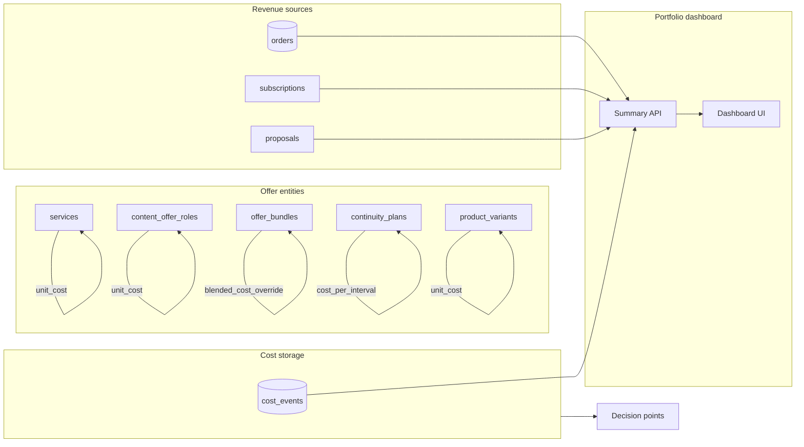

# Offer Cost Structure and Margin Tracking

## Overview

Add cost structure tracking for every offer type (services, content in bundles, continuity plans, merchandise), optional usage-based cost events (LLM, VAPI, Twilio, Replicate, Stripe fees), surface cost/margin at strategic admin decision points, and a **portfolio-level dashboard** for costs and revenue so you can ensure sufficient margin per offer and monitor overall P&L.

---

## Current state

- **Offers** are modeled as: services (price only), content_offer_roles (retail_price, offer_price, perceived_value; no cost), offer_bundles (bundle_price, no cost), continuity_plans (amount_per_interval; no cost), and products/variants (price; Printful provides cost at sync but it is not persisted).
- **Cost-incurring paths** exist but are not recorded: LLM calls, VAPI voice, Printful fulfillment, Stripe payments (fees), social-content regeneration (n8n/Replicate). No central place to store or attribute these costs.
- **Revenue** is captured in orders, subscriptions (Stripe/client_subscriptions), and possibly proposals; there is no single admin view that combines revenue and cost at the portfolio level.

---

## Target outcomes

1. **Per-offer cost and margin**: For each sellable entity, store or compute a cost so that margin % and margin $ can be shown wherever price is set or reviewed.
2. **Usage-based cost visibility**: Record cost events (LLM, VAPI, Twilio, Replicate, Stripe fee, etc.) with optional attribution to order/session/contact.
3. **Strategic decision points**: Surface cost and margin at the moments you make pricing or packaging decisions.
4. **Portfolio-level dashboard**: One place in Admin to see total revenue, total cost, and gross profit/margin over time (MTD, QTD, YTD, custom range), with cost broken down by source and revenue by stream (orders, subscriptions, etc.).
5. **Alex Hormozi metrics**: Use the same metric language and UI patterns as the Kinflo/JuliesFamily CAC:LTGP dashboard (Profit:Cost ratio with target and color coding; optional Value Equation for offers).

---

## 1. Data model

### 1.1 Offer-level cost (unit cost per sellable item)

**Option A — Add cost columns where price already lives** (recommended)

- **services**: Add `unit_cost DECIMAL(10,2)`, optional `cost_notes TEXT`.
- **content_offer_roles**: Add `unit_cost DECIMAL(10,2)`, optional `cost_notes TEXT`.
- **continuity_plans**: Add `cost_per_interval DECIMAL(10,2)` (and optionally `cost_currency`).
- **product_variants** (or **products**): Add `unit_cost DECIMAL(10,2)`. Printful sync can populate; manual override for non-POD.
- **offer_bundles**: Add optional `blended_cost_override DECIMAL(10,2)`. If null, blended cost = sum of resolved item unit costs; if set, use override.

### 1.2 Usage-based cost events

Single table **`cost_events`**:

- `id`, `occurred_at`, `source` (e.g. 'llm_openai', 'vapi_call', 'stripe_fee', 'printful_fulfillment'), `amount`, `currency`, `reference_type`, `reference_id`, `metadata` (JSONB), `created_at`.
- **Constraint**: `CHECK (amount >= 0)` (or document that refunds are negative if ever needed).
- **Index**: `(occurred_at, source)` for the summary API.
- **RLS**: Admin-only read/write (e.g. `is_admin()`). Ingest route uses service role and verifies ingest secret (not cookie).
- **Idempotency**: When ingesting (webhook or n8n), use `(source, reference_type, reference_id, occurred_at)` or a dedicated idempotency key in `metadata` to avoid double-counting on retries.

---

## 2. Cost sources and instrumentation

| Source | Where | What to record |
|--------|--------|----------------|
| LLM | App + n8n | Token usage → cost via lib/cost-calculator.ts; reference session/audit/proposal. |
| VAPI | Webhook on call-end | Duration × $/min; reference chat_session or vapi_call. |
| Stripe | Payment webhook | balance_transaction.fee; reference order. |
| Printful | Order submit | costs.total from API; reference order. |
| Twilio / Replicate | n8n | Ingest endpoint with source and amount. |

---

## 3. Strategic decision points (per-offer margin)

| Decision point | Location | What to show |
|----------------|----------|--------------|
| Service price | Admin → Content → Services | Unit cost, price, margin %, margin $. |
| Content offer role | Admin → Sales → Bundles (line items) | Unit cost, price, margin per line. |
| Bundle price | Admin → Sales → Bundles | Blended cost, bundle price, blended margin %. |
| Continuity plan | Admin → Continuity Plans | Cost per interval, amount per interval, margin %. |
| Merchandise | Admin → Content → Merchandise | Unit cost (from Printful or manual), price, margin %. |
| Proposal generation | Admin → Sales (proposal flow) | Blended margin for this proposal; optional warning if low. |

---

## 4. Portfolio-level cost and revenue dashboard

### 4.1 Purpose

A single Admin view to answer: “How much revenue did we bring in, how much did we spend (by category), and what’s our gross profit and margin at the portfolio level?” for any chosen time range.

### 4.2 Placement

- **Route**: `app/admin/cost-revenue/page.tsx`. Nav label **“Cost & Revenue”**; optional page subtitle “Portfolio P&L”.
- **Nav**: Under **Quality & insights** (alongside Analytics), not Configuration — it’s an insight/report. Update [lib/admin-nav.ts](lib/admin-nav.ts) accordingly.

### 4.3 Data sources

**Revenue (portfolio-level)**

- **Orders**: Sum of `orders.total_amount` (or equivalent) where order is paid/completed and `created_at` in range. Exclude refunded/canceled or adjust with refunds if stored.
- **Subscriptions**: Defer until a single source of truth exists. For Phase 4, show only Orders (+ optional Proposals paid). In UI: either “Subscription revenue (not yet tracked)” with short copy “We’ll add this when subscription payments are stored,” or hide from main summary cards and show in a “Coming soon” block under Revenue by stream so main numbers clearly mean “Orders (and proposals) only.”
- **Proposals**: If proposals have a “paid” state and amount, sum proposal amounts paid in range.

**Document the revenue definition** in `docs/` and in the summary API so “Gross Profit” and the ratio are reproducible.

**Single definition (for dashboard and API)**  
- **Revenue** = Orders (paid/completed in range) + Proposals paid (if tracked) + Subscription revenue (once stored). Phase 4 ships with Orders + optional Proposals; subscription = “coming soon”.  
- **Cost** = Realized COGS (from offer cost columns when order/fulfill happens) + `cost_events` in period.  
- **Gross profit** = Revenue − Cost. **Profit:Cost ratio** = Gross profit / Cost when both Revenue and Cost > 0; show “N/A” when Revenue = 0 **or** Cost = 0 (use shared `formatRatio` everywhere: dashboard and tables).

**Cost (portfolio-level)**

- **cost_events**: Sum `amount` for `occurred_at` in range. Group by `source` (e.g. LLM, VAPI, Stripe fees, Printful, Replicate, Twilio) so you can see which category drives cost.
- Optional: Separate “direct cost of goods” (e.g. Printful, Replicate) from “overhead” (LLM, VAPI, Stripe fees) for a simple P&L view.

### 4.4 Alex Hormozi metrics on the dashboard

Align with the **$100M Leads / $100M Offers** framework and reuse patterns from the Kinflo JuliesFamily dashboard:

**Reference implementation (Kinflo-website/JuliesFamily)**

- **CAC:LTGP dashboard**: `Kinflo-website/JuliesFamily/client/src/pages/AdminCacLtgpDashboard.tsx` — overview cards (Total Spend, Total Donors, Avg CAC, Avg LTGP:CAC), ratio target (5:1), color-coded ratio (green ≥5, yellow ≥3, red &lt;3), top channels table, BarChart (CAC vs LTGP), full channels table.
- **Analytics service**: `Kinflo-website/JuliesFamily/server/services/cacLtgpAnalytics.ts` — CAC:LTGP overview, channel performance, cohort. Schema: `channel_spend_ledger`, `donor_economics` (lifetime_gross_profit, customer_acquisition_cost, ltgp_to_cac_ratio).
- **Value Equation**: `Kinflo-website/JuliesFamily/shared/valueEquation.ts` — Dream Outcome, Perceived Likelihood, Time Delay, Effort & Sacrifice (used for copy generation). Portfolio already has [lib/pricing-model.ts](lib/pricing-model.ts) `calculateHormoziScore` and content_offer_roles with likelihood_multiplier, time_reduction, effort_reduction.

**Portfolio adaptation**

- **Profit:Cost ratio** (analog of LTGP:CAC): Ratio = Gross Profit / Total Cost (for the selected period). Target: e.g. 3:1 or 5:1 (configurable). Display as “X:1” with a Badge. **Colors:** Follow the **Amadutown design system** (see §4.7 and Color scheme below): use design tokens for ratio states (e.g. radiant-gold for on target, amber for caution, design-system-aligned destructive for below target); ensure non-color cues (icon/label) and contrast per a11y.
- **Summary cards** (same layout idea as AdminCacLtgpDashboard): Total Revenue | Total Cost | Gross Profit | **Profit:Cost ratio** (with target and color). Subtexts: e.g. “Across orders + subscriptions”, “From cost_events + COGS”.
- **Value Equation on per-offer views**: Where we show margin (Services, Bundles, Content roles), also show **Hormozi value score** when the offer has dream_outcome, likelihood, time_reduction, effort_reduction (from content_offer_roles or tier). Use existing `calculateHormoziScore` in lib/pricing-model.ts. No need to port Kinflo’s full valueEquation.ts unless we add AI copy generation later.

### 4.5 Dashboard content (full list)

- **Time range selector**: Presets (MTD, QTD, YTD) plus custom date range.
- **Summary cards** (Hormozi-style layout):
  - Total revenue (optional breakdown: Orders | Subscriptions | Other).
  - Total cost (breakdown by `cost_events.source` in subtext or drill-down).
  - Gross profit (revenue − cost).
  - **Profit:Cost ratio** (X:1) with target (e.g. 5:1) and color-coded Badge (green/yellow/red).
  - Gross margin % (profit / revenue when revenue > 0).
- **Cost by source**: Table or bar chart of cost per source (LLM, VAPI, Stripe fee, Printful, etc.) for the selected period.
- **Revenue by stream**: Table or chart (Orders vs Subscriptions vs Other).
- **Optional**: Trend or prior-period comparison; “Top streams by profit” (revenue stream or offer type with profit and ratio).
- **Zero revenue or zero cost**: Show ratio as “N/A” (not “0:1”); use shared `formatRatio` (e.g. in `lib/margin-display.ts`) for dashboard and any “Top by ratio” table. Optional tooltip: “No ratio when revenue or cost is zero.”

### 4.6 Implementation notes

- **API**: New route `GET /api/admin/cost-revenue/summary` with query params `from`, `to`. Aggregates orders (and subscription revenue only when stored); sums `cost_events` in range; returns totals and breakdowns. Admin-only (`verifyAdmin`). **Phase 1**: Implement a read-only version that returns zeros for revenue and only aggregates `cost_events` so the API contract is stable and testable early; Phase 4 adds orders (and later subscriptions) into the same response shape.
- **Caching**: For large `cost_events` and order tables, consider caching daily or weekly aggregates if needed; start with live queries for simplicity.
- **Permissions**: Dashboard is admin-only; reuse existing `ProtectedRoute requireAdmin` and API auth.

### 4.7 UX (Lead Designer recommendations)

**Color scheme — Amadutown design system**

All dashboard and per-offer UI (cards, badges, charts, ratio colors) must follow the **Amadutown design system**. No arbitrary Tailwind hues (e.g. emerald, teal, purple, pink) unless they are part of the palette.

- **Canonical source:** `app/globals.css` and `tailwind.config.ts` (navy/gold palette). Tokens: **imperial-navy**, **radiant-gold**, **silicon-slate**, **platinum-white**, **gold-light**, **bronze**.
- **Admin charts:** Use [lib/admin-chart-theme.ts](lib/admin-chart-theme.ts) for BarChart/pie colors, axis, tooltips.
- **Revenue/finance accent:** Use **radiant-gold** or **amber** (from the design system) for summary cards and CTAs; card surfaces use **silicon-slate** / **imperial-navy** as in existing admin CategoryCard.
- **Ratio Badge (on target / caution / below target):** Map to design tokens (e.g. radiant-gold, amber, and a design-system-aligned destructive) so contrast and dark theme match the rest of admin. See [docs/design/amadutown-color-palette-audit.md](docs/design/amadutown-color-palette-audit.md) for alignment and remediation reference.

**Critical**

- **Ratio N/A**: Use “N/A” when Revenue = 0 **or** Cost = 0; implement shared `formatRatio` (e.g. `lib/margin-display.ts`) and use everywhere so behavior and copy are consistent.
- **Dead end — dashboard → “change price/cost”**: Add at least one of: (1) Subtext on ratio/margin card: “Set unit costs in Services, Bundles, Continuity, Merchandise”; (2) “Adjust costs & prices” link (e.g. to Services or a small dropdown); (3) Phase 5 “Cost & margin” list with each row linking to that offer’s edit page.
- **Value Equation**: When score is hidden (fewer than four components), add tooltip or subtext: “Value Equation needs dream outcome, likelihood, time, and effort set” (or “Why don’t I see a score?” link).

**Consistency**

- **Cards**: Reuse same grid as Analytics (`grid-cols-1 md:grid-cols-2 lg:grid-cols-4`). **Color scheme:** Follow the **Amadutown design system** — canonical source `app/globals.css` and `tailwind.config.ts` (navy/gold palette). Use design tokens: **imperial-navy**, **radiant-gold**, **silicon-slate**, **platinum-white**, **gold-light**, **bronze**. For dashboard cards and charts use [lib/admin-chart-theme.ts](lib/admin-chart-theme.ts); revenue/finance accent = **radiant-gold** or **amber** from the palette (not arbitrary emerald/teal). See [docs/design/amadutown-color-palette-audit.md](docs/design/amadutown-color-palette-audit.md).
- **Time range**: Button group (MTD, QTD, YTD, custom); custom = compact “From – To”. On mobile: horizontal scroll or wrapped row so presets stay visible.
- **Ratio helpers**: Port Kinflo `formatRatio`, `getRatioColor`, `getRatioBadgeVariant` into shared lib (`lib/margin-display.ts` or under `lib/pricing-model.ts`); use same Badge + thresholds (5:1, 3:1) on dashboard and per-offer UIs. **Map ratio colors to Amadutown design system** (radiant-gold, amber, design-system destructive) so dashboard and admin stay on-palette.
- **Subtexts**: Phase-aware, e.g. “Orders + proposals in range”, “From cost events + COGS”, “Orders + proposals; subscriptions coming later.” Profit:Cost card subtext: “Profit ÷ cost; target 5:1.” “Blended margin” in context: “Blended margin (avg across line items)” or “Margin for this bundle/proposal.”

**Accessibility**

- **Ratio color**: Don’t rely on color alone; pair Badge with icon or text (“On target” / “Below target”). Use **Amadutown design system** tokens for ratio states (radiant-gold, amber, and design-system-aligned destructive) so contrast on dark theme is consistent; expose “target: 5:1” for screen readers.
- **Tables**: Real `<table>` with `<th scope="col">` and `<caption>` (e.g. “Cost by source for selected period”).
- **Charts**: Chart title + `aria-label`; provide data table (same data) below or “Show as table” toggle for keyboard/SR users.
- **Time range**: Visible keyboard focus; on range change, move focus to first summary card or `aria-live="polite"` (“Updated for MTD”).
- **Loading/errors**: Reuse Analytics pattern — `aria-busy`, user-facing error message + retry; no raw API errors in UI.

**Suggestions**

- **Discovery**: Add Quality & insights card on admin dashboard (like Analytics) linking to Cost & Revenue; use Amadutown palette (e.g. radiant-gold/silicon-slate per existing CategoryCard style).
- **Proposal low-margin warning**: Use `MARGIN_ALERT_THRESHOLD_PERCENT`; copy e.g. “Blended margin is below 40%. Consider reviewing line item costs or prices.” with link/hint to Bundles/Services.
- **Responsiveness**: Same breakpoints as Analytics; cost/revenue tables horizontal scroll + sticky headers on small viewports.
- **Phase 5 list**: When added, each row links to that offer’s edit screen (Dashboard → list → edit).

---

## 5. Alex Hormozi metrics — summary

| Metric | Where used | Source / logic |
|--------|------------|----------------|
| **Profit:Cost ratio** | Portfolio dashboard | Gross Profit / Total Cost; target 3:1 or 5:1; color Badge (Kinflo-style). |
| **Margin %** | Portfolio + per-offer | Profit / Revenue (portfolio) or (price − cost) / price (offer). |
| **Value Equation score** | Per-offer margin views (optional) | [lib/pricing-model.ts](lib/pricing-model.ts) `calculateHormoziScore` from content_offer_roles (dream_outcome, likelihood, time_reduction, effort). |
| **CAC / LTGP** (optional later) | If we add channel/lead attribution | Blended CAC = acquisition cost / new customers; LTGP = lifetime gross profit per client; ratio as in Kinflo. |

UI patterns to copy from Kinflo: card layout (icon + title + value + subtext), `formatRatio`, `getRatioColor`, `getRatioBadgeVariant`, BarChart (cost vs revenue or CAC vs LTGP analog), and the “Top X by ratio” table. **All colors and gradients must follow the Amadutown design system** (tailwind.config.ts, globals.css, [lib/admin-chart-theme.ts](lib/admin-chart-theme.ts), [docs/design/amadutown-color-palette-audit.md](docs/design/amadutown-color-palette-audit.md)) — no arbitrary Tailwind green/teal/purple; use imperial-navy, radiant-gold, silicon-slate, platinum-white, amber, and chart-theme segment colors where needed.

---

## 6. Configuration and guardrails

- **Cost rates**: Env or `cost_rates` table for LLM, VAPI, etc.
- **Margin threshold**: Env (e.g. `MARGIN_ALERT_THRESHOLD_PERCENT`) for per-offer warnings at decision points.
- **Profit:Cost target**: Env (e.g. `PROFIT_COST_RATIO_TARGET=5`) for dashboard ratio color and “target” label. No admin UI to change it in v1.

---

## 7. Architecture (high level)

---

## 8. Implementation phases

**Phase 1 — Schema and offer-level cost**

- Migration: cost columns on services, content_offer_roles, continuity_plans, product_variants/products, offer_bundles; create cost_events (with `CHECK (amount >= 0)`, index `(occurred_at, source)`, RLS admin-only).
- API: cost_events CRUD + ingest endpoint (service role + ingest secret; idempotency via `(source, reference_type, reference_id, occurred_at)` or metadata idempotency key).
- API: Read-only `GET /api/admin/cost-revenue/summary?from=&to=` returning zeros for revenue and only aggregating cost_events (stable contract for Phase 4).

**Phase 2 — Margin at decision points**

- Admin Services, Bundles, Continuity, Merchandise: show unit cost and margin.
- Proposal flow: show blended margin (optional warning). v1: simple version — sum `(price - unit_cost)` per line; margin % = profit / revenue. Defer fancy allocation rules.
- Value Equation: show score only where content_offer_roles (or tier) has the four components; when hidden, show tooltip/subtext explaining why (see §4.7).

**Phase 3 — Cost event ingestion and LLM**

- lib/cost-calculator.ts; instrument LLM routes.
- **Stripe fee logging** in the existing payment webhook (balance_transaction.fee; reference order_id).
- VAPI call-end logging; Printful cost logging on order submit; n8n ingest for Replicate/Twilio (with idempotency).

**Phase 4 — Portfolio-level dashboard (with Hormozi metrics)**

- New Admin page: Cost & Revenue (or Portfolio P&L).
- API: Extend `GET /api/admin/cost-revenue/summary` to aggregate orders (and proposals paid). Defer subscription revenue until stored; return zeros for subscription stream and show “Subscription revenue (coming soon)” in UI.
- UI: Follow Kinflo `AdminCacLtgpDashboard.tsx` patterns: time range selector; summary cards (revenue, cost, profit, **Profit:Cost ratio** with target and color-coded Badge, margin %); cost by source table/chart; revenue by stream table/chart. When revenue = 0, show ratio as “N/A” or “—”(no divide by zero). **Colors:** Amadutown design system only (see §4.7 and Section 5); use [lib/admin-chart-theme.ts](lib/admin-chart-theme.ts) for charts.
- Add nav entry in lib/admin-nav.ts (e.g. under Quality & insights).
- Optional: On per-offer margin views, show Value Equation score via `calculateHormoziScore` when offer has the four components.

**Phase 5 — Optional**

- Admin “Cost & margin” list view (per-offer): services, bundles, continuity, products with price, cost, margin %. Each row **links to that offer’s edit page** (Dashboard → list → edit). Consider single nav entry under Quality & insights for this list, with portfolio dashboard linked from it or same nav group.
- N8n cost logging for Replicate/Twilio; daily/weekly aggregate caching if needed.

---

## 9. Files to add or touch (summary)

- **Migrations**: Cost columns; cost_events table (CHECK amount >= 0, index (occurred_at, source), RLS).
- **Lib**: lib/cost-calculator.ts; lib/margin-display.ts (or under lib/pricing-model.ts) for formatRatio, getRatioColor, getRatioBadgeVariant; Printful sync to persist variant cost.
- **API**: cost-events routes (CRUD + ingest with idempotency); **GET /api/admin/cost-revenue/summary** (Phase 1 stub, Phase 4 full); Stripe fee logging in existing payment webhook.
- **Admin UI**: Services, Bundles, Continuity, Merchandise (cost + margin); proposal margin (simple blended); **app/admin/cost-revenue/page.tsx** (portfolio dashboard; zero-revenue → “N/A” for ratio).
- **Nav**: [lib/admin-nav.ts](lib/admin-nav.ts) — add “Cost & Revenue” (or “Portfolio P&L”).
- **Docs**: admin-sales-lead-pipeline-sop.md; **document revenue and cost definitions** for dashboard; env and ingest endpoint for cost rates.
