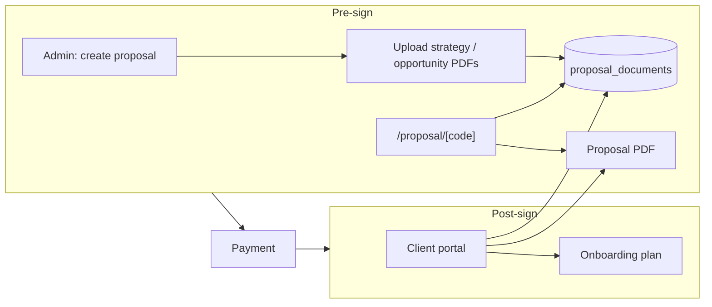

# Centralize Client Reports/Proposals and Align Report Inputs (CTO-Revised)

## Overview

Enable attaching external reports and proposals (e.g. strategy + opportunity quantification PDFs) to proposals at the start of the workflow so all client information is centralized; map KMB-style report inputs to existing site data; and plan data/model gaps so the site can generate these reports in the future.

---

## Current state

- **Proposal flow:** Proposals are created from sales sessions ([app/api/proposals/route.ts](app/api/proposals/route.ts)); client views at `/proposal/[code]`. Only the single proposal PDF (and optional contract PDF) is shown there. After payment, client portal ([lib/client-dashboard.ts](lib/client-dashboard.ts)) shows documents from proposal + onboarding plan (no separate "reports").
- **Client portal:** Documents section ([components/client-dashboard/DocumentsSection.tsx](components/client-dashboard/DocumentsSection.tsx)) supports types: `proposal`, `contract`, `onboarding_plan`. No support for attached strategy/opportunity reports or arbitrary uploads.
- **Report generation:** [lib/gamma-report-builder.ts](lib/gamma-report-builder.ts) already builds prompts for **value_quantification** ("Cost of Standing Still") and **implementation_strategy** ("UX Redesign") from contact, diagnostic audit, value report, services, and benchmarks. Gamma reports are stored in `gamma_reports`; they are not yet attachable to a proposal for pre-sign viewing or surfaced in the client portal as "reports."

---

## Part 1: Add reports and proposals (external PDFs) before sign and centralize in the portal

**Goal:** Store and show strategy/opportunity (and other) reports at the beginning of the workflow (when the client is viewing the proposal, before sign) and keep them centralized in the client portal after sign.

### 1.1 Migration and storage

- **New table: `proposal_documents`**
  - `id` UUID PRIMARY KEY, `proposal_id` UUID NOT NULL REFERENCES proposals(id), `document_type` TEXT NOT NULL (e.g. `strategy_report` | `opportunity_quantification` | `proposal_package` | `other`), `title` TEXT NOT NULL, `file_path` TEXT NOT NULL, `display_order` INTEGER NOT NULL, `created_at` TIMESTAMPTZ DEFAULT NOW().
  - **Include in initial migration (nullable):** `source` TEXT (`uploaded` | `generated`), `gamma_report_id` UUID REFERENCES gamma_reports(id). So phase 6 (Generate report) only adds logic, not schema changes.
- **Storage:** Reuse the existing **`documents`** bucket (used in [app/api/proposals/route.ts](app/api/proposals/route.ts) and [lib/client-dashboard.ts](lib/client-dashboard.ts)). Path convention: **`proposal-docs/{proposal_id}/{uuid}.pdf`** to avoid collisions. Document this in code comments.
- **RLS:** Admin-only for INSERT/UPDATE/DELETE (e.g. using `is_admin()` or equivalent SECURITY DEFINER helper). SELECT can be admin-only; **all public read goes through API** (by-code and dashboard) using `supabaseAdmin`. No circular RLS: by-code route resolves code → proposal, then fetches proposal_documents with service role (see [.cursor/rules/supabase-rls.mdc](.cursor/rules/supabase-rls.mdc)).
- **Signed URLs:** Use the same pattern as client-dashboard (`getSignedUrl`). If the `documents` bucket is private, use service-role client for server-side signed URL creation in API routes.
- **Migration file:** `migrations/YYYY_MM_DD_proposal_documents.sql`. Include CREATE TABLE, indexes, RLS; document apply order (after any proposal-related migrations). Apply via Supabase MCP and keep file on disk. If row-count monitoring is desired, add `proposal_documents` to `CRITICAL_TABLES` in [scripts/database-health-check.ts](scripts/database-health-check.ts); otherwise omit.

### 1.2 Display order

- **On INSERT:** Assign `display_order = (SELECT COALESCE(MAX(display_order), -1) + 1 FROM proposal_documents WHERE proposal_id = $1)` per proposal (per [.cursor/rules/ordering-rank-defaults.mdc](.cursor/rules/ordering-rank-defaults.mdc)).
- **On reorder:** Use index-based reassignment of `display_order` for the affected rows, not pairwise swap.

### 1.3 API

- **Admin**
  - **GET/POST** `app/api/admin/proposals/[id]/documents/route.ts` — list (ordered by `display_order`), create (upload file to Storage at `proposal-docs/{proposal_id}/{uuid}.pdf`, insert row with next `display_order`). Use `verifyAdmin(request)` from [@/lib/auth-server](lib/auth-server).
  - **DELETE** `app/api/admin/proposals/[id]/documents/[docId]/route.ts` — delete row (and optionally Storage object).
  - **PATCH** reorder: either on the list route (body: `{ documentIds: string[] }` with new order) or a dedicated reorder route; reassign `display_order` by index.
- **Public**
  - **Extend** [app/api/proposals/by-code/[code]/route.ts](app/api/proposals/by-code/[code]/route.ts): after resolving the proposal by code, fetch `proposal_documents` for that proposal (ordered by `display_order`), resolve a short-lived signed URL for each `file_path`, and return in the same response (e.g. `proposal`, `proposalDocuments`). Do **not** add a separate public "documents by code" route; single by-code response.

### 1.4 Proposal page UI

- On [app/proposal/[code]/page.tsx](app/proposal/[code]/page.tsx), add a **"Reports & documents"** section that consumes `proposalDocuments` from the by-code response. List title, type label, and "Download PDF" (signed URL). Show before sign/accept.

### 1.5 Client portal after sign

- **Single source of truth:** Client portal documents = proposal PDF + contract PDF (from proposal) + onboarding plan (from onboarding_plans) + **proposal_documents** (new). All served via `getDashboardByToken`; no separate endpoint for proposal_documents in the portal.
- In [lib/client-dashboard.ts](lib/client-dashboard.ts): when building `documents` for a client project, fetch `proposal_documents` for `project.proposal_id`, append to the list with signed URLs. Extend **`DashboardDocument.type`** to include `strategy_report` | `opportunity_quantification` | `other` (or a single `report` type with a label); ensure backend only returns allowed types.
- In [components/client-dashboard/DocumentsSection.tsx](components/client-dashboard/DocumentsSection.tsx): extend **`typeConfig`** for the new document types (icon, label, accent, bg). Same card pattern: title, type label, date, PDF link.

### 1.6 Admin UX for attaching documents

- **Where:** From the **sales conversation flow** where the proposal is linked (e.g. Admin → Sales → conversation → proposal), or from a new Admin proposal detail page if added later (e.g. `/admin/sales/conversation/[sessionId]` with proposal panel). Prefer reusing the conversation flow first; add a dedicated proposal detail page only if needed.
- **Actions:** "Attach report/document" — upload PDF, set title and document type, save to `proposal_documents`. List existing attached documents with reorder and delete.
- **Admin nav:** No new sidebar item for "proposal documents"; attachment is from the sales/conversation or proposal detail surface. If a dedicated "Proposal detail" page is added later, add an entry under Sales in [lib/admin-nav.ts](lib/admin-nav.ts) and a matching icon in [components/admin/AdminSidebar.tsx](components/admin/AdminSidebar.tsx).

---

## Part 2: Map report inputs to the site and identify data gaps (discovery / later phases)

Keep Part 2 as **discovery and design**. Do not block Part 1 (attach/store/show documents) on Part 2.

### 2.1 Inputs the site already has

- **Both reports:** Client name, company (contact_submissions, proposals); segment/industry, company size (contact_submissions.industry, employee_count; value_reports).
- **Strategy:** Recommendations, insights (diagnostic_audits); current state narrative (diagnostic_summary, business_challenges, tech_stack); external findings (Gamma ExternalInputs: thirdPartyFindings, siteCrawlData).
- **Opportunity:** Value statements, total annual value (value_reports, proposals.value_assessment); calculation methods ([lib/value-calculations.ts](lib/value-calculations.ts)); segment benchmarks (industry_benchmarks); investment (proposals, offer_bundles).

### 2.2 Data gaps (phases 5–6)

1. **Structured engagement/discovery metrics** — Reports need: page count, bounce rate, visitors/month, donation completion rate, volunteer hours, staff hours/week (content, onboarding), retention %, avg donation, potential sponsors, avg deal. **Plan:** Add JSONB to `diagnostic_audits`, e.g. `engagement_metrics`, with a small schema; populate from admin form or ingest. Alternative: new table `engagement_metrics` (diagnostic_audit_id, metric_key, value, unit, source).

2. **Nonprofit segment benchmarks** — Ensure `industry_benchmarks` and value-calculations fallbacks for `industry = 'nonprofit'` and company_size (e.g. 1-10): avg_hourly_wage, volunteer_hour_value, avg_donation, first_time_retention_rate, avg_deal_size, avg_close_rate. Document sources (M+R, FEP, Independent Sector, etc.).

3. **Phased delivery and timeline** — Add optional JSONB to `offer_bundles`, e.g. `phased_delivery: [{ phase, label, months_from_start, investment_min, investment_max }]`, or keep phases in report templates.

4. **Methodology and sources** — Keep in report template or config so generated reports inject "Methodology" and "Sources" consistently (e.g. ATAS Value & Pricing Logic v1.0).

### 2.3 Generation flow (phase 6)

- Trigger from admin with contact, diagnostic_audit_id, value_report_id, proposal_id (optional), external inputs. Use [lib/gamma-report-builder.ts](lib/gamma-report-builder.ts); store in `gamma_reports`; optionally create `proposal_documents` row with `source: 'generated'` and `gamma_report_id` so the report appears on the proposal and in the portal. Maintain value-evidence traceability ([.cursor/rules/value-evidence-traceability.mdc](.cursor/rules/value-evidence-traceability.mdc)).

---

## Part 3: Implementation order (revised)

1. **Migration + storage + API**
   - Create `proposal_documents` (with nullable `source`, `gamma_report_id`).
   - Reuse `documents` bucket; path convention `proposal-docs/{proposal_id}/{uuid}.pdf`.
   - RLS: admin manage; read via API (by-code + dashboard) with service role.
   - Admin: GET/POST at `.../proposals/[id]/documents`, DELETE at `.../documents/[docId]`, PATCH reorder.
   - Extend GET [app/api/proposals/by-code/[code]](app/api/proposals/by-code/[code]/route.ts) to return `proposalDocuments` with signed URLs.

2. **Proposal page UI** — "Reports & documents" on [app/proposal/[code]/page.tsx](app/proposal/[code]/page.tsx) from by-code `proposalDocuments`.

3. **Client dashboard** — In [lib/client-dashboard.ts](lib/client-dashboard.ts), fetch `proposal_documents` for the project's proposal_id, append to `documents` with signed URLs; extend `DashboardDocument.type` and [DocumentsSection](components/client-dashboard/DocumentsSection.tsx) `typeConfig`.

4. **Admin UX** — Attach (upload + title + type), list, reorder, delete; from sales conversation/proposal flow (or new proposal detail page if added).

5. **Data gaps** — engagement_metrics (e.g. on diagnostic_audits), nonprofit benchmarks, optional phased_delivery, methodology/sources in gamma-report-builder.

6. **Generation** — "Generate report" → gamma-report-builder → gamma_reports; optionally create proposal_documents row (source: generated, gamma_report_id set).

---

## Diagram

- **By-code API** returns `proposal` + `proposalDocuments` (with signed URLs).
- **Client portal documents** = proposal + contract + onboarding_plan + proposal_documents (same signed-URL pattern).

---

## Risks and dependencies (summary)

- **RLS:** Avoid circular references; keep proposal_documents RLS admin-only; public read only via API with service role.
- **Signed URLs:** Confirm server-side signed URL creation works for the `documents` bucket (service-role if private).
- **Types:** Extend `DashboardDocument` and `typeConfig` for new document types; backend returns only allowed types.
- **Migrations:** Document apply order; apply via Supabase MCP and write file to `migrations/`.
