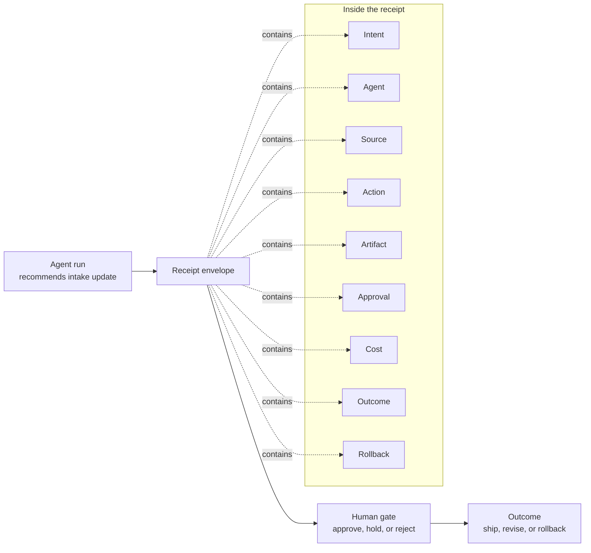

# Chapter 1 receipt diagram review

Review question:

Does this receipt diagram make the governance issue clear to a reader, or does it still feel like internal system bookkeeping?

Context:

The pipeline entry looked complete because it had a title, owner, due date, summary, priority, source, and confidence. Sam's problem was that the visible card did not prove why the agent acted, what source it used, who approved it, or how to reverse it.

Figure: The first receipt

Follow-up paragraph in the manuscript:

The figure did something the clean pipeline card had hidden. It made the risk visible without requiring anyone to be technical. Source, approval, and rollback were missing. Intent was close enough to infer, which made it more dangerous. The card looked complete until someone asked what it would take to defend the work.
