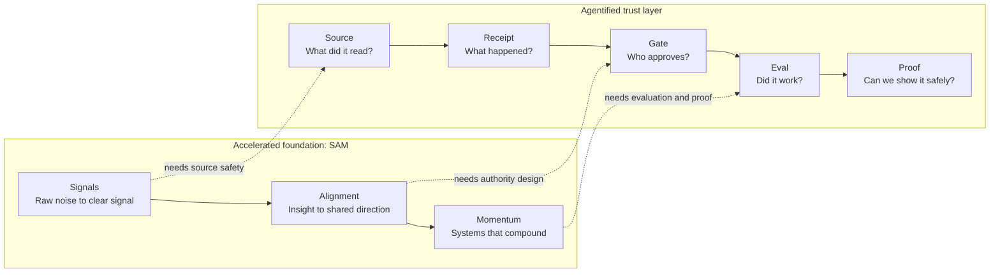
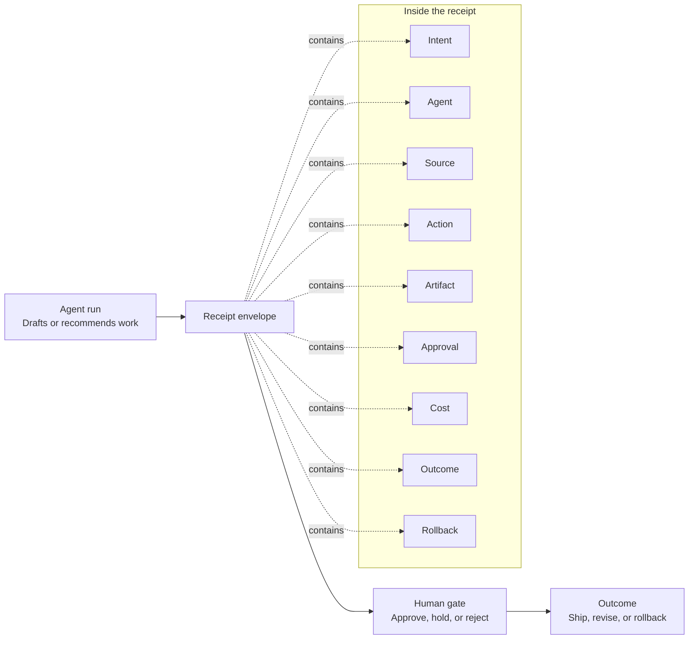
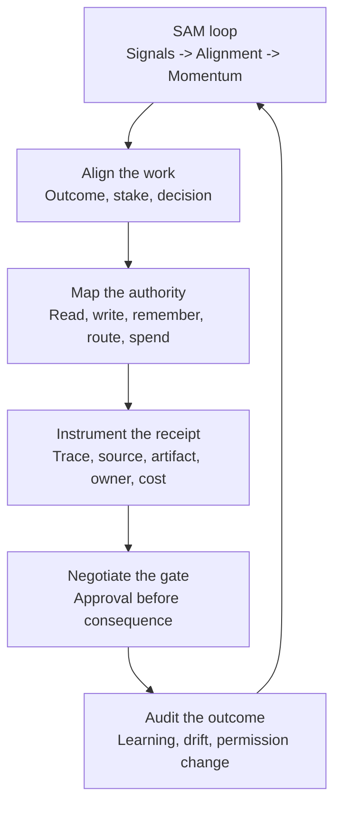
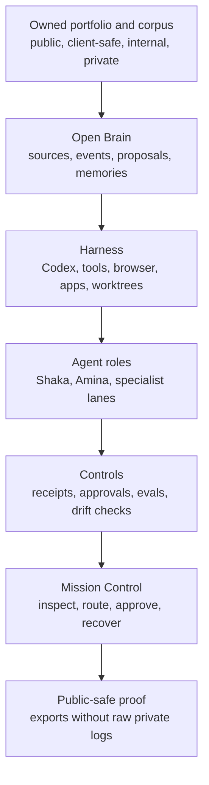
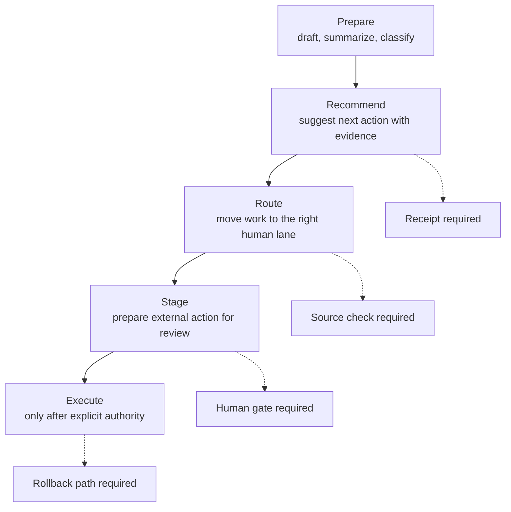

# Agentified diagram system: SAM plus the trust layer

Status: first visual design brief

Purpose: replace dense tables with reader-facing diagrams that build on the SAM diagram from `Accelerated`.

## Core recommendation

Keep SAM as the foundation:

- Signals: turn raw noise into a clear signal.
- Alignment: turn insight into shared direction.
- Momentum: turn testing into systems that compound.

Agentified should add the missing operating question:

Can the accelerated work be trusted?

The visual language should show a trust layer sitting on top of SAM. The reader should feel the sequel logic immediately: Accelerated taught teams how to move from noise to compounding product learning. Agentified teaches teams how to govern that speed when agents can prepare, route, recommend, and stage decisions on their behalf.

Working phrase:

```text
SAM creates acceleration. The trust layer makes acceleration governable.
```

## Design grammar

Use the Accelerated visual as the starting rhythm, not a copy.

- Keep the three-panel movement: Signals, Alignment, Momentum.
- Add a visible trust rail across the panels: Source, Receipt, Gate, Eval, Proof.
- Use icons and directional flow more than tables.
- Use short labels that can survive print.
- Keep Portfolio as structural proof, not a product advertisement.
- Use A.M.I.N.A. as the operating process where a circular or loop diagram helps.

Color direction:

- Inherit warm gold sparingly from Accelerated for continuity.
- Use off-white paper space for manuscript readability.
- Add muted teal for verified proof and muted red for unresolved risk.
- Avoid making every diagram navy and gold. Agentified should feel related, but more operational and precise.

## Diagram 1: SAM with the trust layer

Use near the opening or after the safety note.

Reader job:

Show that Agentified is built on SAM, then adds the governance layer that agentic work requires.

Visual:



Manuscript caption:

`Accelerated` gave teams the SAM loop: Signals, Alignment, Momentum. `Agentified` adds the trust layer: source, receipt, gate, evaluation, and proof. The work can move faster only when the evidence moves with it.

## Diagram 2: The first receipt

Use in Chapter 1 instead of the receipt audit table.

Reader job:

Make the receipt feel like a visible envelope around an agent action, not a checklist.

Visual:



Manuscript caption:

A receipt wraps an agent action in evidence. The output is what the reader sees. The receipt is what the organization needs before the work can earn trust.

Chapter 1 replacement move:

- Keep the prose scene.
- Replace the table with this figure.
- Follow the figure with two sentences naming the missing fields: source, approval, rollback, and unstated intent.

## Diagram 3: A.M.I.N.A. inside SAM

Use in the workbook front matter or Act I opener.

Reader job:

Show how the A.M.I.N.A. process turns SAM into a governed operating habit.

Visual:



Manuscript caption:

A.M.I.N.A. is the operating habit that keeps SAM trustworthy. Align the work, map the authority, instrument the receipt, negotiate the gate, and audit the outcome before expanding permission.

## Diagram 4: Portfolio-first operating stack

Use where the manuscript explains why Portfolio came first.

Reader job:

Show the system logic without exposing private material or selling Portfolio as a product.

Visual:



Manuscript caption:

The agentic operating system did not start with a prompt. It started with a body of work that already had shape. Portfolio gave Open Brain a substrate, and the trust layer gave agents a governed way to use it.

## Diagram 5: Authority ladder

Use in Act II where permission and gates become central.

Reader job:

Replace permission tables with a simple visual ladder.

Visual:



Manuscript caption:

Authority should climb only when evidence climbs with it. The higher the side effect, the stronger the receipt, gate, and rollback path must be.

## Initial figure priority

Build these first:

1. SAM with the trust layer
2. The first receipt
3. A.M.I.N.A. inside SAM
4. Portfolio-first operating stack
5. Authority ladder

These five can replace the most table-heavy early material while keeping the workbook practical.

## Manuscript changes to make after approval

- Replace the Chapter 1 receipt audit table with Diagram 2.
- Keep the `Agent Work Receipt` worksheet in the companion workbook, where the full field list belongs.
- Add Diagram 1 near the safety note or opening of Act I.
- Add Diagram 3 to the workbook-enhanced front matter.
- Add Diagram 4 near the Portfolio-first passage.
- Add Diagram 5 in Act II before the permission chapters.
