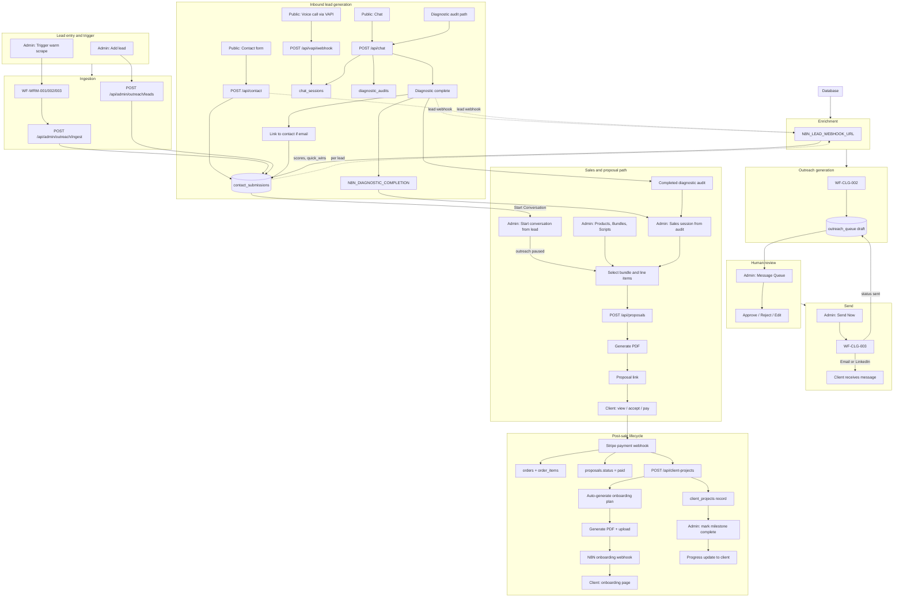

# Admin/Sales Lead Pipeline SOP

## 1. Audience and purpose

This document is the **single source of truth** for new admin and sales associates at Amadutown. It explains:

- What happens when you trigger scraping, add a lead, approve or send a message, or generate a proposal
- What data you enter, where it is stored, and how it flows into workflows
- Which n8n (or app) workflows run, what triggers them, and what they produce
- How offer bundles and line items are built and used in the sales flow
- How sales scripts are used in the walkthrough and how dynamic steps are generated
- How proposals are created and what the client receives (link, PDF, payment)
- How to research pricing by company, industry, and benchmarks
- Inbound lead generation (contact form, chat, diagnostic, voice)
- The full post-sale lifecycle (payment → client project → onboarding → milestones)
- Voice channel (VAPI) and other admin tools

**Relationship to other docs:** The technical integration reference is [warm-lead-workflow-integration.md](./warm-lead-workflow-integration.md). This SOP focuses on **operator-facing procedures** and **system behavior**; use the warm-lead doc for API details, env vars, and troubleshooting.

---

## 2. End-to-end process diagram

The diagram below covers lead entry, inbound leads, enrichment, outreach, human review, send, sales and proposal path, and **post-sale lifecycle** (payment → client project → onboarding → progress updates). It also includes the **voice channel** (VAPI) and where **sales assets** (products, bundles, scripts) are configured.

**Subgraph summary:**

- **Inbound:** Contact form, chat, and voice (VAPI) create or link to contacts and diagnostics; diagnostic completion triggers lead webhook and diagnostic-completion webhook.
- **Entry / Ingest:** Manual add uses Leads API; trigger starts scrapers that POST to ingest API; both write to `contact_submissions`.
- **Enrichment:** Lead webhook runs per lead (from add, edit re-run, contact form, or diagnostic completion); n8n can update scores/quick_wins on the contact.
- **Outreach gen:** WF-CLG-002 writes drafts to `outreach_queue`; not triggered by the app (n8n runs it after enrichment or on schedule).
- **Human review / Send:** Admin approves or edits in Message Queue; "Send Now" calls WF-CLG-003 to send email or LinkedIn and update status.
- **Sales path:** Admin configures products, bundles, and scripts; runs sales session from a completed audit **or starts a conversation directly from a lead** (no audit required). Outreach is automatically paused when a conversation starts. Admin selects bundle and line items; generates proposal; client gets link and pays.
- **Post-sale:** Stripe webhook creates order, marks proposal paid, and calls `/api/client-projects`; app creates client project, onboarding plan, PDF, and fires onboarding webhook; admin tracks milestones and sends progress updates to the client.

---

## 3. Data you input and where it goes

### Add lead / Edit lead

- **Where:** Admin → Lead Pipeline → All Leads → Add lead (or Edit on a row).
- **Inputs:** Name (required), Email, Company, Company website (domain), LinkedIn URL, Job title, Industry, Location, Phone, Message/notes, How did you get this lead? (input_type). Optional **Value Evidence** section (collapsible): Company size, Quick wins, Known pain points — these are stored and pre-fill the unified Lead modal when pushing to the value evidence pipeline.
- **Stored in:** `contact_submissions`. Deduplication by email, LinkedIn URL, or LinkedIn username.
- **Side effect:** On create (and on edit when "Re-run enrichment" is checked), the app calls the lead qualification webhook (`N8N_LEAD_WEBHOOK_URL`) with the lead payload. n8n may write back to `contact_submissions` (e.g. lead_score, quick_wins).

### Trigger warm scraping

- **Where:** Admin → Outreach Dashboard → Trigger Warm Lead Scraping.
- **Inputs:** Source (facebook | google_contacts | linkedin | all), options (e.g. max_leads per source).
- **Trigger:** App calls `triggerWarmLeadScrape()` → N8N_WRM001/002/003 webhooks. Scrapers POST to `/api/admin/outreach/ingest` with Bearer `N8N_INGEST_SECRET`; the app does not write leads directly.

### Message Queue actions

- **Approve / Reject / Edit:** PATCH `/api/admin/outreach` — updates `outreach_queue` status and optionally subject/body.
- **Send Now:** POST `/api/admin/outreach/[id]/send` — loads item and contact, POSTs to `N8N_CLG003_WEBHOOK_URL` with outreach_id, contact_submission_id, channel, subject, body, sequence_step, contact. n8n sends the message and updates `outreach_queue` (e.g. sent_at, status) and `contact_submissions.outreach_status`.

### Proposal

- **Inputs:** sales_session_id, client_name, client_email, client_company, bundle_id, bundle_name, line_items (content_type, content_id, title, description, offer_role, price, perceived_value), subtotal, discount_amount, discount_description, total_amount, valid_days, optional value_report_id.
- **Stored:** `proposals`. PDF is generated and uploaded to Supabase Storage; `pdf_url` and proposal link are returned. Client receives the link (e.g. `/proposal/[id]`) and can view PDF and accept/pay.

### Value evidence

- **Trigger:** Value Evidence UI triggers extraction (N8N_VEP001) or social listening (N8N_VEP002). Results are POSTed to `/api/admin/value-evidence/ingest` (and ingest-market for VEP-002). No lead data entered by admin in this flow; workflows use diagnostics/contacts or external sources.

### Pushing leads to the value evidence pipeline

- **Where:** Admin → Lead Pipeline → **All Leads**.
- **Steps:** Select one or more leads (checkboxes; "Select all on this page" available). Click **Push to Value Evidence**. The same **unified Lead modal** opens for Edit, Push, and Retry — with Lead details (name, email, company, etc.) and Value Evidence (pain points, quick wins, company size). Pre-populated from the database. Edit as needed, then click **Save changes** to persist edits, or **Push to Value Evidence** to push to the extraction pipeline.
- **Result:** The app persists enrichment to `contact_submissions`, sets push status to “pending,” and triggers WF-VEP-001 with `contact_submission_ids` (and optional `enrichments`). When evidence is ingested, the app updates status to “success.” Lead cards show: **Evidence: N** (click to open evidence drawer), **Extracting...**, **Push may have failed**, **Push failed**, or **No evidence**. Use **Retry** or **Refresh evidence** per lead as needed. Evidence drawer shows pain point evidence and value reports; you can generate a report or refresh evidence from there.
- **Prerequisite for “Suggest from Evidence” pricing:** The `content_pain_point_map` table must map products/services to pain points. If it is empty, suggest-from-evidence will return an error; value reports and proposal value assessments still work.

---

## 4. Behind-the-scenes: Lead pipeline

1. **Trigger** — Admin clicks Trigger (or n8n runs on schedule). App calls warm-lead webhooks (WF-WRM-001/002/003).
2. **Scraping** — n8n scrapes Facebook / Google Contacts / LinkedIn and POSTs to `/api/admin/outreach/ingest` with `N8N_INGEST_SECRET`. App deduplicates and inserts into `contact_submissions`.
3. **Enrichment** — For each new or re-enriched lead, the app (or n8n) calls `N8N_LEAD_WEBHOOK_URL`. The workflow does company lookup, scoring, etc., and may update `contact_submissions`.
4. **Outreach generation** — WF-CLG-002 (invoked by n8n, not the app) generates personalized drafts and writes to `outreach_queue` (status: draft).
5. **Human review** — Admin opens `/admin/outreach` (Message Queue tab), approves/rejects/edits drafts.
6. **Send** — Admin clicks "Send Now" on an approved item. App POSTs to WF-CLG-003 with the message and contact; n8n sends email or LinkedIn and updates queue and contact status.

**Key env vars (names only):** `N8N_LEAD_WEBHOOK_URL`, `N8N_CLG002_WEBHOOK_URL`, `N8N_CLG003_WEBHOOK_URL`, `N8N_WRM001_WEBHOOK_URL`, `N8N_WRM002_WEBHOOK_URL`, `N8N_WRM003_WEBHOOK_URL`, `N8N_INGEST_SECRET`.

---

## 5. Inbound lead generation workflows

### Contact form (website)

Visitor submits the form (name, email, company, domain, LinkedIn, message, etc.). The app inserts a row into **contact_submissions** (direct insert, no ingest API), then asynchronously calls **triggerLeadQualificationWebhook** with source `portfolio_contact_form` and the submission id. So: **Website contact form → contact_submissions → N8N_LEAD_WEBHOOK_URL**. The lead appears in Lead Pipeline → All Leads like any other; enrichment and outreach generation follow the normal flow.

### Chat and diagnostic path

Visitor uses the site chat. If they enter diagnostic/audit mode, the app creates or updates **chat_sessions** and **diagnostic_audits**. Messages in diagnostic mode are sent to n8n via the diagnostic webhook; n8n returns the next question or completion with diagnostic data. When the diagnostic **completes** (n8n returns isComplete + diagnosticData):

1. If the visitor provided **email**, the app looks up **contact_submissions** by that email; if found, it **links the diagnostic to that contact** (`diagnostic_audits.contact_submission_id`).
2. It calls **triggerLeadQualificationWebhook** with source `chat_diagnostic` and diagnostic summary.
3. It calls **triggerDiagnosticCompletionWebhook** (N8N_DIAGNOSTIC_COMPLETION_WEBHOOK_URL) with diagnosticAuditId, diagnosticData, and contact info for sales follow-up.

**Where admin sees inbound:** Inbound contacts appear in **Lead Pipeline → All Leads**. Completed **diagnostic_audits** are visible from the **Sales Dashboard**; admin can open a **sales session** tied to a diagnostic (`/admin/sales/[auditId]`) and run the walkthrough (scripts, bundle, proposal). So: **Visitor → contact form and/or chat/diagnostic → contact_submissions + diagnostic_audits → lead webhook + diagnostic completion webhook → admin sees leads and audits → sales session from audit → proposal**.

**Note:** Contact form is the primary way visitors become leads in the DB. Chat/diagnostic enriches and links to that lead; if a visitor only chats and never submits the form, they must be identified by email and a contact_submissions row must exist (e.g. from a prior form submit or manual add) for the link and lead webhook to run.

---

## 6. Behind-the-scenes: Sales and proposals

### Two entry points into a sales session

1. **Diagnostic → sales session:** From the Sales Dashboard, admin opens a completed diagnostic and starts a sales session (`/admin/sales/[auditId]`). The session is linked to the audit and the contact.
2. **Lead → conversation (no audit):** From the Leads page, click **"Start Conversation"** on any lead. This creates a new `sales_session` with `contact_submission_id` set and `diagnostic_audit_id = null`, then redirects to `/admin/sales/conversation/[sessionId]`. The conversation page has the same walkthrough (script, products, objections, proposal) but without diagnostic sections or AI insights.

### Lifecycle linking

- `sales_sessions.contact_submission_id` links the session to the lead (contact_submissions).
- `sales_sessions.client_project_id` links the session to the client project after conversion.
- When a conversation starts from a lead, `contact_submissions.outreach_status` is set to `'in_conversation'`, pausing any outreach sequences.

### Outreach pause and resume

- **Pause:** Automatic when "Start Conversation" is clicked (sets `outreach_status = 'in_conversation'`).
- **Resume:** When the session outcome is updated to `converted`, `lost`, or `deferred`, the outreach status can be cleared or updated (manual or via future automation).

### Multi-session

- Each "Start Conversation" click creates a **new** session (no reuse). The lead card shows the session count and links to the latest session.

### Sales dashboard

- The Sales Dashboard (`/admin/sales`) shows **two sections**: audit-based leads (from completed diagnostics) and **active conversations** (sessions without a diagnostic audit). Both link to their respective walkthrough pages.

### In-person diagnostic

- During a conversation (no prior online diagnostic), the sales rep can fill in diagnostic data using the **In-Person Diagnostic** panel on the left side of the conversation page.
- The panel has 6 collapsible categories matching the online diagnostic: Business Challenges, Tech Stack, Automation Needs, AI Readiness, Budget & Timeline, Decision Making.
- **Save Progress** saves the data to a new `diagnostic_audits` record (with a synthetic session ID) and links it to the `sales_session`.
- **Generate Insights** calls `POST /api/admin/sales/in-person-diagnostic/generate-insights` which uses GPT-4o-mini to produce a diagnostic summary, key insights, recommended actions, urgency score, and opportunity score.
- **Mark Complete** sets the audit status to `completed`.
- Once diagnostic data is saved, the **script generation** (`/api/admin/sales/generate-step`) receives the audit data and personalizes talking points, discovery questions, and closing strategies based on the client's challenges, budget, timeline, and decision-making context.
- As the rep fills in more categories during the call, they can save and the next generated script step will incorporate the new data.

### Bundles, line items, and proposals

- **Bundles and line items:** Admin selects an offer bundle and content (products/services) as line items. "Generate proposal" opens the proposal modal (client name, email, company, discount, valid days, **value report**). In the modal, choose a **Value Report** from the dropdown (lists reports for the current contact); the report’s value assessment is attached to the proposal. Then POST to `/api/proposals` with line items and optional `value_report_id`. Line items are built from the selected content (content_type, content_id, title, description, offer_role, price, perceived_value). The client-facing proposal page shows the value assessment section when a value report was attached.
- **Proposal output:** PDF is generated and stored; proposal link is returned. Admin shares the link with the client. Client sees `/proposal/[id]`, can view PDF and accept (Stripe checkout). After payment, the Stripe webhook creates the order, marks the proposal paid, and calls `POST /api/client-projects` to create the client project and onboarding (see Post-sale section).

---

## 7. Configuring sales assets

Before sales sessions and proposals work correctly, these admin tools must be set up.

### Product Classification

- **Where:** Admin → Sales → Products (`/admin/sales/products`).
- **Purpose:** Assign **offer roles** (core_offer, bonus, upsell, downsell, continuity, lead_magnet, decoy, anchor) and **content types** (product, project, video, publication, music, lead_magnet, prototype, service) to existing content items. Filter by role, type, and search. Preview the "Grand Slam Offer" stack. The same ProductClassifier component powers "Suggest from Evidence" pricing in the sales walkthrough.

### Bundle Management

- **Where:** Admin → Sales → Bundles (`/admin/sales/bundles`).
- **Purpose:** Create, edit, duplicate, and delete **offer bundles**. Each bundle has a name, list of items (with roles and pricing), and calculated totals. Bundles are what get selected in the sales walkthrough and become proposal line items.

### Sales Script Management

- **Where:** Admin → Sales → Scripts (`/admin/sales/scripts`).
- **Purpose:** Create and edit **sales scripts** with structured steps (title, talking points, actions), objection handlers (trigger, response, category), and success metrics. Scripts are typed by **offer_type** (attraction, upsell, downsell, continuity, core, objection) and **target funnel stage** (prospect, interested, informed, converted, active, upgraded). The sales session page loads scripts and uses them in the guided walkthrough; the generate-step API adapts steps to the current client/audit.

---

## 8. Researching pricing models

Pricing in the app is based on **company**, **industry**, and **what others pay** for similar services.

- **Company and industry context:** When a lead or sales session is linked to a contact, the system can use the lead’s **industry** and **company size** (e.g. from `contact_submissions`) to tailor pricing. This is passed to the suggest-pricing API via `contact_submission_id`, or manually via `industry` and `company_size` (`/api/admin/value-evidence/suggest-pricing`).
- **Benchmarks:** Reference data lives in **industry_benchmarks** (by industry and company size range): avg_hourly_wage, avg_deal_size, avg_employee_cost, etc. Value calculations use this to resolve the best match (exact industry+size → same industry → default). Pain point evidence and value_calculations feed into evidence-based suggested prices.
- **Where it’s used:** In the **sales walkthrough**, when building line items, the ProductClassifier shows a **"Suggest from Evidence"** button. It calls `POST /api/admin/value-evidence/suggest-pricing` with content_type, content_id, and optionally industry, company_size, or contact_submission_id. The API returns suggested retail price and perceived value; admin can **Apply** those to the line item.
- **Admin responsibilities:** Keep **industry benchmarks** and **value evidence** (pain points, evidence, calculations) up to date in the Value Evidence admin area so "Suggest from Evidence" and value reports stay accurate. Map pain points to content so suggest-pricing can compute anchor prices per product/service.

---

## 9. Sales scripts and dynamic steps

- **Storage:** `sales_scripts` table: name, description, offer_type, target_funnel_stage, script_content (JSONB with steps, talking_points, actions, objection_handlers).
- **Usage:** The sales session page loads scripts and uses them in the guided walkthrough. Dynamic steps are generated by `/api/admin/sales/generate-step` (context: audit, session, products, etc.) producing a step with talking points and actions. Scripts define "what to say" and "what to do" at each step; the generate-step API adapts them to the current client/audit.

---

## 10. Post-sale: Payment to delivery

After the client accepts and pays the proposal, the following happens automatically and then continues with admin-driven milestone tracking.

### Stripe payment webhook

When the client completes Stripe checkout, the **Stripe webhook** (`/api/payments/webhook`) receives `checkout.session.completed`. If `proposalId` is in session metadata:

1. Creates **orders** and **order_items** from the proposal.
2. Updates **proposals** (status = paid, paid_at, order_id).
3. Updates **sales_sessions** (outcome = converted, actual_revenue) if linked.
4. Calls **POST /api/client-projects** with the proposal_id to create the client project and onboarding.

### Client project creation

**POST /api/client-projects** (called by the payment webhook or manually by admin):

1. Creates **client_projects** record (client_id, client_name, client_email, client_company, proposal_id, project_status, product_purchased, payment_amount, project_start_date, etc.).
2. Builds proposal and project context and calls **createOnboardingPlanForProject** to match an onboarding template and generate an **onboarding_plan** (milestones, communication_plan, warranty, artifacts_handoff).
3. Generates the **onboarding PDF** and uploads to Supabase Storage (`documents/onboarding-plans/[id].pdf`).
4. Fires **fireOnboardingWebhook** (N8N onboarding webhook) with plan link, PDF URL, client info, and milestones summary so n8n can send the onboarding email to the client.
5. Optionally updates **client_projects.estimated_end_date** from the template’s estimated_duration_weeks.

### Client Projects dashboard

- **Where:** Admin → Client Projects (`/admin/client-projects`).
- **Features:** List all client projects with status filters (payment_received, onboarding_scheduled, kickoff_scheduled, active, testing, delivering, complete, archived), search by client name/email/company, and milestone progress (completed/total). **Create Project** button opens a modal that lists **eligible paid proposals** (paid, no existing project); admin selects one and optionally sets an override start date, then the app creates the project (same flow as the webhook).

### Project detail and milestones

- **Where:** Admin → Client Projects → [project] (`/admin/client-projects/[id]`).
- **Features:** Milestone timeline with status (pending, in_progress, complete, skipped). For each incomplete milestone, **Mark Complete** opens a modal where admin can attach files (screenshots, PDFs) and add a personal note. Submitting marks the milestone complete and sends a **progress update** to the client (via email or Slack, depending on project channel). The page also shows communication plan, warranty, artifact handoff list, progress update log, and open blockers.

### Client-facing onboarding page

- **Where:** Public page `/onboarding/[id]` (link and PDF are sent via the onboarding email).
- **Features:** Setup requirements, milestone timeline, communication plan, win conditions, warranty, and artifacts. The client can view and download the PDF.

### Onboarding templates

- **Where:** Admin → Onboarding Templates (`/admin/onboarding-templates`).
- **Purpose:** Manage reusable **onboarding_plan_templates** that drive auto-generated plans. Each template has name, content_type, service_type, setup_requirements, milestones_template, communication_plan, win_conditions, warranty, artifacts_handoff, estimated_duration_weeks, and is_active. When a client project is created, the app matches the proposal (bundle/content) to a template and instantiates the plan from it.

---

## 11. Follow-up sequences

- **Outreach:** Each outreach_queue row has a **sequence_step** (1–6). When admin clicks "Send Now", the step number is sent to WF-CLG-003 so n8n can track multi-step drip campaigns.
- **Sales sessions:** Sales sessions track **next_follow_up** date and **follow_up_count** for post-session nurture.
- **Scheduling:** Multi-step sequence timing is managed by n8n (schedules); the app stores and displays the current step and sends it on each send.

---

## 12. Workflow reference table

| Workflow / system | Trigger | Purpose | Inputs (summary) | Outputs / where results show |
|-------------------|---------|---------|------------------|------------------------------|
| WF-WRM-001/002/003 | Admin Trigger or n8n schedule | Scrape Facebook / Google Contacts / LinkedIn | source, max_leads, etc. | POST to `/api/admin/outreach/ingest` → contact_submissions |
| N8N_LEAD_WEBHOOK_URL | Add lead, Edit lead (re-run), contact form, diagnostic completion | Lead qualification / enrichment | LeadQualificationRequest | Enrichment/scoring; contact_submissions updated by n8n when configured |
| WF-CLG-002 | n8n (after enrichment) | Generate outreach message | contact_id, score_tier, lead_score, etc. | Writes draft to outreach_queue (status: draft) |
| WF-CLG-003 | Admin "Send Now" | Send email or LinkedIn | outreach item + contact, sequence_step | Sends message; updates outreach_queue + contact outreach_status |
| WF-VEP-001 | Admin Trigger on Value Evidence | Internal evidence extraction | (none from UI) | POST to `/api/admin/value-evidence/ingest` |
| WF-VEP-002 | Admin Trigger on Value Evidence | Social listening | (none from UI) | POST to ingest-market then ingest |
| N8N_DIAGNOSTIC_COMPLETION_WEBHOOK_URL | Diagnostic completion in chat | Sales notification | diagnosticAuditId, diagnosticData, contactInfo | Used by n8n for sales follow-up |
| N8N_ONBOARDING_WEBHOOK | Auto after client project creation | Send onboarding email with plan link + PDF | onboarding_plan_id, client info, milestones_summary, pdf_url | Email to client |
| VAPI Webhook Handler | VAPI voice call events | Route voice transcripts to n8n, handle function calls | VAPI event payload (transcript, function-call, etc.) | AI response for VAPI to speak; chat_sessions + chat_messages updated |
| Milestone progress update | Admin "Mark Complete" on project milestone | Send progress update to client via email/Slack | milestone_index, attachments, note, sender_name | Email or Slack message to client; progress_updates log |
| Promote meeting tasks | WF-MCH (via HTTP Request) or admin manually | Promote action_items from meeting_records into meeting_action_tasks | meeting_record_id | meeting_action_tasks rows created; optionally synced to Slack |
| WF-TSK (Task Slack Sync) | App (after promote or task status change) | Post/update task messages in Slack Kanban channels | task list with status | Slack messages in #meeting-actions-todo / done |
| Client update draft (send) | Admin "Send" on draft | Send action-items update email via progress-update webhook | draft subject, body, client info | Email to client; client_update_drafts marked sent |

**Note:** Outreach generation (WF-CLG-002) is not triggered by the app; n8n invokes it (e.g. after enrichment or on schedule). The app only displays the resulting drafts in the Message Queue.

---

## 13. Human-in-the-loop summary

| Step | Admin action | Client sees after |
|------|--------------|-------------------|
| Trigger | Click Trigger (source selection) | — |
| Add/Edit lead | Enter lead details; optionally Re-run enrichment | — |
| Message Queue | Approve / Reject / Edit draft | — |
| Send | Click "Send Now" on approved item | Email or LinkedIn message |
| Sales session | Run walkthrough, select bundle and line items | — |
| Proposal | Generate proposal, share link | Proposal link → view PDF, accept, pay |
| Create project | (Optional) Create project from eligible paid proposal if not auto-created | — |
| Milestone | Mark milestone complete (optional attachments/note) | Progress update email or Slack |
| Promote tasks | Click "Promote" on meeting record (or auto via WF-MCH) | — |
| Manage tasks | Change status, assign, set due date on `/admin/meeting-tasks` | — |
| Generate draft | Click "Generate update" for a project with completed tasks | — |
| Edit draft | Edit subject/body of unsent draft | — |
| Send update | Click "Send to Client" on draft | Email with action-items status |

---

## 14. Voice channel (VAPI integration)

Inbound leads can also come from **voice calls** via VAPI. The app receives events at **POST /api/vapi/webhook** and handles:

- **status-update:** Creates or updates **chat_sessions** with `source: voice`, `metadata.vapiCallId`, startedAt/endedAt.
- **transcript:** For final user transcripts, the app saves the message to **chat_messages**, fetches conversation context (including cross-channel history if the visitor used both text and voice), sends the transcript to n8n via **sendToN8n** (same AI pipeline as chat), and returns the AI response for VAPI to speak. The assistant response is stored in chat_messages with metadata (latency, channel: voice, escalated).
- **function-call:** Voice assistant can invoke `startDiagnostic`, `getProjectInfo`, `scheduleCallback`, `transferToHuman`, `sendToN8n`. Results are returned to VAPI; all tool calls are logged to **chat_messages** with latency and success/failure.
- **end-of-call-report:** Session metadata is updated with summary, transcript, recordingUrl, durationSeconds, endedReason, and optional costBreakdown/analysis.

**Cross-channel:** If a visitor has both text and voice messages in the same session, the system sets `hasCrossChannelHistory` and includes full context when calling n8n so the voice assistant can continue the conversation coherently.

**Admin visibility:** Voice sessions appear in **Chat Eval** (`/admin/chat-eval`) with channel filter "voice". Admins can evaluate and rate voice conversations the same way as text.

---

## 15. Other admin tools

- **Analytics Dashboard** (`/admin/analytics`): Site-wide metrics (events, sessions, page views, clicks, form submits), event breakdowns by type and section, top projects/videos, social clicks. Time range: 7 / 30 / 90 days.
- **Chat Eval** (`/admin/chat-eval`): Review and evaluate chat and voice sessions. Filter by channel (text/voice), rating (good/bad). Batch evaluation. Shows success rate, total sessions, evaluated count.
- **Content Hub** (`/admin/content`): Central management for content types: Projects, Videos, Publications, Music, Lead Magnets, Prototypes, Merchandise, Tags.
- **User Management** (`/admin/users`): Manage admin users and roles.
- **System Prompts** (`/admin/prompts`): Configure chatbot system prompts and evaluation criteria.
- **E2E Testing** (`/admin/testing`): Automated client simulation tool for testing flows (e.g. warm lead pipeline, contact form, checkout).
- **Meeting Tasks** (`/admin/meeting-tasks`): Track action items between meetings. Tasks promoted from meeting records, synced to Slack Kanban channels. Generate and send client-update emails when tasks are completed.

---

## 16. Real app screenshots

Screenshots assume an authenticated admin session. Capture from a running dev server (e.g. `npm run dev`) and place under `docs/images/`. If a screen has no data (e.g. no drafts, no audit), capture what is available and add a short note in training.

| Caption | Filename |
|---------|----------|
| Admin Dashboard – quick links to outreach, sales, client projects, etc. | `admin-dashboard.png` |
| Lead Pipeline – Message Queue and All Leads tabs | `lead-pipeline-tabs.png` |
| Outreach Dashboard – Trigger Warm Lead Scraping section | `outreach-dashboard-trigger.png` |
| All Leads – Add lead button | `all-leads-add-button.png` |
| Add lead modal – fields and Re-run enrichment | `add-lead-modal.png` |
| Message Queue – draft rows, Approve/Reject/Edit | `message-queue-drafts.png` |
| Message Queue – Send Now on approved item | `message-queue-send-now.png` |
| Sales walkthrough – bundle, script, content | `sales-walkthrough.png` |
| Proposal modal – client details, discount, valid days | `proposal-modal.png` |
| Pricing – Suggest from Evidence in ProductClassifier | `pricing-suggest-from-evidence.png` |
| Inbound – public contact form | `inbound-contact-form.png` |
| Inbound – chat widget / diagnostic | `inbound-chat-diagnostic.png` |
| Client Projects dashboard – list, filters, milestone progress | `client-projects-dashboard.png` |
| Client project detail – milestone timeline, Mark Complete | `client-project-detail.png` |
| Onboarding Templates – list and template detail | `onboarding-templates.png` |
| Client-facing onboarding page | `client-onboarding-page.png` |
| Product Classification – offer roles and types | `product-classification.png` |
| Bundle Management – create/edit bundles | `bundle-management.png` |
| Sales Script editor – steps, objection handlers | `sales-script-editor.png` |
| Analytics Dashboard – metrics and charts | `analytics-dashboard.png` |
| Chat Eval – sessions and filters | `chat-eval.png` |
| Content Hub – content type cards | `content-hub.png` |
| Checkout / payment page (client-facing) | `checkout-page.png` |

Example embed in the SOP: ``.

---

## 17. Quick reference

- **Admin:** `/admin` — Dashboard; `/admin/outreach` — Message Queue & All Leads; `/admin/outreach/dashboard` — Trigger; `/admin/sales` — Sales Dashboard; `/admin/sales/[auditId]` — Sales session; `/admin/client-projects` — Client projects; `/admin/onboarding-templates` — Onboarding templates; `/admin/sales/products` — Product classification; `/admin/sales/bundles` — Bundles; `/admin/sales/scripts` — Scripts; `/admin/analytics` — Analytics; `/admin/chat-eval` — Chat Eval; `/admin/content` — Content Hub; `/admin/meeting-tasks` — Meeting Action Tasks & Client Update Drafts.
- **Client-facing:** `/proposal/[id]` — View/accept/pay proposal; `/checkout` — Checkout; `/onboarding/[id]` — Onboarding plan.
- **Key env var names (no secrets):** N8N_LEAD_WEBHOOK_URL, N8N_CLG002_WEBHOOK_URL, N8N_CLG003_WEBHOOK_URL, N8N_WRM001/002/003_WEBHOOK_URL, N8N_INGEST_SECRET, N8N_DIAGNOSTIC_WEBHOOK_URL, N8N_DIAGNOSTIC_COMPLETION_WEBHOOK_URL, N8N_VEP001_WEBHOOK_URL, N8N_VEP002_WEBHOOK_URL, N8N_TASK_SLACK_SYNC_WEBHOOK_URL, N8N_PROGRESS_UPDATE_WEBHOOK_URL, and onboarding webhook used by `fireOnboardingWebhook` in `lib/onboarding-templates`.
- **Troubleshooting:** See [warm-lead-workflow-integration.md](./warm-lead-workflow-integration.md) and [n8n-lead-workflow-activation-rca.md](./n8n-lead-workflow-activation-rca.md).
