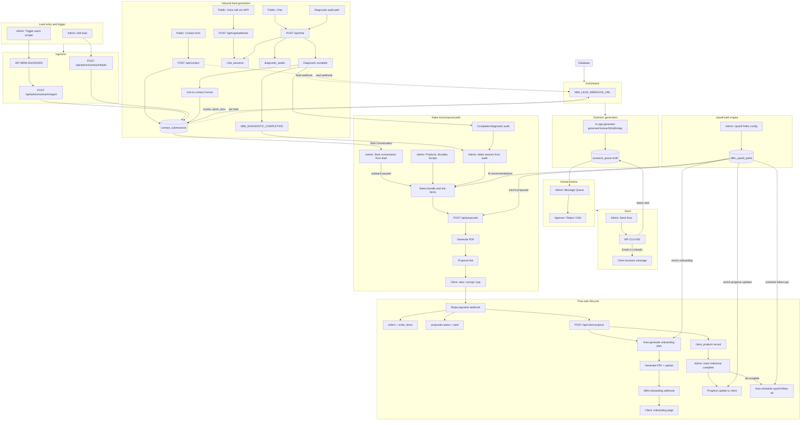
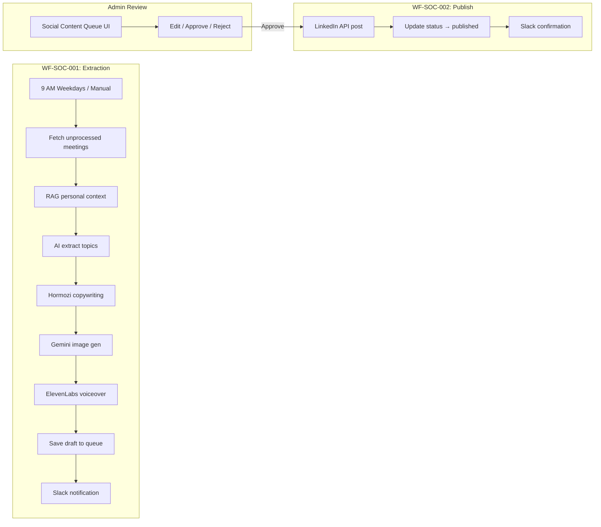

# Admin / Sales Lead Pipeline SOP

Welcome! This is the **single source of truth** for admin and sales associates at Amadutown. It covers every operator-facing procedure — from triggering a scrape to closing a deal and delivering post-sale. Use the table of contents below to jump to any section.

> **Related docs:** Technical integration details live in [warm-lead-workflow-integration.md](./warm-lead-workflow-integration.md). For audit-to-sales data mapping, see [audit-inputs-and-client-data.md](./audit-inputs-and-client-data.md).

---

## Table of Contents

1. [End-to-End Process Diagram](#1-end-to-end-process-diagram)
2. [Data You Input and Where It Goes](#2-data-you-input-and-where-it-goes)
3. [Behind the Scenes: Lead Pipeline](#3-behind-the-scenes-lead-pipeline)
4. [Inbound Lead Generation Workflows](#4-inbound-lead-generation-workflows)
5. [Behind the Scenes: Sales and Proposals](#5-behind-the-scenes-sales-and-proposals)
6. [Configuring Sales Assets](#6-configuring-sales-assets)
7. [Researching Pricing Models](#7-researching-pricing-models)
8. [Sales Scripts and Dynamic Steps](#8-sales-scripts-and-dynamic-steps)
9. [Post-Sale: Payment to Delivery](#9-post-sale-payment-to-delivery)
10. [Follow-Up Sequences](#10-follow-up-sequences)
11. [Workflow Reference Table](#11-workflow-reference-table)
12. [Human-in-the-Loop Summary](#12-human-in-the-loop-summary)
13. [Voice Channel (VAPI Integration)](#13-voice-channel-vapi-integration)
14. [Other Admin Tools](#14-other-admin-tools)
15. [Social Content Pipeline](#15-social-content-pipeline)
16. [Real App Screenshots](#16-real-app-screenshots)
17. [Quick Reference](#17-quick-reference)

---

## 1. End-to-End Process Diagram

The diagram below covers lead entry, inbound leads, enrichment, outreach, human review, send, sales and proposal path, and **post-sale lifecycle** (payment → client project → onboarding → progress updates). It also includes the **voice channel** (VAPI) and where **sales assets** (products, bundles, scripts) are configured.

```mermaid
flowchart TB
  subgraph inbound [Inbound lead generation]
    ContactForm[Public: Contact form]
    Chat[Public: Chat]
    VoiceCall[Public: Voice call via VAPI]
    Diagnostic[Diagnostic audit path]
    ContactAPI[POST /api/contact]
    ChatAPI[POST /api/chat]
    VapiWebhook[POST /api/vapi/webhook]
    ContactForm --> ContactAPI
    Chat --> ChatAPI
    VoiceCall --> VapiWebhook
    Diagnostic --> ChatAPI
    VapiWebhook --> ChatSessions[chat_sessions]
    ContactAPI --> CS
    ChatAPI --> ChatSessions
    ChatAPI --> DiagAudits[diagnostic_audits]
    DiagComplete[Diagnostic complete]
    ChatAPI --> DiagComplete
    DiagComplete --> LinkContact[Link to contact if email]
    DiagComplete --> CompletionWebhook[N8N_DIAGNOSTIC_COMPLETION]
  end

  subgraph entry [Lead entry and trigger]
    ManualAdd[Admin: Add lead]
    Trigger[Admin: Trigger warm scrape]
  end

  subgraph ingest [Ingestion]
    IngestAPI[POST /api/admin/outreach/ingest]
    LeadsAPI[POST /api/admin/outreach/leads]
    ManualAdd --> LeadsAPI
    Trigger --> WRM[WF-WRM-001/002/003]
    WRM --> IngestAPI
  end

  subgraph storage [Database]
    CS[(contact_submissions)]
    IngestAPI --> CS
    LeadsAPI --> CS
  end

  LinkContact --> CS
  DiagComplete -.->|lead webhook| LeadWebhook
  ContactAPI -.->|lead webhook| LeadWebhook

  subgraph enrichment [Enrichment]
    LeadWebhook[N8N_LEAD_WEBHOOK_URL]
    CS -.->|per lead| LeadWebhook
    LeadWebhook -->|scores, quick_wins| CS
  end

  subgraph outreach_gen [Outreach generation]
    InAppGen[In-app generator<br/>generateOutreachDraftInApp]
    InAppGen --> OQ[(outreach_queue draft)]
  end

  subgraph human_review [Human review]
    Queue[Admin: Message Queue]
    Approve[Approve / Reject / Edit]
    Queue --> Approve
    OQ --> Queue
  end

  subgraph send [Send]
    SendBtn[Admin: Send Now]
    CLG003[WF-CLG-003]
    SendBtn --> CLG003
    CLG003 -->|Email or LinkedIn| ClientOutreach[Client receives message]
    CLG003 -->|status sent| OQ
  end

  subgraph sales_path [Sales and proposal path]
    SalesAssets[Admin: Products, Bundles, Scripts]
    CompletedAudit[Completed diagnostic audit]
    SalesSessionFromAudit[Admin: Sales session from audit]
    ConversationFromLead[Admin: Start conversation from lead]
    Bundle[Select bundle and line items]
    ProposalAPI[POST /api/proposals]
    CompletionWebhook --> SalesSessionFromAudit
    CompletedAudit --> SalesSessionFromAudit
    CS -->|Start Conversation| ConversationFromLead
    ConversationFromLead -->|outreach paused| Bundle
    SalesAssets --> Bundle
    SalesSessionFromAudit --> Bundle
    Bundle --> ProposalAPI
    ProposalAPI --> PDF[Generate PDF]
    PDF --> ProposalLink[Proposal link]
    ProposalLink --> ClientProposal[Client: view / accept / pay]
  end

  DiagComplete --> CompletedAudit
  entry --> ingest
  storage --> enrichment
  enrichment --> outreach_gen
  human_review --> send

  subgraph upsellPaths [Upsell path engine]
    UpsellDB[(offer_upsell_paths)]
    UpsellAdmin[Admin: Upsell Paths config]
    UpsellAdmin --> UpsellDB
  end

  subgraph postSale [Post-sale lifecycle]
    StripeWebhook[Stripe payment webhook]
    OrderCreated[orders + order_items]
    ProposalPaid[proposals.status = paid]
    CreateProject[POST /api/client-projects]
    ClientProject[client_projects record]
    OnboardingPlan[Auto-generate onboarding plan]
    OnboardingPDF[Generate PDF + upload]
    OnboardingEmail[N8N onboarding webhook]
    ClientOnboarding[Client: onboarding page]
    MilestoneComplete[Admin: mark milestone complete]
    ProgressUpdate[Progress update to client]
    UpsellFollowUp[Auto-schedule upsell follow-up]
    ClientProposal --> StripeWebhook
    StripeWebhook --> OrderCreated
    StripeWebhook --> ProposalPaid
    StripeWebhook --> CreateProject
    CreateProject --> ClientProject
    CreateProject --> OnboardingPlan
    OnboardingPlan --> OnboardingPDF
    OnboardingPDF --> OnboardingEmail
    OnboardingEmail --> ClientOnboarding
    ClientProject --> MilestoneComplete
    MilestoneComplete --> ProgressUpdate
    MilestoneComplete -->|all complete| UpsellFollowUp
  end

  UpsellDB -->|enrich proposals| ProposalAPI
  UpsellDB -->|enrich onboarding| OnboardingPlan
  UpsellDB -->|enrich progress updates| ProgressUpdate
  UpsellDB -->|schedule follow-ups| UpsellFollowUp
  UpsellDB -->|AI recommendations| Bundle
```

**Subgraph summary:**

- **Inbound:** Contact form, AI Readiness Scorecard (Resources page), chat, and voice (VAPI) create or link to contacts and diagnostics; diagnostic completion triggers lead webhook and diagnostic-completion webhook.
- **Entry / Ingest:** Manual add uses Leads API; trigger starts scrapers that POST to ingest API; both write to `contact_submissions`.
- **Enrichment:** Lead webhook runs per lead (from add, edit re-run, contact form, or diagnostic completion); n8n can update scores/quick_wins on the contact.
- **Outreach gen:** Drafts are generated **in-app** (`generateOutreachDraftInApp` in `lib/outreach-queue-generator.ts`) using DB system prompts, Pinecone RAG voice, and prior-correspondence context, then written to `outreach_queue` as `status: draft`. Sequence-driven rows store **`context_meeting_record_id`** (and dedupe on contact + channel + `sequence_step` + **template** + that meeting) so you can have separate drafts per meeting and per email template; if a matching draft already exists, the API returns **200** with `outcome: 'existing'` and an **`openDraftUrl`** instead of blocking with an error. Optional body **`meeting_record_id`** scopes which meeting to use. Admin triggers via **Generate Email** / **Draft in app** on a lead (§3); the auto-follow-up branch of WF-CLG-003 re-enters the same generator via `/api/webhooks/n8n/outreach-followup-trigger`. WF-CLG-002 (the legacy n8n outreach generator) was retired 2026-04-27.
- **Human review / Send:** Admin approves or edits in Message Queue; "Send Now" calls WF-CLG-003 to send email or LinkedIn and update status.
- **Sales path:** Admin configures products, bundles, and scripts; runs sales session from a completed audit **or starts a conversation directly from a lead** (no audit required). Outreach is automatically paused when a conversation starts. Admin selects bundle and line items; generates proposal; client gets link and pays.
- **Upsell path engine:** Admin configures decoy-to-premium upgrade pairings with two-touch prescription scripts (point-of-sale and point-of-pain). These feed into proposals (optional add-ons), onboarding plans (upgrade milestone), AI recommendations, progress updates (signal matching), pricing page (comparison context), and follow-up scheduling.
- **Post-sale:** Stripe webhook creates order, marks proposal paid, and calls `/api/client-projects`; app creates client project, onboarding plan, PDF, and fires onboarding webhook; admin tracks milestones and sends progress updates to the client. When all milestones are complete, the system auto-schedules upsell follow-up tasks based on `next_problem_timing` from matching upsell paths.

[Back to top](#table-of-contents)

---

## 2. Data You Input and Where It Goes

### Add lead / Edit lead

- **Where:** Admin → Lead Pipeline → All Leads → Add lead (or Edit on a row).
- **Inputs:** Name (required), Email, Company, Company website (domain), LinkedIn URL, Job title, Industry, Location, Phone, Message/notes, How did you get this lead? (input_type). Optional **Value Evidence** section (collapsible): Company size, Quick wins, Known pain points — these are stored and pre-fill the unified Lead modal when pushing to the value evidence pipeline.
- **Stored in:** `contact_submissions`. Deduplication by email, LinkedIn URL, or LinkedIn username.
- **Side effect:** On create (and on edit when "Re-run enrichment" is checked), the app calls the lead qualification webhook (`N8N_LEAD_WEBHOOK_URL`) with the lead payload. n8n may write back to `contact_submissions` (e.g. lead_score, quick_wins).

### Trigger warm scraping

- **Where:** Admin → Outreach Dashboard → Trigger Warm Lead Scraping.
- **Inputs:** Source (facebook | google_contacts | linkedin | all), options (e.g. max_leads per source).
- **Trigger:** App calls `triggerWarmLeadScrape()` → N8N_WRM001/002/003 webhooks. Scrapers POST to `/api/admin/outreach/ingest` with Bearer `N8N_INGEST_SECRET`; the app does not write leads directly.

### Message Queue actions

- **Approve / Reject / Edit:** PATCH `/api/admin/outreach` — updates `outreach_queue` status and optionally subject/body.
- **Send Now:** POST `/api/admin/outreach/[id]/send` — loads item and contact, POSTs to `N8N_CLG003_WEBHOOK_URL` with outreach_id, contact_submission_id, channel, subject, body, sequence_step, contact. n8n sends the message and updates `outreach_queue` (e.g. sent_at, status) and `contact_submissions.outreach_status`.
- **Open in Gmail (email only):** On draft or approved **email** rows, the external-link action opens **Gmail web compose** in a new tab with **To** (lead email), **Subject**, and **Body** pre-filled. If the body is too long for a URL, the app opens compose with To + Subject only and **copies the body to the clipboard** so you can paste it. No server call; you send from your own Gmail session. Requires the lead to have an email on the contact. If Google asks you to sign in first, use **Gmail sign-in** in the queue filters row (opens `mail.google.com` in a new tab).
- **Email copy to inbox (draft + approved, all channels):** POST `/api/admin/outreach/[id]/email-draft-to-inbox` — admin-only. Sends a copy of the queue item (lead context + subject + body) to the **Supabase account email** of the signed-in admin. Uses the shared transactional email stack: Resend when configured, otherwise Gmail SMTP (`GMAIL_USER` + `GMAIL_APP_PASSWORD`). The client-facing sender/reply-to identity comes from `BUSINESS_FROM_EMAIL` and `BUSINESS_REPLY_TO_EMAIL`, not the transport credential. Optional JSON body `{ subject?, body? }` uses those strings when present so unsaved edits in the editor are reflected in the copy. Returns **503** if no transactional provider is configured; **400** if the admin user has no email on file. Logs `contact_communications` with `admin_inbox_copy` metadata.
- **My Gmail (OAuth, per admin):** **Connect my Gmail** starts Google OAuth (`GET /api/admin/oauth/google-gmail/start` returns `{ url }`; callback `GET /api/admin/oauth/google-gmail/callback`). Stores an **encrypted refresh token** in **`admin_gmail_user_credentials`** (one row per `auth.users` id). Scopes: **gmail.compose** + **userinfo.email**. Env: **`GOOGLE_GMAIL_OAUTH_CLIENT_ID`**, **`GOOGLE_GMAIL_OAUTH_CLIENT_SECRET`**, **`GOOGLE_GMAIL_OAUTH_REDIRECT_URI`** (must match Google Cloud Console exactly), **`GMAIL_USER_OAUTH_SECRET`** (min 24 chars — encrypts tokens and signs OAuth `state`). **Disconnect** → `DELETE /api/admin/oauth/google-gmail/disconnect`. **Save to my Gmail** (draft icon on **email** rows when connected): `POST /api/admin/outreach/[id]/gmail-user-draft` — creates a **draft in that admin’s Gmail** (To = lead email) via Gmail API; optional `{ subject?, body? }` for unsaved editor text. **400** if not connected or lead has no email; **503** if OAuth env not configured.
- **Draft in app (All Leads, primary path):** POST `/api/admin/outreach/leads/[id]/generate-in-app` — admin-only. Uses OpenAI with the same DB template **`email_cold_outreach`** (Saraev tokens: `{{research_brief}}`, `{{social_proof}}`, `{{sender_name}}`, `{{#meeting_action_items}}…{{/meeting_action_items}}`) as the primary n8n path, builds the research brief from `contact_submissions` + latest completed diagnostic + latest value report (shared with delivery-email context), and optionally appends **Recent meeting context** from the latest `meeting_record` for that lead (or an optional capped `meeting_summary` in the body). For **sequence step 1 only**, open `meeting_action_tasks` rows with `task_category='outreach'` attributed to this contact are surfaced via the `{{meeting_action_items}}` block so the email can reference real commitments. Inserts `outreach_queue` with `status: draft`, `channel: email`, `generation_prompt_summary: in_app:email_cold_outreach`, and `source_task_id` when generated from a task. Requires **`OPENAI_API_KEY`**. If a draft already exists for the same lead + sequence step + email channel + `source_task_id`, returns **409** unless `force: true`. Disable without deploy: set **`ENABLE_IN_APP_OUTREACH_GEN=false`**. **Parity note:** WF-CLG-002 may add different enrichment steps; wording can differ between n8n and in-app even when both use `email_cold_outreach`.

### Meeting action tasks

- **Where:** Admin → Meetings (`/admin/meetings`) → row **View tasks** or **View transcript**; Admin → Meeting Action Tasks (`/admin/meeting-tasks`) with optional query params `?meeting_record_id=<id>` or `?contact_submission_id=<id>`.
- **Inputs / actions:** Edit task (title, owner, due date, status), **Attribute to contact** (sets `contact_submission_id`), **Category** (`internal` | `outreach` — inferred by heuristic during promote; editable), **Send to outreach** (generates an in-app cold draft for the attributed contact and backlinks the task via `outreach_queue_id`).
- **Attribution cascade:** When admin sets or changes the lead on a meeting via `PATCH /api/meetings/[id]/assign-lead`, all promoted `meeting_action_tasks` on that meeting are updated in three branches: (a) **newly attributed** — backfill `contact_submission_id` for tasks that previously had none; (b) **reassigned** — update tasks that still match the previous meeting contact (manually retargeted tasks keep their custom attribution); (c) **unlinked** — clear `contact_submission_id` on tasks that matched the previous contact. This is the fastest way to fan out attribution across all action items from a meeting.
- **Send to outreach:** POST `/api/meeting-action-tasks/[id]/send-to-outreach` — admin-only. Validates task has `contact_submission_id` set and is not `complete`/`cancelled`. Idempotent: if `outreach_queue_id` is already linked (or a draft with `source_task_id = task.id` exists but isn't linked), returns that draft instead of regenerating. Inserts into `outreach_queue` with `source_task_id = task.id`. Requires **`OPENAI_API_KEY`** and **`ENABLE_IN_APP_OUTREACH_GEN`** (default on). Returns **404** for missing task, **400** for orphan (no `contact_submission_id`), **409** for terminal-status tasks, **503** when in-app generation is disabled.
- **Auto-complete on send:** The DB trigger `trg_complete_task_on_outreach_sent` marks the task `complete` with a `completed_at` timestamp the moment its linked `outreach_queue` row transitions to `status = 'sent'`. No admin action required.
- **Cross-links from All Leads:** Expanding a lead row in Admin → Outreach → All Leads shows the **Meeting action items attributed to this lead** panel (up to 6, with open/total counts, category + draft badges, and **Manage →** to the filtered task list).

### Proposal

- **Inputs:** sales_session_id, client_name, client_email, client_company, bundle_id, bundle_name, line_items (content_type, content_id, title, description, offer_role, price, perceived_value), subtotal, discount_amount, discount_description, total_amount, valid_days, optional value_report_id.
- **Stored:** `proposals`. PDF is generated and uploaded to Supabase Storage; `pdf_url` and proposal link are returned. Client receives the link (e.g. `/proposal/[id]`) and can view PDF and accept/pay.

### Value evidence

- **Where:** Admin → **Value Evidence** (`/admin/value-evidence`). The **Dashboard** tab has **Run Full Pipeline**, **Cancel Pipeline**, and status chips for **Internal** (WF-VEP-001, internal evidence) and **Social** (WF-VEP-002, social listening). In **local development**, a third control shows **Cloudflare tunnel** status so you can confirm n8n callbacks can reach your machine (counted as **phase 3 of 3** together with Internal + Social; in production without that pill, phases are **2** — Internal and Social only).
- **Reading the UI:** Each chip shows **phase X of Y** next to the name (e.g. Internal **1/3**, Social **2/3** in dev). Open a chip while a run is active to see **Phase … of …** plus **Step N of M** and the current task label for **that workflow** (e.g. Social listening has multiple steps from scraping through finalizing). The **percentage** on the bar is an **estimate for the current workflow step**, not “percent of the whole admin product.” The top **tabs** (Dashboard, Pain Points, Market Intel, Benchmarks, Calculations, Reports) are **places to review data** — they are **not** sequential pipeline steps.
- **Trigger:** From the Value Evidence UI, admin triggers WF-VEP-001 or WF-VEP-002 (webhook env: **N8N_VEP001_WEBHOOK_URL**, **N8N_VEP002_WEBHOOK_URL**). Results are POSTed to `/api/admin/value-evidence/ingest` (and ingest-market for social listening). No lead data entered by admin in this bulk flow; workflows use diagnostics/contacts or external sources.

### Pushing leads to the value evidence pipeline

- **Where:** Admin → Lead Pipeline → **All Leads**.
- **Steps:** Select one or more leads (checkboxes; "Select all on this page" available). Click **Push to Value Evidence**. The same **unified Lead modal** opens for Edit, Push, and Retry — with Lead details (name, email, company, etc.) and Value Evidence (pain points, quick wins, company size). Pre-populated from the database. Edit as needed, then click **Save changes** to persist edits, or **Push to Value Evidence** to push to the extraction pipeline.
- **Result:** The app persists enrichment to `contact_submissions`, sets push status to “pending,” and triggers WF-VEP-001 with `contact_submission_ids` (and optional `enrichments`). When evidence is ingested, the app updates status to “success.” Lead cards show: **Evidence: N** (click to open evidence drawer), **Extracting...**, **Push may have failed**, **Push failed**, or **No evidence**. Use **Retry** or **Refresh evidence** per lead as needed. Evidence drawer shows pain point evidence and value reports; you can generate a report or refresh evidence from there.
- **Run progress and cancel:** Detailed workflow progress (internal extraction / social), **cancel pipeline**, and full run history live on **Admin → Value Evidence** (`/admin/value-evidence?tab=dashboard` — opens the dashboard tab; optional `&highlight=vep001` scrolls to the pipeline controls), not on the Lead Pipeline list. Use **Open Value Evidence** from All Leads when you need that view after queuing leads from here. On the dashboard, treat **Internal** and **Social** as **phases 1 and 2** of the value-evidence run bar; open either chip for **step-level** progress inside that workflow.
- **Prerequisite for “Suggest from Evidence” pricing:** The `content_pain_point_map` table must map products/services to pain points. If it is empty, suggest-from-evidence will return an error; value reports and proposal value assessments still work.

[Back to top](#table-of-contents)

---

## 3. Behind the Scenes: Lead Pipeline

1. **Trigger** — Admin clicks Trigger (or n8n runs on schedule). App calls warm-lead webhooks (WF-WRM-001/002/003).
2. **Scraping** — n8n scrapes Facebook / Google Contacts / LinkedIn and POSTs to `/api/admin/outreach/ingest` with `N8N_INGEST_SECRET`. App deduplicates and inserts into `contact_submissions`.
3. **Enrichment** — For each new or re-enriched lead, the app (or n8n) calls `N8N_LEAD_WEBHOOK_URL`. The workflow does company lookup, scoring, etc., and may update `contact_submissions`.
4. **Outreach generation (in-app)** — Admin clicks **Generate Email** / **Draft in app** on a lead → `POST /api/admin/outreach/leads/[id]/generate-in-app` runs `generateOutreachDraftInApp` (LLM dispatch + DB system prompts + Pinecone voice + prior-correspondence context) and inserts a row into `outreach_queue` with `status: draft`. The auto-follow-up branch of WF-CLG-003 re-enters the same generator via `/api/webhooks/n8n/outreach-followup-trigger` (Bearer `N8N_INGEST_SECRET`).
   - **Status pill behavior:** `last_n8n_outreach_status` is set to **pending** when generation starts and flips to **success** on the `outreach_queue` insert (via `trg_outreach_queue_mark_n8n_success` trigger) or **failed** when the generator throws / is gated. WF-CLG-002 and `/api/webhooks/n8n/outreach-generation-complete` were retired 2026-04-27.
5. **Human review** — Admin opens `/admin/outreach` (Message Queue tab), approves/rejects/edits drafts. For **email** drafts or approved items, admin can **Open in Gmail** to pre-fill Gmail compose (or paste body if the link was too long).
6. **Send** — Admin clicks "Send Now" on an approved item. App POSTs to WF-CLG-003 with the message and contact; n8n sends email or LinkedIn and updates queue and contact status.

**Key env vars (names only):** `N8N_LEAD_WEBHOOK_URL`, `N8N_CLG003_WEBHOOK_URL`, `N8N_WRM001_WEBHOOK_URL`, `N8N_WRM002_WEBHOOK_URL`, `N8N_WRM003_WEBHOOK_URL`, `N8N_INGEST_SECRET`, `OPENAI_API_KEY` / `ANTHROPIC_API_KEY` (in-app drafts; provider chosen via `system_prompts.config.model`), `ENABLE_IN_APP_OUTREACH_GEN` (optional; set `false` to disable in-app generation).

[Back to top](#table-of-contents)

---

## 4. Inbound Lead Generation Workflows

### Contact form (website)

Visitor submits the form (name, email, company, domain, LinkedIn, message, etc.). The app inserts a row into **contact_submissions** (direct insert, no ingest API), then asynchronously calls **triggerLeadQualificationWebhook** with source `portfolio_contact_form` and the submission id. So: **Website contact form → contact_submissions → N8N_LEAD_WEBHOOK_URL**. The lead appears in Lead Pipeline → All Leads like any other; enrichment and outreach generation follow the normal flow.

### AI Readiness Scorecard (Resources page)

Visitor completes the **AI Readiness Scorecard** on the Resources page (`/resources`): answers a few questions, gets a score (0–10), then enters email (and optionally name) to unlock the full result. The app upserts **contact_submissions** with `lead_source: website_form`, `submission_source: scorecard`, and `ai_readiness_score` (0–10); optional `full_report` stores the answer payload as JSON. The app then asynchronously calls **triggerLeadQualificationWebhook** with source `scorecard` and `aiReadinessScore` so the n8n workflow can use it for routing or scoring. So: **Resources page Scorecard → contact_submissions (submission_source scorecard) → N8N_LEAD_WEBHOOK_URL**. These leads appear in Lead Pipeline → All Leads; filter or identify by submission_source or ai_readiness_score as needed.

### Chat and diagnostic path

Visitor uses the site chat. If they enter diagnostic/audit mode, the app creates or updates **chat_sessions** and **diagnostic_audits**. Messages in diagnostic mode are sent to n8n via the diagnostic webhook; n8n returns the next question or completion with diagnostic data. When the diagnostic **completes** (n8n returns isComplete + diagnosticData):

1. The app resolves an email from the **visitor email** (if provided) or from the **signed-in user’s account** (Supabase Auth). If an email is available, it **finds or creates** a **contact_submissions** row (normalized email, deduplicated) and **links** the audit (`diagnostic_audits.contact_submission_id`).
2. If a contact was linked, it calls **triggerLeadQualificationWebhook** with source `chat_diagnostic` and diagnostic summary.
3. It calls **triggerDiagnosticCompletionWebhook** (N8N_DIAGNOSTIC_COMPLETION_WEBHOOK_URL) with diagnosticAuditId, diagnosticData, and contact info for sales follow-up.

**Audit summary (Gamma) deck:** The **Next.js app** auto-generates an `audit_summary` row in **gamma_reports** (and calls the Gamma API) when an audit is **completed** and has a **contact_submission_id**—including after link-on-completion in chat. **Do not** add a duplicate Gamma-generation step in n8n on diagnostic completion; the diagnostic-completion webhook is for sales/ops notifications and enrichment only, not for creating `gamma_reports`.

**Where admin sees inbound:** Inbound contacts appear in **Lead Pipeline → All Leads**. Completed **diagnostic_audits** are visible from the **Sales Dashboard**; admin can open a **sales session** tied to a diagnostic (`/admin/sales/[auditId]`) and run the walkthrough (scripts, bundle, proposal). So: **Visitor → contact form and/or chat/diagnostic → contact_submissions + diagnostic_audits → lead webhook + diagnostic completion webhook → admin sees leads and audits → sales session from audit → proposal**.

**Note:** Chat/diagnostic can create a lead via find-or-create when email is known (visitor or signed-in). If there is no email, the audit can still complete; no contact link runs until email exists (soft gate for Gamma and lead webhooks that require a contact).

### Chat escalations (request human / inadequate response)

When the chatbot cannot adequately respond or the user asks to be contacted by a person, the app creates a **chat_escalations** row (source of truth), optionally links it to a lead by matching **visitor_email** to **contact_submissions**, and notifies Slack if **SLACK_CHAT_ESCALATION_WEBHOOK_URL** is set. Escalations are visible in **Lead Pipeline → Escalations** tab (no new dashboard card). From the list, open an escalation to view transcript and link/unlink to a lead. On lead detail (All Leads → expand a lead), **Chat escalations for this contact** lists escalations linked to that lead. Chat Eval continues to show escalated sessions (e.g. "Escalated" badge); the Escalations tab is for acting on them (link to lead, follow up).

### Standalone audit tool (same diagnostic data, different entry)

Visitors can complete the **AI & Automation Audit** form at **/tools/audit** without using chat. The app creates a **diagnostic_audits** row (`audit_type = 'standalone'`) and saves the same six categories (business challenges, tech stack, automation needs, AI readiness, budget & timeline, decision making). When all six sections are submitted, the audit is marked **completed** only after a **contact_submissions** link exists: email from the first step **or** the signed-in user’s account email is used to find-or-create the contact (DB enforces `contact_submission_id` for completed standalone audits). **urgency_score** and **opportunity_score** are computed on completion. The app may auto-create an **audit_summary** Gamma deck tied to that contact. These audits appear on the **Sales Dashboard** alongside chat and in-person diagnostics; admin can open any of them to start a sales session (`/admin/sales/[auditId]`). For a full map of **how audit and other client inputs tie into sales and where they are used in the codebase**, see **[audit-inputs-and-client-data.md](./audit-inputs-and-client-data.md)**.

[Back to top](#table-of-contents)

---

## 5. Behind the Scenes: Sales and Proposals

### Two entry points into a sales session

1. **Diagnostic → sales session:** From the Sales Dashboard, admin opens a completed diagnostic and starts a sales session (`/admin/sales/[auditId]`). The session is linked to the audit and the contact.
2. **Lead → conversation (no audit):** From the Leads page, click **"Start Conversation"** on any lead. This creates a new `sales_session` with `contact_submission_id` set and `diagnostic_audit_id = null`, then redirects to `/admin/sales/conversation/[sessionId]`. The conversation page has the same walkthrough (script, products, objections, proposal) but without diagnostic sections or AI insights.

### Lifecycle linking

- `sales_sessions.contact_submission_id` links the session to the lead (contact_submissions).
- `sales_sessions.client_project_id` links the session to the client project after conversion.
- When a conversation starts from a lead, `contact_submissions.outreach_status` is set to `'in_conversation'`, pausing any outreach sequences.

### Outreach pause and resume

- **Pause:** Automatic when "Start Conversation" is clicked (sets `outreach_status = 'in_conversation'`).
- **Resume:** When the session outcome is updated to `converted`, `lost`, or `deferred`, the outreach status can be cleared or updated (manual or via future automation).

### Loss reason tracking

When the session **outcome** is set to **"Lost"**, a **loss_reason** dropdown appears with options: Price Too High, Bad Timing, Feature Gap, Chose Competitor, No Budget, No Need, Ghosted, Other. This data feeds the **Sales Funnel Analytics** dashboard (`/admin/analytics/funnel`) and its loss-reason breakdown.

### Multi-session

- Each "Start Conversation" click creates a **new** session (no reuse). The lead card shows the session count and links to the latest session.

### Sales dashboard

- The Sales Dashboard (`/admin/sales`) shows **two sections**: audit-based leads (from completed diagnostics) and **active conversations** (sessions without a diagnostic audit). Both link to their respective walkthrough pages.

### In-person diagnostic

- During a conversation (no prior online diagnostic), the sales rep can fill in diagnostic data using the **In-Person Diagnostic** panel on the left side of the conversation page.
- The panel has 6 collapsible categories matching the online diagnostic: Business Challenges, Tech Stack, Automation Needs, AI Readiness, Budget & Timeline, Decision Making.
- **Save Progress** saves the data to a new `diagnostic_audits` record (with a synthetic session ID) and links it to the `sales_session`.
- **Generate Insights** calls `POST /api/admin/sales/in-person-diagnostic/generate-insights` which uses GPT-4o-mini to produce a diagnostic summary, key insights, recommended actions, urgency score, and opportunity score.
- **Mark Complete** sets the audit status to `completed`.
- Once diagnostic data is saved, the **script generation** (`/api/admin/sales/generate-step`) receives the audit data and personalizes talking points, discovery questions, and closing strategies based on the client's challenges, budget, timeline, and decision-making context.
- As the rep fills in more categories during the call, they can save and the next generated script step will incorporate the new data.

### Bundles, line items, and proposals

- **Bundles and line items:** Admin selects an offer bundle and content (products/services) as line items. "Generate proposal" opens the proposal modal (client name, email, company, discount, valid days, **value report**). In the modal, choose a **Value Report** from the dropdown (lists reports for the current contact); the report’s value assessment is attached to the proposal. Then POST to `/api/proposals` with line items and optional `value_report_id`. Line items are built from the selected content (content_type, content_id, title, description, offer_role, price, perceived_value). The client-facing proposal page shows the value assessment section when a value report was attached.
- **Upsell add-ons:** When a proposal is created, the system automatically checks each line item against `offer_upsell_paths`. If a matching upsell path exists, it is attached as an optional add-on (`upsell_addons` JSONB column on proposals) with the upsell title, description (next problem), price, perceived value, risk reversal, and credit note. These are presented as "Recommended" optional items on the proposal.
- **Proposal output:** PDF is generated and stored; proposal link is returned. Admin shares the link with the client. Client sees `/proposal/[id]`, can view PDF and accept (Stripe checkout). After payment, the Stripe webhook creates the order, marks the proposal paid, and calls `POST /api/client-projects` to create the client project and onboarding (see Post-sale section).
- **Reports and documents:** After generating a proposal, admin can attach extra PDFs (e.g. strategy report, opportunity quantification) from the same conversation page: under **Convert to Proposal**, open **Reports & documents** → **Attach report or document (PDF)**. Choose title, type (Strategy Report, Opportunity Quantification, Proposal Package, Other), and upload a PDF. Attached documents appear on the client’s proposal page and in the client portal after payment. Use the move-up/move-down controls to change order; use the trash icon to remove one.

### Stack-aware feasibility snapshot (v1, flag: `FEASIBILITY_ASSESSMENT_ENABLED`)

When a Gamma **implementation strategy** or **offer presentation** deck is generated, or a proposal is created from a bundle, a deterministic feasibility assessment is computed and snapshotted:

- **Inputs:** Per-asset tech stack declarations from `content_offer_roles.tech_stack`, our canonical platform stack (`lib/constants/our-tech-stack.ts`), and the client's merged tech stack (precedence: admin-verified > audit self-report > BuiltWith).
- **Output:** Stored on `gamma_reports.feasibility_assessment` (for decks) and `proposals.feasibility_assessment` (for proposals). Contains per-item fit kinds (`match` / `integrate` / `gap` / `replace`), effort (`small` / `medium` / `large`), `overall_feasibility`, open tradeoffs, and a human summary.
- **Deck rendering:** Three slides appended to implementation strategy / offer presentation decks — Stack Fit, Effort & Complexity, Tradeoff Decisions — plus a fenced JSON block and anti-fabrication clause so the LLM uses the structured data verbatim.
- **Client rendering:** The proposal view at `/proposal/[code]` shows an **Implementation Fit** section with client-safe labels ("Already on your stack", "Connects with", "We'll set up") and the overall fit / estimated scope. Internal fields (raw conflicts, integration methods) are stripped server-side by `projectForClient`.

### Admin-verified tech stack (conflict reconciliation + BuiltWith credits)

- **Where:** `Admin → Sales → [auditId]` → **Client tech stack (admin-verified)** section in the sidebar.
- **Credit badge:** Reads `website_tech_stack.creditsRemaining` (captured when the admin runs the BuiltWith lookup on the outreach page). Red pill when `0`; amber under `25`; emerald otherwise; `unknown` for legacy rows without a captured value.
- **Conflict reconciliation:** When BuiltWith and the audit self-report disagree within a category (e.g. different CMS), a radio row is shown per category: **BuiltWith only**, **Audit only**, or **Merge both**. A manual-override textarea accepts one `name:tag` per line for additions not in either source.
- **Save:** Writes a canonical list to `contact_submissions.client_verified_tech_stack` (`{ technologies, resolved_at, resolved_by }`) via `PATCH /api/admin/contact-submissions/[id]/verified-tech-stack`. The feasibility engine then treats the verified list as the source of truth, overriding the other sources.
- **Regeneration:** Re-generate the Gamma deck or re-create the proposal to refresh the snapshot with the new verified stack.

[Back to top](#table-of-contents)

---

## 6. Configuring Sales Assets

Before sales sessions and proposals work correctly, these admin tools must be set up.

### Product Classification

- **Where:** Admin → Sales → Products (`/admin/sales/products`).
- **Purpose:** Assign **offer roles** (core_offer, bonus, upsell, downsell, continuity, lead_magnet, decoy, anchor) and **content types** (product, project, video, publication, music, lead_magnet, prototype, service) to existing content items. Filter by role, type, and search. Preview the "Grand Slam Offer" stack. The same ProductClassifier component powers "Suggest from Evidence" pricing in the sales walkthrough.

### Bundle Management

- **Where:** Admin → Sales → Bundles (`/admin/sales/bundles`).
- **Purpose:** Create, edit, duplicate, and delete **offer bundles**. Each bundle has a name, list of items (with roles and pricing), and calculated totals. Bundles are what get selected in the sales walkthrough and become proposal line items.

### Sales Script Management

- **Where:** Admin → Sales → Scripts (`/admin/sales/scripts`).
- **Purpose:** Create and edit **sales scripts** with structured steps (title, talking points, actions), objection handlers (trigger, response, category), and success metrics. Scripts are typed by **offer_type** (attraction, upsell, downsell, continuity, core, objection) and **target funnel stage** (prospect, interested, informed, converted, active, upgraded). The sales session page loads scripts and uses them in the guided walkthrough; the generate-step API adapts steps to the current client/audit.

### Upsell Path Management (Two-Touch Prescription Model)

- **Where:** Admin → Sales → Upsell Paths (`/admin/sales/upsell-paths`).
- **Purpose:** Configure **decoy-to-premium upgrade pairings** using a two-touch prescription model inspired by Alex Hormozi's $100M Offers framework. Each upsell path defines:
  - **Source offer** (content_type, content_id, tier_slug) — the initial/decoy offer the client purchased.
  - **Next problem** — the predicted pain point the client will experience after using the source offer.
  - **Timing** (next_problem_timing) — when the pain point typically surfaces (e.g. "2-4 weeks").
  - **Signals** (next_problem_signals) — observable indicators that the client is hitting the predicted pain point (used by progress update signal matching).
  - **Upsell offer** (content_type, content_id, tier_slug) — the premium solution that solves the next problem.
  - **Point-of-sale steps** — script steps for prescribing the upsell at the time of the initial sale.
  - **Point-of-pain steps** — script steps for re-offering the upsell when the client experiences the predicted friction.
  - **Value frame** — the positioning statement for the incremental investment.
  - **Risk reversal** — guarantee or safety net for the upsell.
  - **Credit policy** — whether the initial investment applies as credit toward the upgrade, and the credit note text.
- **How it integrates (seven touchpoints):**
  1. **Sales scripts / AI recommendations:** The AI recommendation engine (`/api/admin/sales/ai-recommend`) fetches active upsell paths and generates recommendations when the source offer is being presented.
  2. **Proposals:** When a proposal is created (`POST /api/proposals`), matching upsell paths are auto-attached as optional add-on line items (`upsell_addons` JSONB column).
  3. **Onboarding plans:** When an onboarding plan is generated, matching upsell paths add a "Recommended Upgrade Review" milestone at the end.
  4. **Progress updates:** When generating a client update draft, completed task titles/descriptions are matched against `next_problem_signals`; if a match is found, an upgrade recommendation is appended to the email.
  5. **Follow-up scheduling:** When all milestones are marked complete, the system auto-creates `meeting_action_tasks` with due dates based on `next_problem_timing`, containing the point-of-pain script summary.
  6. **Pricing page:** The decoy-vs-premium comparison on the public pricing page is enriched with `nextProblem`, `valueFrame`, `riskReversal`, and `creditNote` from matching upsell paths.
  7. **Sales conversation flow:** Scripts and talking points from upsell paths are available in the sales walkthrough context.
- **Database:** `offer_upsell_paths` table with RLS (admin full access, public read for active paths).
- **API:** Admin CRUD at `/api/admin/sales/upsell-paths` and `/api/admin/sales/upsell-paths/[id]`; public lookup at `/api/upsell-paths?source_content_type=...&source_content_id=...`.

[Back to top](#table-of-contents)

---

## 7. Researching Pricing Models

Pricing in the app is based on **company**, **industry**, and **what others pay** for similar services.

- **Company and industry context:** When a lead or sales session is linked to a contact, the system can use the lead’s **industry** and **company size** (e.g. from `contact_submissions`) to tailor pricing. This is passed to the suggest-pricing API via `contact_submission_id`, or manually via `industry` and `company_size` (`/api/admin/value-evidence/suggest-pricing`).
- **Benchmarks:** Reference data lives in **industry_benchmarks** (by industry and company size range): avg_hourly_wage, avg_deal_size, avg_employee_cost, etc. Value calculations use this to resolve the best match (exact industry+size → same industry → default). Pain point evidence and value_calculations feed into evidence-based suggested prices.
- **Where it’s used:** In the **sales walkthrough**, when building line items, the ProductClassifier shows a **"Suggest from Evidence"** button. It calls `POST /api/admin/value-evidence/suggest-pricing` with content_type, content_id, and optionally industry, company_size, or contact_submission_id. The API returns suggested retail price and perceived value; admin can **Apply** those to the line item.
- **Admin responsibilities:** Keep **industry benchmarks** and **value evidence** (pain points, evidence, calculations) up to date in the Value Evidence admin area so "Suggest from Evidence" and value reports stay accurate. Map pain points to content so suggest-pricing can compute anchor prices per product/service.

[Back to top](#table-of-contents)

---

## 8. Sales Scripts and Dynamic Steps

- **Storage:** `sales_scripts` table: name, description, offer_type, target_funnel_stage, script_content (JSONB with steps, talking_points, actions, objection_handlers).
- **Usage:** The sales session page loads scripts and uses them in the guided walkthrough. Dynamic steps are generated by `/api/admin/sales/generate-step` (context: audit, session, products, etc.) producing a step with talking points and actions. Scripts define "what to say" and "what to do" at each step; the generate-step API adapts them to the current client/audit.

[Back to top](#table-of-contents)

---

## 9. Post-Sale: Payment to Delivery

After the client accepts and pays the proposal, the following happens automatically and then continues with admin-driven milestone tracking.

### Stripe payment webhook

When the client completes Stripe checkout, the **Stripe webhook** (`/api/payments/webhook`) receives `checkout.session.completed`. If `proposalId` is in session metadata:

1. Creates **orders** and **order_items** from the proposal.
2. Updates **proposals** (status = paid, paid_at, order_id).
3. Updates **sales_sessions** (outcome = converted, actual_revenue) if linked.
4. Calls **POST /api/client-projects** with the proposal_id to create the client project and onboarding.

### Client project creation

**POST /api/client-projects** (called by the payment webhook or manually by admin):

1. Creates **client_projects** record (client_id, client_name, client_email, client_company, proposal_id, project_status, product_purchased, payment_amount, project_start_date, etc.).
2. Builds proposal and project context and calls **createOnboardingPlanForProject** to match an onboarding template and generate an **onboarding_plan** (milestones, communication_plan, warranty, artifacts_handoff).
3. Generates the **onboarding PDF** and uploads to Supabase Storage (`documents/onboarding-plans/[id].pdf`).
4. **Auto-generates a client dashboard** when one does not already exist: creates a **client_dashboard_access** row (or reuses the promoted lead dashboard if the client came from a diagnostic). Returns **dashboard_url** in the response so the proposal success page and (after approval) the onboarding email can show "View Your Client Portal".  
5. **Does NOT send the onboarding email automatically.** The project is created with `onboarding_email_sent_at = NULL`, awaiting admin approval (see "Onboarding email approval" below).
6. Optionally updates **client_projects.estimated_end_date** from the template’s estimated_duration_weeks.

### Onboarding email approval (human-in-the-loop)

After a client project is created, the admin must approve the onboarding email before it is sent:

1. **Pending queue:** Admin → Client Projects shows a "Pending Onboarding Approval" section at the top listing projects with `project_status = 'payment_received'` and `onboarding_email_sent_at IS NULL`.
2. **Review:** Admin reviews the project details, onboarding plan, and PDF.
3. **Approve & Send:** Admin clicks "Approve & Send" which calls `POST /api/admin/client-projects/[id]/approve-onboarding`. The route looks up the project's **client_dashboard_access** token and includes **dashboard_url** in the webhook payload. It then fires **fireOnboardingWebhook** (with `trigger_onboarding_call: true`, `dashboard_url`) and sets `onboarding_email_sent_at = now()`.
4. The n8n workflow sends the onboarding email (with "View Your Client Portal" when `dashboard_url` is present) and, when configured, sends the onboarding call invite (Calendly).

### Proposal access codes

Proposals now use 6-character access codes instead of UUID-based links:

1. **Code generation:** When a proposal is created via admin, a 6-character alphanumeric access code is auto-generated.
2. **Shareable link:** The link format is `https://amadutown.com/proposal/{CODE}` (e.g. `/proposal/A3B7K2`).
3. **Client access:** Client enters the code at `/proposal/access` or uses the direct link.
4. **Sign & Accept:** Client must type their full name to sign, then proceeds to Stripe payment.
5. **Admin can regenerate:** `POST /api/admin/proposals/[id]/generate-code` creates a new code (invalidates old).

### Client Projects dashboard

- **Where:** Admin → Client Projects (`/admin/client-projects`).
- **Features:** List all client projects with status filters (payment_received, onboarding_scheduled, kickoff_scheduled, active, testing, delivering, complete, archived), search by client name/email/company, and milestone progress (completed/total). **Create Project** button opens a modal that lists **eligible paid proposals** (paid, no existing project); admin selects one and optionally sets an override start date, then the app creates the project (same flow as the webhook).

### Project detail and milestones

- **Where:** Admin → Client Projects → [project] (`/admin/client-projects/[id]`).
- **Features:** **Client Dashboard** card — copy portal link or "View as Client"; generate dashboard if none exists. **Milestone timeline** with status (pending, in_progress, complete, skipped). On each milestone card: **time tracker** (start/stop timer; elapsed and total logged) and **Mark Complete** (opens modal to attach files and add a note; sends progress update to client via email or Slack). **Tasks** section lists **dashboard_tasks** for the project: toggle complete and run a time tracker per task. Time is stored in **time_entries** (polymorphic: milestone index or task id) and is visible in the client portal as "Time Investment." The page also shows communication plan, warranty, artifact handoff list, progress update log, and open blockers.

### Client-facing onboarding page and portal

- **Onboarding page:** Public `/onboarding/[id]` (link and PDF are sent via the onboarding email). Setup requirements, milestone timeline, communication plan, win conditions, warranty, and artifacts. The client can view and download the PDF.
- **Client portal:** Token-based `/client/dashboard/[token]`. The client gets the link on the proposal success page (after payment) and in the onboarding email when admin has approved and sent. The portal shows documents & proposals, time investment (from admin time entries), milestones, tasks, meeting history (past meetings with summaries and action items), next meeting, and assessment/value report. No login required — the token is the access.

### Onboarding templates

- **Where:** Admin → Onboarding Templates (`/admin/onboarding-templates`).
- **Purpose:** Manage reusable **onboarding_plan_templates** that drive auto-generated plans. Each template has name, content_type, service_type, setup_requirements, milestones_template, communication_plan, win_conditions, warranty, artifacts_handoff, estimated_duration_weeks, and is_active. When a client project is created, the app matches the proposal (bundle/content) to a template and instantiates the plan from it.
- **Upsell milestone:** If any proposal line items have matching entries in `offer_upsell_paths`, a "Recommended Upgrade Review" milestone is automatically added at the end of the onboarding plan with upgrade notes.

### Upsell follow-up scheduling

When **all milestones** on a client project are marked complete, the system automatically:

1. Fetches the project's proposal line items.
2. Checks each line item against `offer_upsell_paths` for matching upsell paths.
3. For each match, creates a **meeting_action_task** with:
   - Title: "Upsell check-in: [upsell title]"
   - Due date: calculated from `next_problem_timing` (e.g. "2-4 weeks" → midpoint from completion date)
   - Description: predicted problem, value frame, risk reversal, credit policy, and point-of-pain script summary
   - Owner: "Sales Lead"
4. These tasks appear in Admin → Meeting Tasks and can be managed, assigned, and synced to Slack like any other action task.

This implements the **point-of-pain** touch of the two-touch prescription model: the follow-up is timed to when the client is predicted to experience friction with the initial offer.

[Back to top](#table-of-contents)

---

## 10. Follow-Up Sequences

- **Outreach:** Each outreach_queue row has a **sequence_step** (1–6). When admin clicks "Send Now", the step number is sent to WF-CLG-003 so n8n can track multi-step drip campaigns.
- **Sales sessions:** Sales sessions track **next_follow_up** date and **follow_up_count** for post-session nurture.
- **Scheduling:** Multi-step sequence timing is managed by n8n (schedules); the app stores and displays the current step and sends it on each send.
- **Meeting action items in email drafts:** Open `meeting_action_tasks` rows with `task_category='outreach'` attributed to a contact are automatically surfaced to the LLM when generating **in-app cold outreach at sequence_step 1** (`lib/outreach-queue-generator.ts`) and when generating **delivery emails** for the two outreach-style templates `email_cold_outreach` and `email_follow_up` (`lib/delivery-email.ts`). Asset-delivery templates (`email_asset_delivery`) are excluded to keep asset emails focused on the asset summary. The prompts use Mustache-style sentinels (`{{#meeting_action_items}}…{{/meeting_action_items}}`) so the block vanishes when no tasks exist.

### Sales Funnel Analytics

- **Where:** Admin → Sales Funnel (`/admin/analytics/funnel`).
- **Purpose:** End-to-end visibility into how leads progress through the pipeline: **Opt-in → Outreach → Diagnostic → Sales → Proposal → Paid → Acquired**. Shows conversion rates between adjacent stages, conversion from top of funnel, pipeline dollar values, and attention items that need follow-up.
- **Filters:** Time range (7/30/90 days) and channel (All/Warm/Cold). "All" applies no lead_source restriction.
- **Key metrics:** Total leads, pipeline value (proposals sent but not paid), closed revenue (paid proposals), average deal size, win/loss ratio, median cycle time, and loss-reason breakdown.
- **Attention items:** Priority-sorted alerts for overdue follow-ups, stale proposals (sent but not viewed), proposals viewed but not accepted, and conversion drops vs. the previous period.
- **Self-benchmarking:** Each summary card shows a delta (up/down/flat arrow with percentage) comparing the current period to the same-length prior period (e.g. last 30 days vs. prior 30 days).
- **Loss reasons:** When a session outcome is set to "Lost", the admin selects a reason (price, timing, feature_gap, competitor, no_budget, no_need, ghosted, other). The funnel dashboard aggregates these into a collapsible breakdown with progress bars.
- **API:** `GET /api/admin/analytics/funnel?days=30&channel=all` — admin-only.
- **Data sources:** `contact_submissions`, `outreach_queue`, `diagnostic_audits`, `sales_sessions`, `proposals`, `client_projects`.

[Back to top](#table-of-contents)

---

## 11. Workflow Reference Table

| Workflow / system | Trigger | Purpose | Inputs (summary) | Outputs / where results show |
|-------------------|---------|---------|------------------|------------------------------|
| WF-WRM-001/002/003 | Admin Trigger or n8n schedule | Scrape Facebook / Google Contacts / LinkedIn | source, max_leads, etc. | POST to `/api/admin/outreach/ingest` → contact_submissions |
| N8N_LEAD_WEBHOOK_URL | Add lead, Edit lead (re-run), contact form | Lead qualification / enrichment | LeadQualificationRequest | Enrichment/scoring; contact_submissions updated by n8n when configured |
| In-app draft (primary) | Admin **Generate Email** / **Draft in app** on All Leads, or WF-CLG-003 auto-follow-up via `/api/webhooks/n8n/outreach-followup-trigger` | `generateOutreachDraftInApp` — DB system prompts + Pinecone voice + prior-correspondence context | LLM dispatch (OpenAI / Anthropic per `system_prompts.config.model`) + tiered research brief + optional meeting context | Inserts outreach_queue (draft, email); writes `generation_inputs` for traceability |
| Message Queue inbox copy | Admin **Inbox** on draft/approved row | `POST /api/admin/outreach/[id]/email-draft-to-inbox` | Admin JWT; optional `{ subject, body }` for unsaved editor text | Email to admin’s Supabase email; `contact_communications` log |
| My Gmail OAuth + draft | **Connect my Gmail** then **Save** on email row | Google OAuth + `POST /api/admin/outreach/[id]/gmail-user-draft` | Encrypted refresh token per admin; Gmail API `drafts.create` | Draft in admin’s Gmail; `contact_communications` metadata |
| WF-CLG-003 | Admin "Send Now" | Send email or LinkedIn | outreach item + contact, sequence_step | Sends message; updates outreach_queue + contact outreach_status |
| WF-VEP-001 | Admin Trigger on Value Evidence | Internal evidence extraction | (none from UI) | POST to `/api/admin/value-evidence/ingest` |
| WF-VEP-002 | Admin Trigger on Value Evidence | Social listening | (none from UI) | POST to ingest-market then ingest |
| WF-DIAG-COMP / N8N_DIAGNOSTIC_COMPLETION_WEBHOOK_URL | Diagnostic completion (chat or standalone audit) | Sales Slack notification (no Gamma) | diagnosticAuditId, diagnosticData, contactInfo, completedAt, source (`chat_diagnostic` or `standalone_audit`) | Slack post; responds `{ ok: true }` to app. Set env to production webhook; if unset, completion falls back to lead intake webhook |
| WF-GAMMA-CLEANUP | n8n schedule (hourly) | Mark stuck `gamma_reports` (`generating` >10 min) as failed | Calls `POST /api/cron/gamma-stuck-cleanup` with Bearer `N8N_INGEST_SECRET` | DB update; optional Slack if any rows updated |
| N8N_ONBOARDING_WEBHOOK | After admin Approve & Send (approve-onboarding) | Send onboarding email with plan link + PDF + client portal link | onboarding_plan_id, client info, milestones_summary, pdf_url, **dashboard_url** | Email to client |
| VAPI Webhook Handler | VAPI voice call events | Route voice transcripts to n8n, handle function calls | VAPI event payload (transcript, function-call, etc.) | AI response for VAPI to speak; chat_sessions + chat_messages updated |
| Milestone progress update | Admin "Mark Complete" on project milestone | Send progress update to client via email/Slack | milestone_index, attachments, note, sender_name | Email or Slack message to client; progress_updates log |
| Promote meeting tasks | WF-MCH (via HTTP Request) or admin manually | Promote action_items from meeting_records into meeting_action_tasks | meeting_record_id | meeting_action_tasks rows created with `task_category` inferred (internal / outreach) and `contact_submission_id` backfilled from meeting; optionally synced to Slack |
| Meeting → assign lead cascade | Admin sets/changes lead on `/admin/meetings/[id]` | Fan out attribution across all tasks from that meeting | `PATCH /api/meetings/[id]/assign-lead { contact_submission_id }` | Three-branch update on `meeting_action_tasks.contact_submission_id`; preserves manually retargeted tasks |
| Send meeting task to outreach | Admin **Send to outreach** on a `task_category='outreach'` task | Generate a cold email draft linked to the task | `POST /api/meeting-action-tasks/[id]/send-to-outreach` | `outreach_queue` row with `source_task_id = task.id`; `meeting_action_tasks.outreach_queue_id` backlink; `trg_complete_task_on_outreach_sent` auto-completes task when the draft is sent |
| Cost event logging | Stripe webhook, Printful, VAPI, LLM routes | Record usage-based costs for P&L | payment/order, call end, LLM usage | cost_events table; visible in Admin → Cost & Revenue |
| WF-TSK (Task Slack Sync) | App (after promote or task status change) | Post/update task messages in Slack Kanban channels | task list with status | Slack messages in #meeting-actions-todo / done |
| Client update draft (send) | Admin "Send" on draft | Send action-items update email via progress-update webhook | draft subject, body, client info | Email to client; client_update_drafts marked sent |
| Upsell follow-up scheduling | All milestones complete on a client project | Auto-create follow-up tasks timed to next_problem_timing | client_project_id, proposal line_items, offer_upsell_paths | meeting_action_tasks rows with due dates and point-of-pain scripts |
| Upsell signal matching | Generate client update draft | Match completed task titles against next_problem_signals | completed tasks, offer_upsell_paths | Upgrade recommendation appended to email body if signals match |
| WF-SOC-001 | Cron (Mon–Fri 9 AM ET) or manual webhook | Extract social topics from meeting transcripts, generate LinkedIn posts with images + voiceovers | meeting_records (last 7 days) | Drafts in social_content_queue; Slack notification |
| WF-SOC-002 | Admin approve action (webhook) | Publish approved social content to LinkedIn | social_content_queue row + social_content_config | LinkedIn post published; status updated; Slack confirmation |

**Note:** Outreach drafts are generated **in-app** via `generateOutreachDraftInApp` (admin **Generate Email** / **Draft in app**, or auto-follow-up from WF-CLG-003 → `/api/webhooks/n8n/outreach-followup-trigger`). The legacy n8n WF-CLG-002 path was retired 2026-04-27. The Message Queue lists drafts from any of those entry points.

[Back to top](#table-of-contents)

---

## 12. Human-in-the-Loop Summary

| Step | Admin action | Client sees after |
|------|--------------|-------------------|
| Trigger | Click Trigger (source selection) | — |
| Add/Edit lead | Enter lead details; optionally Re-run enrichment | — |
| Message Queue | Approve / Reject / Edit draft; **Open in Gmail**; **Save to my Gmail** (OAuth); **Connect / Disconnect my Gmail**; **Email copy to inbox**; **Gmail sign-in** (browser tab) | — |
| Send | Click "Send Now" on approved item | Email or LinkedIn message |
| Sales session | Run walkthrough, select bundle and line items | — |
| Proposal | Generate proposal, share link | Proposal link → view PDF, accept, pay |
| Create project | (Optional) Create project from eligible paid proposal if not auto-created | — |
| Onboarding email | Approve & Send on pending project | Client receives email with plan PDF + "View Your Client Portal" link |
| Milestone | Mark milestone complete (optional attachments/note); use time tracker to log time | Progress update email or Slack; time visible in client portal |
| Task | Mark dashboard task complete; use time tracker per task | Client portal shows task status and time investment |
| Promote tasks | Click "Promote" on meeting record (or auto via WF-MCH) | — |
| Manage tasks | Change status, assign, set due date on `/admin/meeting-tasks` | — |
| Generate draft | Click "Generate update" for a project with completed tasks | — |
| Edit draft | Edit subject/body of unsent draft | — |
| Send update | Click "Send to Client" on draft | Email with action-items status |
| Configure upsell paths | Create/edit upsell paths in Admin → Sales → Upsell Paths | — (affects proposals, onboarding, progress updates, follow-ups, pricing page, AI recommendations) |
| Social content review | Preview, edit, approve/reject AI-generated LinkedIn posts in `/admin/social-content` | LinkedIn post (if approved) |
| Value Evidence / video assets | **Value Evidence** dashboard: run or cancel full pipeline; open **Internal** / **Social** chips for phase + step detail. **Video Generation** or **Gamma**: **Run Full Pipeline** or per-chip sync for **HeyGen** + **Drive**; open chips for steps and history | — |

[Back to top](#table-of-contents)

---

## 13. Voice Channel (VAPI Integration)

Inbound leads can also come from **voice calls** via VAPI. The app receives events at **POST /api/vapi/webhook** and handles:

- **status-update:** Creates or updates **chat_sessions** with `source: voice`, `metadata.vapiCallId`, startedAt/endedAt.
- **transcript:** For final user transcripts, the app saves the message to **chat_messages**, fetches conversation context (including cross-channel history if the visitor used both text and voice), sends the transcript to n8n via **sendToN8n** (same AI pipeline as chat), and returns the AI response for VAPI to speak. The assistant response is stored in chat_messages with metadata (latency, channel: voice, escalated).
- **function-call:** Voice assistant can invoke `startDiagnostic`, `getProjectInfo`, `scheduleCallback`, `transferToHuman`, `sendToN8n`. Results are returned to VAPI; all tool calls are logged to **chat_messages** with latency and success/failure.
- **end-of-call-report:** Session metadata is updated with summary, transcript, recordingUrl, durationSeconds, endedReason, and optional costBreakdown/analysis.

**Cross-channel:** If a visitor has both text and voice messages in the same session, the system sets `hasCrossChannelHistory` and includes full context when calling n8n so the voice assistant can continue the conversation coherently.

**Admin visibility:** Voice sessions appear in **Chat Eval** (`/admin/chat-eval`) with channel filter "voice". Admins can evaluate and rate voice conversations the same way as text.

[Back to top](#table-of-contents)

---

## 14. Other Admin Tools

- **Analytics** (`/admin/analytics`): Site-wide metrics (events, sessions, page views, clicks, form submits), event breakdowns by type and section, top projects/videos, social clicks. Time range: 7 / 30 / 90 days. A prominent link to **Sales Funnel** (`/admin/analytics/funnel`) appears in the header.
- **Chat Eval** (`/admin/chat-eval`): Review and evaluate chat and voice sessions. Filter by channel (text/voice), rating (good/bad). Batch evaluation. Shows success rate, total sessions, evaluated count.
- **Value Evidence Pipeline** (`/admin/value-evidence`): Pain points, market intel, benchmarks, calculations, and value reports. **Dashboard** tab: **Run Full Pipeline** / **Cancel Pipeline**, **Internal** + **Social** workflow chips (and tunnel status in dev). See **[Value evidence](#value-evidence)** for how **phase vs step vs tabs** read in the UI.
- **Video Generation** (`/admin/content/video-generation`): Script queue, B-roll, drafts, HeyGen catalog. Toolbar matches the Value Evidence pattern: **Run Full Pipeline** runs **HeyGen** + **Google Drive** script-index sync together; **Cancel Pipeline** stops both; each chip shows **phase 1/2** or **2/2**; open a chip for per-workflow steps, run history, and (on **Drive**) optional **Force resync all**.
- **Gamma report builder** (`/admin/reports/gamma`): Build Gamma decks (value quantification, implementation strategy, audit summary, prospect overview). After you pick a contact, use **Generate value report for this contact** (or **Regenerate value report**) in Context to create the same client-facing value report as Admin → Value Evidence Pipeline → Reports — you do not need to open the Value Evidence Pipeline page first. **Theme:** use **Sync from Gamma** to refresh the catalog (Gamma’s `/themes` API is paginated; sync walks every page so new workspace themes appear). The theme picker matches **Video Generation** style: **favorites**, **Set default** (stored in the database; falls back to **GAMMA_DEFAULT_THEME_ID** when none), and **Add by ID** for themes that still do not show after sync. **HeyGen Configuration** uses the **same HeyGen + Drive toolbar** as Video Generation (**Run Full Pipeline**, **Cancel Pipeline**, **1/2** and **2/2** chips, Drive **Force resync** in the chip footer) so avatar/voice lists and the Drive script index stay current without leaving the page. **HeyGen Run** (chip or full pipeline) calls the HeyGen list-avatars API and upserts **stock avatars and photo avatars** (talking photos) into the catalog; generation sends the correct character type to HeyGen automatically.
- **Content Hub** (`/admin/content`): Central management for content types: Projects, Videos, Publications, Music, Lead Magnets, Prototypes, Merchandise, Tags. **Video Generation** lives under Content Hub in the sidebar but has its own route above.
- **User Management** (`/admin/users`): Manage admin users and roles.
- **System Prompts** (`/admin/prompts`): Configure chatbot system prompts and evaluation criteria.
- **E2E Testing** (`/admin/testing`): Automated client simulation tool for testing flows (e.g. warm lead pipeline, contact form, checkout).
- **Meetings** (`/admin/meetings`): List meeting records (transcript, type, date) and attribute them to a lead or project (Assign lead). **Build audit from meetings:** Select a lead or client project and click "Build audit from meetings" to create a diagnostic audit from that lead’s or project’s meeting transcripts (AI extracts the six diagnostic categories and scores). The new audit has `audit_type = 'from_meetings'` and appears in Sales and under the lead like any other diagnostic.
- **Meeting Tasks** (`/admin/meeting-tasks`): Track action items between meetings. Tasks promoted from meeting records, synced to Slack Kanban channels. Generate and send client-update emails when tasks are completed.
- **Guarantees** (`/admin/guarantees`): Manage guarantee instances and rollover.
- **Tech stack lookup (BuiltWith):** On **Lead Pipeline → All Leads**, when a lead has a **company website** (company_domain), use **Fetch tech stack** next to the website link to load the site’s detected technologies (CMS, analytics, frameworks, etc.) via the BuiltWith API. This avoids asking the client for tech-stack details during sales calls. Requires **BUILTWITH_API_KEY** in `.env.local` (get a key at [builtwith.com/signup](https://builtwith.com/signup)). API: `GET /api/admin/tech-stack-lookup?domain=example.com`.

The main admin dashboard (`/admin`) groups these tools by workflow: **Pipeline**, **Sales**, **Post-sale**, **Quality & insights**, **Configuration**.

[Back to top](#table-of-contents)

---

## 15. Social Content Pipeline

The social content pipeline automatically extracts topics from meeting transcripts, generates branded LinkedIn posts (with images and voiceovers), and queues them for human review before publishing.

### How it works (step by step)

```mermaid
flowchart LR
  subgraph extraction [WF-SOC-001: Extraction]
    Trigger[9 AM Weekdays / Manual]
    Fetch[Fetch unprocessed meetings]
    RAG[RAG personal context]
    Topics[AI extract topics]
    Copy[Hormozi copywriting]
    Image[Gemini image gen]
    Voice[ElevenLabs voiceover]
    Save[Save draft to queue]
    Slack1[Slack notification]
    Trigger --> Fetch --> RAG --> Topics --> Copy --> Image --> Voice --> Save --> Slack1
  end

  subgraph review [Admin Review]
    Queue[Social Content Queue UI]
    Edit[Edit / Approve / Reject]
    Queue --> Edit
  end

  subgraph publish [WF-SOC-002: Publish]
    Pub[LinkedIn API post]
    Status[Update status → published]
    Slack2[Slack confirmation]
    Edit -->|Approve| Pub --> Status --> Slack2
  end
```

### 15.1 Extraction workflow (WF-SOC-001)

| Step | What happens | Node / service |
|------|-------------|----------------|
| **Trigger** | Runs Mon–Fri at 9 AM Eastern (cron), or manually via webhook | Schedule Trigger / Webhook |
| **Fetch meetings** | Queries `meeting_records` from the last 7 days, excludes any already in `social_content_queue` | Code node → Supabase REST API |
| **RAG context** | Calls the `amadutown-rag-query` webhook to retrieve personal stories, case studies, and client outcomes related to the meeting topics | HTTP Request |
| **Extract topics** | OpenAI (o4-mini) analyzes transcript + RAG context and extracts 1–3 social-worthy topics with Hormozi framework tags and diagram types | OpenAI node |
| **Copywriting** | A second OpenAI call writes a Hormozi-style LinkedIn post: pattern-interrupt hook, story/proof, named framework, CTA, hashtags | OpenAI node |
| **Image generation** | Google Gemini 2.0 Flash generates a branded framework illustration (navy/gold/white, 1:1 ratio) | HTTP Request → Gemini API |
| **Voiceover** | ElevenLabs TTS generates an MP3 voiceover of the post text | HTTP Request → ElevenLabs API |
| **Save draft** | Inserts a row into `social_content_queue` with status `draft` and all generated content | Code node → Supabase REST API |
| **Notify** | Posts a summary to the #outreach Slack channel with a link to the admin review page | Slack node |

### 15.2 Admin review (`/admin/social-content`)

The Social Content Queue page shows:

- **Status cards** — Total, Drafts, Approved, Scheduled, Published, Rejected
- **Filters** — By status (All / Draft / Approved / Scheduled / Published / Rejected) and platform (All / LinkedIn / Instagram / Facebook)
- **Search** — Full-text search across post content

**For each draft, the admin can:**

1. **Preview** — Read the generated post text, view the image, listen to the voiceover
2. **Edit** — Modify post text, CTA, hashtags, or any field before approving
3. **Approve** — Triggers WF-SOC-002 to publish to LinkedIn
4. **Reject** — Marks the post as rejected (will not be published)
5. **Schedule** — Set a future publish date/time (future enhancement)

### 15.3 Publish workflow (WF-SOC-002)

| Step | What happens | Node / service |
|------|-------------|----------------|
| **Webhook** | Triggered by admin approve action | Webhook |
| **Platform router** | Routes to LinkedIn, Instagram (coming soon), or Facebook (coming soon) | Switch node |
| **Fetch content + config** | Retrieves the queue row and LinkedIn credentials from `social_content_config` | Code node → Supabase REST API |
| **Prepare post** | Builds the LinkedIn UGC API payload (text + hashtags + CTA + image) | Code node |
| **Publish** | POSTs to LinkedIn UGC Posts API | HTTP Request |
| **Update status** | Sets `status = 'published'`, records `published_at` and `platform_post_id` | Code node → Supabase REST API |
| **Confirm** | Posts confirmation to #outreach Slack channel | Slack node |

### 15.4 Database tables

| Table | Purpose |
|-------|---------|
| `social_content_queue` | Stores all generated posts (draft → approved → published/rejected). Fields: post_text, image_url, voiceover_url, hashtags, topic_extracted, hormozi_framework, rag_context, platform, status, published_at, platform_post_id |
| `social_content_config` | Platform credentials and settings (LinkedIn access_token, author_urn, etc.). One row per platform. |

### 15.5 LinkedIn OAuth setup

LinkedIn credentials are obtained via a one-time OAuth flow:

1. Navigate to `/api/auth/linkedin` — redirects to LinkedIn consent screen
2. Authorize the app — LinkedIn redirects back to `/api/auth/linkedin/callback`
3. The callback exchanges the code for an access token and stores it in `social_content_config`

**LinkedIn Developer Portal requirements:**
- Products: "Share on LinkedIn" and "Sign In with LinkedIn using OpenID Connect"
- Scopes: `openid`, `profile`, `w_member_social`
- Redirect URL: `http://localhost:3000/api/auth/linkedin/callback` (dev) or `https://amadutown.com/api/auth/linkedin/callback` (prod)

### 15.6 Key environment variables

| Variable | Purpose |
|----------|---------|
| `LINKEDIN_CLIENT_ID` | LinkedIn OAuth app Client ID |
| `LINKEDIN_CLIENT_SECRET` | LinkedIn OAuth app Client Secret |
| `GEMINI_API_KEY` | Google AI Studio API key (hardcoded in n8n workflow) |
| `ELEVENLABS_API_KEY` | ElevenLabs TTS API key (hardcoded in n8n workflow) |
| `ELEVENLABS_DEFAULT_VOICE_ID` | ElevenLabs voice ID (hardcoded in n8n workflow) |

[Back to top](#table-of-contents)

---

## 16. Real App Screenshots

Screenshots assume an authenticated admin session. Capture from a running dev server (e.g. `npm run dev`) and place under `docs/images/`. If a screen has no data (e.g. no drafts, no audit), capture what is available and add a short note in training.

| Caption | Filename |
|---------|----------|
| Admin Dashboard – quick links to outreach, sales, client projects, etc. | `admin-dashboard.png` |
| Lead Pipeline – Message Queue and All Leads tabs | `lead-pipeline-tabs.png` |
| Outreach Dashboard – Trigger Warm Lead Scraping section | `outreach-dashboard-trigger.png` |
| All Leads – Add lead button | `all-leads-add-button.png` |
| Add lead modal – fields and Re-run enrichment | `add-lead-modal.png` |
| Message Queue – draft rows, Approve/Reject/Edit | `message-queue-drafts.png` |
| Message Queue – Send Now on approved item | `message-queue-send-now.png` |
| Sales walkthrough – bundle, script, content | `sales-walkthrough.png` |
| Proposal modal – client details, discount, valid days | `proposal-modal.png` |
| Pricing – Suggest from Evidence in ProductClassifier | `pricing-suggest-from-evidence.png` |
| Inbound – public contact form | `inbound-contact-form.png` |
| Inbound – chat widget / diagnostic | `inbound-chat-diagnostic.png` |
| Client Projects dashboard – list, filters, milestone progress | `client-projects-dashboard.png` |
| Client project detail – milestone timeline, Mark Complete | `client-project-detail.png` |
| Onboarding Templates – list and template detail | `onboarding-templates.png` |
| Client-facing onboarding page | `client-onboarding-page.png` |
| Product Classification – offer roles and types | `product-classification.png` |
| Bundle Management – create/edit bundles | `bundle-management.png` |
| Sales Script editor – steps, objection handlers | `sales-script-editor.png` |
| Analytics Dashboard – metrics and charts | `analytics-dashboard.png` |
| Chat Eval – sessions and filters | `chat-eval.png` |
| Content Hub – content type cards | `content-hub.png` |
| Checkout / payment page (client-facing) | `checkout-page.png` |
| Social Content Queue – drafts, approve/reject, status cards | `social-content-queue.png` |

Example embed in the SOP: ``.

[Back to top](#table-of-contents)

---

## 17. Quick Reference

- **Admin navigation:** Persistent left sidebar (categories: Pipeline, Sales, Post-sale, Quality & insights, Configuration) with direct links to all hub/list pages; Content Hub is expandable. Dashboard home (`/admin`) shows category-snapshot cards with feeds and links. Detail pages (e.g. `/admin/guarantees/[id]`) are reached from the parent in the sidebar; breadcrumbs show path. Nav tree: `lib/admin-nav.ts`.
- **View diagnostic (source workspace):** From the sales conversation **Script Guide**, **Proposal** drawer, **Gamma** report builder (when a diagnostic audit is selected), **Lead dashboards** list, and **Meetings** (post-build success and row actions), use **View diagnostic** to open `/admin/sales/[auditId]` in a new tab (default). Links use `buildLinkWithReturn` from `lib/admin-return-context.ts` so the audit workspace **Back** button returns to the admin page you came from (`returnTo` — same convention as other admin cross-links; see `getBackUrl` on the audit page).
- **Admin routes:** `/admin` — Dashboard (category cards with feeds); `/admin/outreach` — Message Queue, All Leads, **Escalations** (chat/voice escalations, link to lead); `/admin/email-center` — **Email Center** (unified index: kind, transport, status, source row; filter by contact; links from Lead Pipeline, contact detail, Meeting Tasks); `/admin/email-preview` — **Email Preview** (registry-driven: static HTML from `lib/email/templates`, LLM keys + external/n8n entries with links to System Prompts / Email Center; legacy guarantee/subscription samples); `/admin/outreach/escalations/[id]` — Escalation detail (transcript, link/unlink lead); `/admin/outreach/dashboard` — Trigger; `/admin/sales` — Sales Dashboard; `/admin/sales/[auditId]` — Sales session; `/admin/client-projects` — Client projects; `/admin/onboarding-templates` — Onboarding templates; `/admin/guarantees` — Guarantee instances; `/admin/sales/products` — Product classification; `/admin/sales/bundles` — Bundles; `/admin/sales/scripts` — Scripts; `/admin/sales/upsell-paths` — Upsell Paths (two-touch prescription); `/admin/analytics` — Analytics (with Sales Funnel link); `/admin/analytics/funnel` — **Sales Funnel Analytics** (conversion rates, pipeline value, deal flow, attention items, loss reasons); `/admin/chat-eval` — Chat Eval; `/admin/cost-revenue` — **Cost & Revenue** (portfolio P&L, cost by source, profit:cost ratio); `/admin/value-evidence` — **Value Evidence Pipeline** (dashboard run bar: Internal / Social / dev tunnel; tabs for pain points, market intel, reports); `/admin/content` — Content Hub; `/admin/content/video-generation` — **Video Generation** (HeyGen + Drive **Run Full Pipeline** bar); `/admin/reports/gamma` — **Gamma report builder** (same HeyGen + Drive bar as Video Generation); `/admin/meetings` — **Meeting records** (Assign lead, Build audit from meetings, **View transcript**, **View tasks**); `/admin/meetings/[id]` — **Meeting detail** (full transcript, structured notes, tasks section); `/admin/meeting-tasks` — Meeting Action Tasks & Client Update Drafts (supports `?meeting_record_id=<id>` and `?contact_submission_id=<id>` filters, **Attribute to contact**, **Send to outreach**); `/admin/social-content` — **Social Content Queue** (review, edit, approve/reject AI-generated LinkedIn posts).
- **Client-facing:** `/resources` — Resources (AI Readiness Scorecard + templates/playbooks); `/tools/audit` — **AI & Automation Audit** (standalone form → diagnostic_audits); `/proposal/[code]` — View/accept/pay proposal (6-char code or legacy UUID); `/checkout` — Checkout; `/onboarding/[id]` — Onboarding plan; `/client/dashboard/[token]` — **Client Portal** (documents, time investment, milestones, tasks, meeting history; token from proposal success page or onboarding email).
- **How audit/client input ties to sales:** [audit-inputs-and-client-data.md](./audit-inputs-and-client-data.md) — map of audit sources, sales flow, and every place in the codebase that uses diagnostic/contact input.
- **Key env var names (no secrets):** N8N_LEAD_WEBHOOK_URL, N8N_CLG003_WEBHOOK_URL, N8N_WRM001/002/003_WEBHOOK_URL, N8N_INGEST_SECRET, N8N_DIAGNOSTIC_WEBHOOK_URL, N8N_DIAGNOSTIC_COMPLETION_WEBHOOK_URL, N8N_VEP001_WEBHOOK_URL, N8N_VEP002_WEBHOOK_URL, N8N_TASK_SLACK_SYNC_WEBHOOK_URL, N8N_PROGRESS_UPDATE_WEBHOOK_URL, N8N_FOLLOW_UP_SCHEDULER_WEBHOOK_URL, SLACK_CHAT_ESCALATION_WEBHOOK_URL (optional; Slack Incoming Webhook for chat escalation notifications), VAPI_COST_PER_MINUTE (optional; default 0.05 for voice call cost tracking), onboarding webhook used by `fireOnboardingWebhook` in `lib/onboarding-templates`, LINKEDIN_CLIENT_ID, LINKEDIN_CLIENT_SECRET (LinkedIn OAuth), GEMINI_API_KEY, ELEVENLABS_API_KEY, ELEVENLABS_DEFAULT_VOICE_ID (social content pipeline — hardcoded in n8n workflows), **BUILTWITH_API_KEY** (optional; tech stack lookup on lead pipeline — [builtwith.com/signup](https://builtwith.com/signup)).
- **Troubleshooting:** See [warm-lead-workflow-integration.md](./warm-lead-workflow-integration.md) and [n8n-lead-workflow-activation-rca.md](./n8n-lead-workflow-activation-rca.md).

[Back to top](#table-of-contents)
