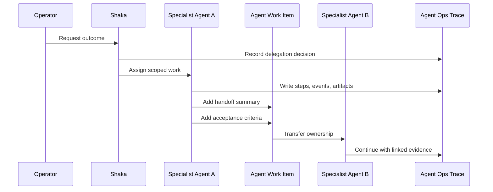
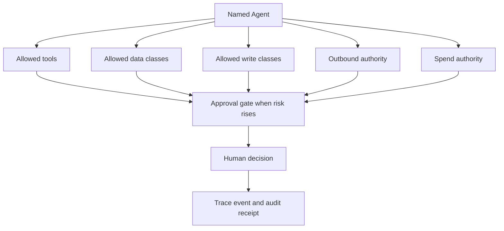
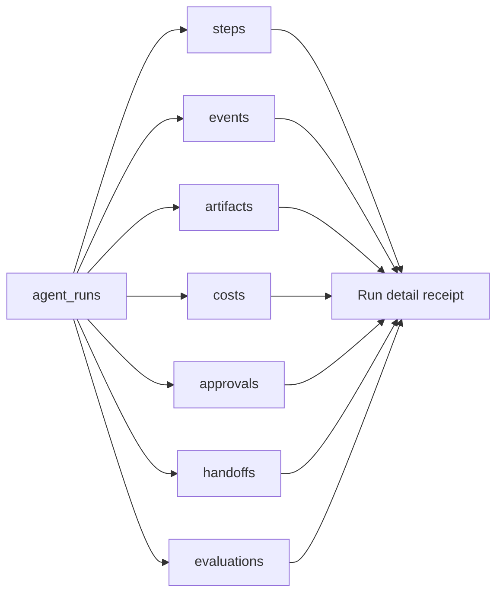
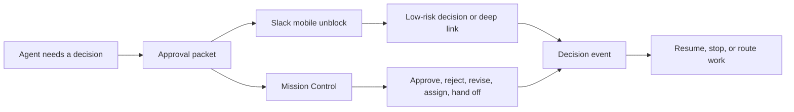
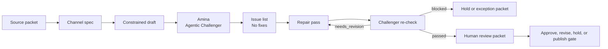

# Enterprise Agentic Value Map

Status: Master source map for channel-specific deliverables
Audience: executives, product leaders, operators, nonprofit and small business leaders, enterprise AI teams
Primary use: Source-of-truth narrative, component map, proof register, and script raw material

This is not intended to be the only public artifact. Use it as the source map for the channel plan in [`docs/agentic-value-communications-plan.md`](agentic-value-communications-plan.md).

## Core Message

Most people think launching an enterprise agent starts when the model can take an action.

That is where the risk starts.

The real work is the operating system around the agent: the trace, the handoff, the scope, the approval gate, the evaluation loop, the human review surface, and the audit trail that proves what happened after the demo ended.

Portfolio now demonstrates that operating layer. It is not a loose set of automations. It is a governed agent control plane.

## What We Built In Plain Language

| Layer | Plain-language question | Portfolio proof surface | Value |
| --- | --- | --- | --- |
| Agent registry | Who is allowed to work? | Named agent organization, pods, runtime policy, governance inventory | Turns "the AI did it" into accountable ownership. |
| Scope profile | What can this agent touch? | Runtime policy, capability profiles, approval-gated actions | Keeps each agent inside a known boundary. |
| Delegation | Why did this agent get the job? | Shaka routing, engagement queue, delegation decision events | Makes handoffs explainable instead of vibes-based. |
| Handoff | What does the next agent need to know? | `agent_handoffs`, work item ownership, acceptance criteria | Prevents context loss between agents and runtimes. |
| Observability | What happened, in what order? | `agent_runs`, steps, events, artifacts, costs, approvals, handoffs | Gives operators a receipt for every run. |
| Human approval | Where does autonomy stop? | Approval checkpoints, Mission Control, Slack mobile unblocks | Lets people approve side effects without losing traceability. |
| Compliance | What needs review before it moves? | Moremi risk monitor, policy gates, governance export | Converts risk into reviewable work instead of silent exposure. |
| Transaction authority | Can the agent spend, refund, publish, or send? | Payment and paid-job approval gates | Separates recommendation from authority to act. |
| QA loop | How do we know the output is good before a person is asked to approve it? | Agent evaluations, rubrics, quality summaries, coaching signals, challenger review packets | Makes quality measurable and keeps first-pass work out of human approval. |
| Client-safe proof | What can we show without exposing private material? | Governance export and advisory explainer | Makes the system explainable to clients without leaking raw logs. |

## The Frame For Open CLAW-Style Enterprise Launches

Open CLAW, OpenCode, Hermes, n8n, Codex, and similar runtimes solve only part of the problem.

They give you execution capacity.

Enterprise value comes from the control system around that capacity.

The common question is: "Can this agent complete the task?"

The better questions are:

- Who assigned the task?
- Why was this agent selected?
- What data was it allowed to use?
- What tools could it call?
- What side effects were blocked?
- What did it cost?
- What did it hand off?
- What did the human approve?
- What evidence can we show later?
- Did the work pass an agentic challenger before a person was asked to approve it?
- How does the system learn from the quality of the result?

That is the difference between an agent demo and an agent operating model.

## Visual 1: The Enterprise Agent Lifecycle

Use this as the first carousel/deck diagram.

```mermaid
flowchart LR
  A["Intent<br/>What does the operator need?"] --> B["Routing<br/>Shaka selects the right agent"]
  B --> C["Scope<br/>Tools, data, write authority, spend boundary"]
  C --> D["Execution<br/>Agent run, steps, artifacts, cost events"]
  D --> E["Evaluation<br/>Rubric score, pass/fail, coaching signal"]
  E --> F["Challenge<br/>Unsupported claims, drift, privacy, source gaps"]
  F --> G["Handoff<br/>Next owner, summary, acceptance criteria"]
  G --> H["Approval<br/>Human decision for side effects"]
  H --> I["Audit<br/>Client-safe receipt and governance export"]
  I --> B
```

Narrative:

An enterprise agent is not one run. It is a loop. Intent enters the system, Shaka routes it, the agent acts inside scope, the work is evaluated, a challenger tests whether the work is ready for a person, a handoff is recorded, a human approves side effects, and the audit trail becomes the memory for the next decision.

## Visual 2: Agent-To-Agent Handoff

What this explains:

The handoff is not a chat message. It is a work packet. It needs an owner, a summary, criteria for acceptance, a linked run, and a trace event. Without that structure, the next agent inherits confusion.

## Visual 3: Scope And Permission Boundary

What this explains:

Scope is not a prompt instruction. Scope is an operating boundary. The agent should know what it can read, what it can write, what it can send, what it can spend, and where a person must step in.

## Visual 4: Observability Receipt

What this explains:

Observability means an operator can reconstruct the work without guessing. The run detail should answer what happened, what was produced, what it cost, who approved it, where it was handed off, and how quality was scored.

## Visual 5: Human-In-The-Loop Surface

What this explains:

Human-in-the-loop is not a person hovering over every action. It is a designed checkpoint. The operator sees the decision, the evidence, the risk boundary, and the next action. Slack can unblock low-risk items, but production-impacting work goes back to Portfolio.

## Visual 6: Ralph Loop / Agentic Challenger Gate

What this explains:

The human should not be the first quality filter. The challenger tests the draft for unsupported claims, implementation drift, source gaps, privacy risk, duplicated work, and channel mismatch. Only challenger-cleared work becomes a human approval packet.

## Component Narratives

### 1. Agent-To-Agent Handoff

The value is continuity.

Agents fail quietly when work moves from one runtime to another without a packet. Portfolio uses work items and handoff records so the next agent receives the summary, owner, runtime, active trace, and acceptance criteria.

What this gives an enterprise team:

- less context loss,
- clearer ownership,
- cleaner escalation,
- and a way to tell whether the second agent inherited the right problem.

### 2. Observability

The value is trust.

Agentic systems need a receipt. Portfolio records runs, steps, events, artifacts, approvals, costs, handoffs, and evaluations. The operator can inspect a run instead of relying on the agent's last message.

What this gives an enterprise team:

- incident review,
- cost review,
- compliance review,
- training review,
- and a practical way to debug bad work.

### 3. Scope

The value is restraint.

Each agent needs a boundary. Portfolio separates runtime policy, agent capability profiles, allowed data, allowed writes, outbound authority, spend authority, and approval gates. That matters because agents should not inherit broad authority just because the tool can technically do something.

What this gives an enterprise team:

- least-privilege agent roles,
- safer runtime adoption,
- clearer security review,
- and a path to expand autonomy one boundary at a time.

### 4. Compliance And Traceability For Transactions

The value is evidence.

Publishing, sending, production writes, config changes, private-to-public content, payment actions, refunds, subscriptions, vendor payments, paid API increases, and paid external jobs need a different standard. Portfolio treats these as approval-gated authority events, not casual tool calls.

What this gives an enterprise team:

- a chain from operator intent to agent action,
- proof of authorization,
- separation between recommendation and execution,
- and client-safe exports that summarize the evidence without exposing private logs.

### 5. QA And Continuous Improvement

The value is learning.

Agents will not become reliable through belief. They become reliable when their outputs are evaluated against rubrics, scored, trended, and turned into coaching signals. Portfolio has trace-linked evaluations and quality summaries so performance can improve over time.

What this gives an enterprise team:

- scorecards instead of vibes,
- targeted prompt or process changes,
- evidence that a change improved quality,
- and a way to compare agents, workflows, and runtimes.

### 6. Agent-To-Human Handoff

The value is control.

The human should receive a decision packet, not a vague alert. Portfolio uses Mission Control as the full operator surface and Slack as the mobile unblock surface. The system can ask for approval, revision, assignment, handoff, or context while preserving the decision trail.

What this gives an enterprise team:

- faster decisions,
- fewer buried blockers,
- safer mobile approvals,
- and a record that shows who decided what.

## The Portfolio Value Stack

| What buyers see | What we actually built | Why it matters |
| --- | --- | --- |
| "AI agents" | Named agents with roles, pods, runtimes, and scope | Accountability starts with identity. |
| "Automation" | Trace-linked runs with artifacts, approvals, costs, and events | Operators need to see the work, not trust the output. |
| "Multi-agent workflows" | Handoff packets and work item ownership | Collaboration needs state, context, and ownership across chained prompts. |
| "Governance" | Approval gates, policy boundaries, risk monitor, client-safe exports | Trust needs proof. |
| "Human review" | Mission Control plus Slack unblock surfaces | Review has to fit the way operators actually work. |
| "Quality" | Evaluations, rubrics, trends, coaching signals | Agent performance must improve through feedback loops. |
| "Enterprise readiness" | Runtime evaluation and tooling parity checks | New runtimes need install, auth, trace, rollback, and audit proof before production use. |

## Script: "The Part Of Agentic AI Most Teams Skip"

Target length: 6 to 8 minutes
Tone: plain, reflective, builder-to-builder
Visual style: Portfolio UI captures, simple diagrams, operator receipts, blurred/private-safe admin surfaces

### Opening

Most teams are asking the wrong first question about agents.

They ask: can the agent do the work?

That question matters. But in an enterprise setting, it is only the beginning.

The harder question is this:

When the agent does the work, who can explain what happened?

Who gave it the task? Why did that agent get selected? What tools could it touch? What data was out of bounds? Where did the handoff happen? Who approved the side effect? What did it cost? How do we know the output was any good?

That is the layer most demos skip.

And that is the layer we have been building into Portfolio.

### Section 1: The Demo Is Not The Operating Model

It is easy to get impressed by an agent that can open a tool, write code, draft an email, search a database, or trigger a workflow.

I get impressed too. I build with these tools every day.

But I keep coming back to the same tension.

The same capability that makes agents powerful also makes them risky. They answer questions, then they move work. They can touch systems. They can create records. They can spend money. They can publish. They can make a mistake while looking confident.

The enterprise problem is governed execution.

### Section 2: The Agent Needs A Receipt

In Portfolio, every serious agentic workflow starts with traceability.

We built Agent Ops around the idea that an agent run should leave a receipt. A run has steps. Events. Artifacts. Costs. Approvals. Handoffs. Evaluations.

That receipt matters because operators should not have to reconstruct the system from screenshots and Slack messages.

If an agent drafts something, we need to know where the source came from.

If it routes work, we need to know why that agent was chosen.

If it creates a paid job or touches a public channel, we need to know who approved it.

This is where observability becomes more than logs.

Observability becomes accountability.

### Section 3: Handoff Is A Product Feature

A lot of multi-agent talk makes handoff sound magical.

One agent finishes. Another agent starts. The workflow continues.

That is not enough.

In the real world, a handoff needs structure. The next agent needs the summary, the acceptance criteria, the owner, the runtime, and the trace that explains what happened before.

That is why Portfolio uses work items and `agent_handoffs`.

The handoff is not buried in a conversation. It becomes part of the operating record.

That changes the quality of the system. Agents can specialize without losing continuity. Humans can inspect where work changed hands. The Integration Captain can own merge and deployment without losing the context from the feature agent.

That is how agent swarms become manageable.

### Section 4: Scope Is The Safety Model

The next piece is scope.

Every agent needs a job description that the system can enforce.

What can it read? What can it write? What tools can it call? Can it touch client data? Can it send an email? Can it publish? Can it spend money? Can it start a paid external job?

Portfolio separates those questions into runtime policy and agent capability profiles.

That is important because a coding agent, an automation runtime, a research agent, and a publishing agent should not have the same authority.

The goal is not to make every agent powerful.

The goal is to make every agent appropriately bounded.

That is what enterprise teams need when they start evaluating tools like Open CLAW or any other agent runtime. The runtime may be capable. The operating model still has to decide what capability is allowed in this environment.

### Section 5: Compliance Lives In The Workflow

Compliance cannot be a PDF that sits outside the system.

It has to live in the workflow.

Portfolio does this through approval gates, risk monitoring, and governance exports.

Moremi watches for AI risk and compliance signals, then converts relevant concerns into exposure checks or proposed work. Payment and spend authority are treated as approval-gated events. Publishing and outbound sends require checkpoints. Private material cannot casually become public content.

That gives us a way to explain the system to a client without exposing raw private logs.

We can say: here is the agent role, here is the scope, here is the delegation trail, here is the approval boundary, here is the audit export.

That is the language enterprises understand.

### Section 6: QA Is A Loop

The final piece is quality.

Agent quality cannot depend on someone saying, "Looks good to me," every once in a while.

Portfolio supports evaluations and rubrics tied back to agent runs. The system can score an output, record whether it passed, surface coaching signals, and track trends over time.

That creates a real improvement loop.

If an agent keeps failing on attribution, we can see that.

If a workflow produces weaker handoffs, we can see that.

If a prompt change improves quality, we can prove it with the next set of runs.

That is how you slowly tune an agentic system without pretending it became reliable overnight.

### Section 7: Human-In-The-Loop Has To Be Designed

Human-in-the-loop is often described like a checkbox.

In practice, it is an interface problem.

The human needs the right packet at the right moment.

Mission Control is the full operator surface. Slack is the mobile unblock surface. Slack can help with low-risk approvals, assignments, handoffs, and context requests. Higher-risk actions deep-link back into Portfolio.

That matters because people do not work from one screen all day.

The system has to meet the operator where they are without letting convenience erase governance.

### Close

So when I talk about what we have built in Portfolio, I am talking about more than a website.

I am talking about a working blueprint for governed agentic operations.

Agent registry.
Scope.
Delegation.
Handoff.
Observability.
Approval.
Compliance.
QA.
Human review.
Client-safe proof.

That is the part of agentic AI many teams will discover after the first demo.

We are building it now because the organizations that need AI the most often have the least room for chaotic automation.

Speed matters.

But trust is what lets speed survive contact with real people, real money, real clients, and real work.

## LinkedIn Post Seed

Anyone can launch an agent now.

That is the exciting part.

It is also the dangerous part.

The hard work starts after the first demo. Who decides which agent gets the task? What is the agent allowed to touch? What happens when one agent hands work to another? Who approves a public send, a payment action, or a production change? Where does the receipt live when something goes wrong?

This is what we have been building into Portfolio.

Agents are only the visible layer.

The operating system around them is where the value compounds.

Agent runs leave traces. Handoffs carry summaries and acceptance criteria. Runtime policies define scope. Approval gates stop side effects. Mission Control gives the operator a full view. Slack supports mobile unblocks without turning convenience into uncontrolled authority. Evaluations turn quality into a loop instead of a feeling.

That is the part many enterprise teams will have to confront as tools like Open CLAW and other agent runtimes get easier to deploy.

Execution is becoming cheap.

Governed execution is where the value is.

If your AI agent can act on behalf of the business, the business needs a way to answer:

- who gave it the work,
- what it was allowed to do,
- what evidence it used,
- what it handed off,
- who approved the side effect,
- what it cost,
- and how the quality improves next time.

That is the difference between an impressive demo and something you can trust inside real operations.

What part of agent governance do you think most teams are underestimating right now?

## Source Map

- `docs/agent-operations-roadmap.md` - Agent Ops phases, trace model, approval-backed execution, Slack surface, runtime evaluation.
- `docs/agentic-operating-system-governance.md` - agent scope, delegation, payment authority, governance UI, client-safe export framing.
- `docs/agentic-patterns.md` - pattern coverage, handoffs, observability, QA, memory, production constraints.
- `docs/ai-risk-compliance-agent.md` - Moremi risk/compliance monitor, exposure checks, approval-gated remediation.
- `docs/agent-ops-slack-mobile-unblock.md` - Slack mobile action boundaries and Mission Control deep links.
- `docs/agentic-os-client-advisory-explainer.md` - client-safe governance positioning.
- `lib/agent-policy.ts` - runtime policy, approval gates, payment and paid-job authority actions.
- `lib/agent-governance.ts` and `lib/agent-governance-export.ts` - capability inventory and client-safe audit export.
- `lib/agent-work-items.ts` - handoff records, ownership transfer, acceptance criteria.
- `lib/agent-evaluations.ts` - rubrics, trace-linked scoring, quality summaries.
- `app/api/admin/agents/runs/[runId]/route.ts` - run detail receipt with timeline, artifacts, approvals, handoffs, costs, evaluations.
