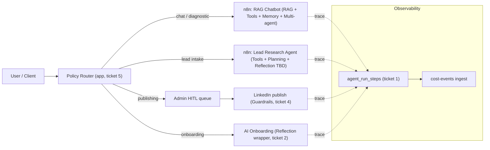

# Agentic Patterns Scorecard

Single source of truth for how this repo applies the 20 agentic AI design patterns (framing from the talk linked in the April 2026 planning session). Companion to the Cursor rule at [`.cursor/rules/agentic-patterns.mdc`](../.cursor/rules/agentic-patterns.mdc) — the rule tells you *when* to use each pattern, this doc tells you *where* we already do, where we don't, and what to build next.

Keep this doc in sync with reality: any PR that touches an agentic flow must update the relevant section.

## Canonical list (4 buckets)

Our pinned 20 patterns, grouped the same way as the talk:

- **Grounding:** Prompt Chaining, Routing, Parallelization, Tool Use, RAG.
- **Transparent decision-making:** Planning/Orchestration, Chain-of-Thought, Tree-of-Thought, Multi-Agent Collaboration, Goal Tracking.
- **Self-awareness / QA:** Reflection, Debate, Self-Consistency, Learning & Feedback, Memory Management.
- **Production constraints:** Exception Handling, Human-in-the-Loop, Guardrails & Safety, Monitoring & Observability, Cost/Resource Control.

## Coverage at a glance

| # | Pattern | Bucket | Coverage |
|---|---|---|---|
| 1 | Prompt Chaining | Grounding | Strong |
| 2 | Routing | Grounding | Strong (n8n) / Absent (app) |
| 3 | Parallelization | Grounding | Partial |
| 4 | Tool Use | Grounding | Strong (n8n) / Partial (app) |
| 5 | RAG | Grounding | Strong |
| 6 | Planning / Orchestration | Transparent | Strong (workflow) / Partial (app) |
| 7 | Chain-of-Thought | Transparent | Minimal |
| 8 | Tree-of-Thought | Transparent | Absent |
| 9 | Multi-Agent Collaboration | Transparent | Partial |
| 10 | Goal Tracking | Transparent | Partial |
| 11 | Reflection | Self-awareness | Minimal |
| 12 | Debate | Self-awareness | Absent |
| 13 | Self-Consistency | Self-awareness | Absent |
| 14 | Learning & Feedback | Self-awareness | Partial |
| 15 | Memory Management | Self-awareness | Partial |
| 16 | Exception Handling | Production | Partial |
| 17 | Human-in-the-Loop | Production | Strong on publish / Partial elsewhere |
| 18 | Guardrails & Safety | Production | Strong (authz) / Partial (content) |
| 19 | Monitoring & Observability | Production | Partial (highest-leverage gap) |
| 20 | Cost/Resource Control | Production | Partial |

Coverage scale: **Strong** (consistent, reusable, tested) · **Partial** (present in some flows) · **Minimal** (one-off or offline only) · **Absent** (no deliberate implementation).

---

## Per-pattern sections

Each section follows the same template: *Definition · Where we use it today · Coverage · Gaps · Retrofit backlog*.

### 1. Prompt Chaining — Grounding

**Definition.** Break a single task into a sequence of LLM (or LLM + code) steps so each has a narrow, testable job.

**Where we use it today.**
- The social content pipeline (WF-SOC-001) chains extract topics → copy → image → voice → draft (see [`docs/admin-sales-lead-pipeline-sop.md`](admin-sales-lead-pipeline-sop.md) §15.1).
- Meeting Complete Handler ([`n8n-exports/WF-MCH-Meeting-Complete-Handler.json`](../n8n-exports/WF-MCH-Meeting-Complete-Handler.json)) chains multiple agent nodes.
- Build-time chain for chatbot knowledge via [`scripts/build-chatbot-knowledge.ts`](../scripts/build-chatbot-knowledge.ts) (pre-generates `lib/chatbot-knowledge-content.generated.ts`).

**Coverage.** Strong.

**Gaps.** None critical. App-layer chains are rare but also rarely needed (most chains live in n8n).

**Retrofit backlog.** None.

---

### 2. Routing — Grounding

**Definition.** A classifier decides which downstream branch (agent, workflow, model tier) handles the input.

**Where we use it today.**
- [`n8n-exports/WF-CAL-Calendly-Webhook-Router.json`](../n8n-exports/WF-CAL-Calendly-Webhook-Router.json) — routes calendar events to the right downstream workflow.
- [`n8n-exports/Client-Progress-Update-Router.json`](../n8n-exports/Client-Progress-Update-Router.json) — routes client progress updates.
- Diagnostic vs chatbot split documented in [`N8N_DIAGNOSTIC_SETUP.md`](../N8N_DIAGNOSTIC_SETUP.md).

**Coverage.** Strong at the n8n layer, **Absent** at the app layer (no policy/model router).

**Gaps.**
- App-side code hard-codes model IDs and providers per call site; no central place to switch by tenant/tier/feature flag.
- No "default branch" convention for routers in n8n — silent drops possible on unknown inputs.

**Retrofit backlog.** Ticket [#5](#top-retrofit-tickets) — app-layer policy router.

---

### 3. Parallelization — Grounding

**Definition.** Execute independent sub-tasks concurrently when they share no mutable state.

**Where we use it today.**
- Playwright `fullyParallel: true` in [`playwright.config.ts`](../playwright.config.ts).
- Some n8n branches fan out for independent enrichments.

**Coverage.** Partial.

**Gaps.**
- Lead Research Agent ([`n8n-exports/Lead-Research-and-Qualifying-Agent.json`](../n8n-exports/Lead-Research-and-Qualifying-Agent.json)) runs Perplexity/LinkedIn/Glassdoor/news lookups sequentially even though they are independent.
- App-layer agentic code uses `await` chains where `Promise.all` would be safe (e.g. onboarding content, outreach generation sub-steps).

**Retrofit backlog.**
- Identify 2–3 sequential n8n branches that can be parallelized; measure wall-clock before/after.
- Add a `Promise.all` audit pass during the reflection wrapper ticket ([#2](#top-retrofit-tickets)).

---

### 4. Tool Use — Grounding

**Definition.** The LLM calls external tools (APIs, databases, vector stores, deterministic code) instead of hallucinating.

**Where we use it today.**
- LangChain `agent` + `toolVectorStore` + Perplexity HTTP tools across n8n exports, most richly in [`n8n-exports/Lead-Research-and-Qualifying-Agent.json`](../n8n-exports/Lead-Research-and-Qualifying-Agent.json) (research tools mandated in the system prompt).
- [`n8n-exports/RAG-Chatbot-for-AmaduTown-using-Google-Gemini.json`](../n8n-exports/RAG-Chatbot-for-AmaduTown-using-Google-Gemini.json) — vector store tool + Pinecone + OpenAI embeddings.

**Coverage.** Strong in n8n; Partial in app.

**Gaps.**
- App-layer LLM callers like [`lib/ai-onboarding-generator.ts`](../lib/ai-onboarding-generator.ts) do not expose a tool-calling abstraction — they shove context into the prompt string.
- No shared convention for defining a tool schema once and reusing across call sites.

**Retrofit backlog.**
- Introduce a thin `lib/llm/tools.ts` (tool registry + typed schemas) once ticket [#5](#top-retrofit-tickets) lands; adopt in onboarding generator first.

---

### 5. RAG — Grounding

**Definition.** Retrieve relevant documents at query time and inject them into the LLM context.

**Where we use it today.**
- [`n8n-exports/WF-RAG-INGEST-Google-Drive-→-Pinecone-Ingestion-(Daily).json`](../n8n-exports/WF-RAG-INGEST-Google-Drive-→-Pinecone-Ingestion-(Daily).json) — daily Pinecone ingestion.
- [`n8n-exports/RAG-Chatbot-for-AmaduTown-using-Google-Gemini.json`](../n8n-exports/RAG-Chatbot-for-AmaduTown-using-Google-Gemini.json) — Gemini + Pinecone runtime query.
- Social pipeline references a dedicated `amadutown-rag-query` webhook in [`docs/admin-sales-lead-pipeline-sop.md`](admin-sales-lead-pipeline-sop.md).

**Coverage.** Strong.

**Gaps.**
- No evaluator of retrieval quality (top-k relevance, recall on a held-out set).
- No visibility into which chunks were retrieved per answer — hard to debug bad answers.

**Retrofit backlog.**
- Add a retrieval-debug field to chat responses in admin mode (top-k chunk ids + similarity scores).
- Run a quarterly RAG eval using a 20-item golden set; track in the scorecard.

---

### 6. Planning / Orchestration — Transparent decision-making

**Definition.** A top-level controller sequences multiple agents or workflows toward a goal, handling state and handoffs.

**Where we use it today.**
- Client lifecycle workflows WF-000 through WF-012 (see [`n8n-exports/manifest.json`](../n8n-exports/manifest.json)) together form an orchestrated pipeline.
- [`lib/testing/orchestrator.ts`](../lib/testing/orchestrator.ts) orchestrates simulated clients for E2E testing.

**Coverage.** Strong at the workflow level, Partial in app.

**Gaps.**
- No reusable orchestrator abstraction for production app flows; any multi-step agent logic gets re-invented.
- No single place to see "for lead X, which workflows have run and which are pending".

**Retrofit backlog.**
- Evaluate extracting the testing orchestrator's core into `lib/orchestrator/` once we have a second non-test caller.
- Add an admin page listing active agent runs (blocked on ticket [#1](#top-retrofit-tickets)).

---

### 7. Chain-of-Thought — Transparent decision-making

**Definition.** Capture the model's intermediate reasoning so decisions are auditable, not just opaque outputs.

**Where we use it today.** Implicit in some prompts ("think step by step"); nothing structured.

**Coverage.** Minimal.

**Gaps.**
- Reasoning traces are not persisted, so we cannot diagnose why a bad output happened.

**Retrofit backlog.**
- When ticket [#1](#top-retrofit-tickets) (agent run trace) lands, add an optional `reasoning` field on each step record for call sites that opt in.

---

### 8. Tree-of-Thought — Transparent decision-making

**Definition.** Branch into multiple candidate reasoning paths, score them, prune.

**Where we use it today.** Nowhere.

**Coverage.** Absent.

**Gaps.** Not currently needed. Document as "evaluate case-by-case" — do not adopt without a concrete problem that single-pass reasoning fails on.

**Retrofit backlog.** None. Reassess annually.

---

### 9. Multi-Agent Collaboration — Transparent decision-making

**Definition.** Multiple specialized agents (researcher, writer, critic, etc.) cooperate, each with its own prompt and tools.

**Where we use it today.**
- [`n8n-exports/WF-MCH-Meeting-Complete-Handler.json`](../n8n-exports/WF-MCH-Meeting-Complete-Handler.json) — multiple agent nodes in sequence.
- [`n8n-exports/RAG-Chatbot-for-AmaduTown-using-Google-Gemini.json`](../n8n-exports/RAG-Chatbot-for-AmaduTown-using-Google-Gemini.json) — six diagnostic category agents (Tech Stack, Business Challenges, Automation Needs, AI Readiness, Budget/Timeline, Decision Making) with independent memory buffers.
- [`n8n-exports/HeyGen-Cold-Email---Sub-Agent---Jono-Catliff.json`](../n8n-exports/HeyGen-Cold-Email---Sub-Agent---Jono-Catliff.json) — sub-agent pattern for cold email.
- [`n8n-exports/WF-CLG-002-Outreach-Generation.json`](../n8n-exports/WF-CLG-002-Outreach-Generation.json) — multiple agent nodes.

**Coverage.** Partial.

**Gaps.**
- No formal handoff contract — each workflow reinvents how state is passed between agents.
- No shared memory schema; per-lead facts produced by one agent are often not reused by the next.

**Retrofit backlog.**
- Define a "lead_state" JSON schema used as the handoff payload between agents in the cold-lead pipeline (WF-CLG-001 → 002 → 003 → 004).

---

### 10. Goal Tracking — Transparent decision-making

**Definition.** The agent knows what "done" looks like and reports progress toward it.

**Where we use it today.**
- RAG chatbot diagnostic flow tracks `{ completedCategories, questionsAsked, responsesReceived }` in n8n code nodes.
- Milestone workflows WF-006, WF-009, WF-012 track lifecycle goals.

**Coverage.** Partial.

**Gaps.**
- Progress state is workflow-local; admins cannot see "this lead is 60% through diagnostic" from the app.

**Retrofit backlog.**
- Surface diagnostic progress on the admin lead detail page once run-trace helper ships.

---

### 11. Reflection — Self-awareness / QA

**Definition.** The agent (or a critic) reviews a draft output and revises it before shipping.

**Where we use it today.**
- Offline/post-hoc only: [`lib/llm-judge.ts`](../lib/llm-judge.ts), [`lib/source-validator/llm-judge.ts`](../lib/source-validator/llm-judge.ts), [`app/api/admin/llm-judge/route.ts`](../app/api/admin/llm-judge/route.ts), [`app/api/admin/chat-eval/diagnose/route.ts`](../app/api/admin/chat-eval/diagnose/route.ts).

**Coverage.** Minimal — no **inline** reflection before user-facing output.

**Gaps.**
- Outreach generation and AI onboarding content ship first-pass output with no self-critique.
- The existing llm-judge logic is not reusable as a generic "review-then-revise" wrapper.

**Retrofit backlog.** Ticket [#2](#top-retrofit-tickets) — inline reflection wrapper.

---

### 12. Debate — Self-awareness / QA

**Definition.** Run N model/prompt variants, have them argue, pick the winner.

**Where we use it today.** Nowhere.

**Coverage.** Absent.

**Gaps.**
- Lead qualification scoring could benefit — single-pass score is brittle for borderline leads.

**Retrofit backlog.**
- Prototype: run two different system prompts for lead AI-readiness scoring and reconcile. Defer until ticket [#1](#top-retrofit-tickets) makes the cost visible.

---

### 13. Self-Consistency — Self-awareness / QA

**Definition.** Sample N answers from the same model and aggregate (majority vote, median).

**Where we use it today.** Nowhere.

**Coverage.** Absent.

**Gaps.**
- Diagnostic category classification (does this message belong to Tech Stack or AI Readiness?) is currently a single call.

**Retrofit backlog.**
- After ticket [#1](#top-retrofit-tickets) lands, A/B test self-consistency (N=3) vs single-call for diagnostic routing.

---

### 14. Learning & Feedback — Self-awareness / QA

**Definition.** Outcomes feed back into prompts, retrieval, or routing policies.

**Where we use it today.**
- [`components/PrototypeFeedback.tsx`](../components/PrototypeFeedback.tsx) + `/api/prototypes/[id]/feedback` — collects user feedback.
- Chat-eval system under `app/admin/chat-eval/*` and [`app/api/admin/chat-eval/*`](../app/api/admin/chat-eval) scores transcripts.
- `lib/source-validator/llm-judge.ts` validates sources.

**Coverage.** Partial — we collect feedback but the loop to prompt/workflow updates is manual.

**Gaps.**
- No automated prompt regression tests keyed to feedback outcomes.
- No dashboard showing reply rate / conversion by outreach template over time.

**Retrofit backlog.**
- Weekly job aggregating chat-eval scores → Slack digest.
- Outreach template win/loss dashboard (blocked on ticket [#1](#top-retrofit-tickets)).

---

### 15. Memory Management — Self-awareness / QA

**Definition.** Short-term (conversation) and long-term (per-entity facts) memory with explicit scoping and TTL.

**Where we use it today.**
- `@n8n/n8n-nodes-langchain.memoryBufferWindow` nodes in the RAG chatbot (six distinct windows — one per diagnostic agent).
- Session progress objects tracked in n8n code nodes.

**Coverage.** Partial.

**Gaps.**
- No long-term cross-workflow memory — facts learned in Lead Research Agent are not automatically available to Outreach Generation.
- No TTL or tenant scoping on memory stores.

**Retrofit backlog.**
- Design a `lead_memory` Supabase table storing structured facts per lead (AI readiness score, pain points, champions) written by any agent and readable by downstream agents.

---

### 16. Exception Handling — Production constraints

**Definition.** Network, LLM, and tool errors are caught, retried, logged, and surfaced with a user-safe message.

**Where we use it today.**
- Runtime gates: [`lib/n8n-runtime-flags.ts`](../lib/n8n-runtime-flags.ts) (`isN8nOutboundDisabled`, `isMockN8nEnabled`).
- User-facing error hygiene enforced by [`.cursor/rules/no-expose-errors-to-users.mdc`](../.cursor/rules/no-expose-errors-to-users.mdc).
- Trigger functions in [`lib/n8n.ts`](../lib/n8n.ts) return `{ triggered, message }` shape.

**Coverage.** Partial.

**Gaps.**
- No standard retry/backoff helper for LLM calls or n8n triggers — each call site reinvents `try/catch`.
- No dead-letter path for failed agent runs.

**Retrofit backlog.** Ticket [#3](#top-retrofit-tickets) — retry/backoff helper.

---

### 17. Human-in-the-Loop — Production constraints

**Definition.** A human approves AI-generated content before it reaches a client, prospect, or public channel.

**Where we use it today.**
- Social content queue: drafts → admin review → approve → publish (WF-SOC-001 → admin UI → WF-SOC-002), documented in [`docs/admin-sales-lead-pipeline-sop.md`](admin-sales-lead-pipeline-sop.md) §15.
- Gmail draft reply workflow [`n8n-exports/WF-GDR-Gmail-Draft-Reply.json`](../n8n-exports/WF-GDR-Gmail-Draft-Reply.json) — drafts, does not auto-send.

**Coverage.** Strong on publish paths; Partial on pre-publish content.

**Gaps.**
- Audit every path that produces client-bound AI content and confirm a review state exists: outreach generation ([`lib/outreach-queue-generator.ts`](../lib/outreach-queue-generator.ts)), AI onboarding content ([`lib/ai-onboarding-generator.ts`](../lib/ai-onboarding-generator.ts)), client progress updates.

**Retrofit backlog.**
- One-page HITL audit: for each AI output destination, document whether a human sees it before it ships.

---

### 18. Guardrails & Safety — Production constraints

**Definition.** Authz, content-safety, and output validation applied before AI artifacts leave the system.

**Where we use it today.**
- Authz: Supabase RLS (see [`.cursor/rules/supabase-rls.mdc`](../.cursor/rules/supabase-rls.mdc)), `verifyAdmin` for admin routes, Bearer `N8N_INGEST_SECRET` for ingest routes.
- User-facing error hygiene ([`.cursor/rules/no-expose-errors-to-users.mdc`](../.cursor/rules/no-expose-errors-to-users.mdc)).

**Coverage.** Strong on authz; Partial on content-safety.

**Gaps.**
- No content-safety check before LinkedIn publish in [`lib/publishing/linkedin.ts`](../lib/publishing/linkedin.ts) — a jailbroken draft could slip through HITL by social-engineering the reviewer.
- No output-schema validation for structured LLM responses across call sites.

**Retrofit backlog.** Ticket [#4](#top-retrofit-tickets) — content-safety gate before LinkedIn publish.

---

### 19. Monitoring & Observability — Production constraints

**Definition.** Every agent run produces a trace: `run_id`, steps, latency, tokens/$ cost, outcome.

**Where we use it today.**
- [`app/api/admin/cost-events/ingest/route.ts`](../app/api/admin/cost-events/ingest/route.ts) and [`lib/cost-calculator.ts`](../lib/cost-calculator.ts) — cost accounting.
- [`n8n-exports/WF-MON-001-Apify-Actor-Health-Monitor.json`](../n8n-exports/WF-MON-001-Apify-Actor-Health-Monitor.json) — actor health monitor.
- DB health check (`scripts/database-health-check.ts`) — referenced in [`CLAUDE.md`](../CLAUDE.md).

**Coverage.** Partial.

**Gaps.**
- No unified "agent run trace" tying a user request to every downstream step (n8n + app) with latency, cost, and outcome. **This is the single highest-leverage gap.**

**Retrofit backlog.** Ticket [#1](#top-retrofit-tickets) — agent run trace helper.

---

### 20. Cost/Resource Control — Production constraints

**Definition.** Each agent call declares model tier, token cap, and per-request budget — no implicit blank-check calls.

**Where we use it today.**
- [`lib/cost-calculator.ts`](../lib/cost-calculator.ts) computes post-hoc costs.
- Cost-events ingest accumulates spend per event.

**Coverage.** Partial.

**Gaps.**
- No pre-flight budget cap — a runaway loop can rack up cost before the monitor fires.
- Model IDs are hard-coded at call sites; no tenant/tier-aware policy.

**Retrofit backlog.** Ticket [#5](#top-retrofit-tickets) — policy router selects model + budget by tier.

---

## Top retrofit tickets

These are the first five PR-sized items seeded from the scorecard. Each one closes a named gap above.

### Ticket 1 — Agent run trace helper (Monitoring)

- **Owner.** _TBD_
- **Scope.** Add `lib/agent-run.ts` exporting `startRun({ kind, subjectId }) → runId`, `recordStep(runId, { name, latencyMs, tokensIn, tokensOut, costUsd, status, reasoning? })`, `endRun(runId, { status, outcome })`. Writes to the existing cost-events pipeline ([`app/api/admin/cost-events/ingest/route.ts`](../app/api/admin/cost-events/ingest/route.ts)) with a new `agent_run_id` column.
- **First adoption.** [`lib/outreach-queue-generator.ts`](../lib/outreach-queue-generator.ts).
- **Acceptance criteria.**
  - New DB column `agent_run_id` (Supabase migration, applied via MCP per `.cursor/rules/supabase-migrations-apply-via-mcp.mdc`).
  - Helper has unit tests covering success, partial-failure, and `endRun` idempotency.
  - Outreach queue generator emits `start → step(s) → end` with realistic cost numbers visible in cost-events.
  - Scorecard row for Monitoring & Observability updated to "Strong" on completion.
- **Unblocks.** Chain-of-Thought capture, Goal Tracking UI, Learning & Feedback dashboard, Self-Consistency and Debate experiments (all need cost visibility).

### Ticket 2 — Inline reflection wrapper (Reflection)

- **Owner.** _TBD_
- **Scope.** Add `lib/llm/with-reflection.ts` that takes `{ generate, critique, maxRevisions = 1 }` and returns `{ output, critique, revisions }`. The critique step uses a distinct prompt and can short-circuit when output already passes.
- **First adoption.** [`lib/ai-onboarding-generator.ts`](../lib/ai-onboarding-generator.ts).
- **Acceptance criteria.**
  - Wrapper logs each pass via the run trace helper (ticket #1).
  - AI onboarding tests cover: passes-first-try, revised-on-critique, critique-fails-gracefully.
  - Scorecard row for Reflection updated to "Partial" on completion.
- **Depends on.** Ticket #1 (for observability).

### Ticket 3 — Retry/backoff helper for LLM/n8n calls (Exception Handling)

- **Owner.** _TBD_
- **Scope.** Add `lib/llm/with-retry.ts` with capped exponential backoff + jitter, configurable retryable error matcher, and a dead-letter hook. Wrap the trigger functions in [`lib/n8n.ts`](../lib/n8n.ts) and the direct LLM call sites found via grep.
- **Acceptance criteria.**
  - Unit tests for: success-on-first-try, success-after-N-retries, gives-up-after-max, honors non-retryable errors.
  - User-facing errors remain generic per `no-expose-errors-to-users.mdc`.
  - Scorecard row for Exception Handling updated to "Strong" on completion.

### Ticket 4 — Content-safety gate before LinkedIn publish (Guardrails)

- **Owner.** _TBD_
- **Scope.** In [`lib/publishing/linkedin.ts`](../lib/publishing/linkedin.ts), add a pre-publish safety call (moderation API or a lightweight classifier prompt) that blocks on configured red flags and logs the decision via the run trace helper.
- **Acceptance criteria.**
  - Block is configurable via env (policy strictness levels: `strict | standard | off`, default `standard`).
  - Blocked publishes surface to the admin queue with the reason, not to the end user.
  - Playwright test: publishing a deliberately-flagged post is blocked and logged.
  - Scorecard row for Guardrails & Safety updated accordingly.

### Ticket 5 — App-layer policy router (Routing + Cost/Resource Control)

- **Owner.** _TBD_
- **Scope.** Add `lib/llm/policy-router.ts` that chooses `{ provider, model, maxOutputTokens, budgetUsd }` given a `{ feature, tenantTier, env }` input. Defaults live in config; overrides via env vars per [`.cursor/rules/n8n-integration.mdc`](../.cursor/rules/n8n-integration.mdc) pattern. First adoption in [`lib/ai-onboarding-generator.ts`](../lib/ai-onboarding-generator.ts).
- **Acceptance criteria.**
  - Every LLM call in the onboarding generator goes through the router; no literal model strings remain in that file.
  - Router refuses to dispatch a call whose estimated cost exceeds the budget cap and logs the refusal.
  - Scorecard rows for Routing and Cost/Resource Control updated.

---

## Appendix — How the patterns compose

How the main agentic flows compose the patterns today (solid lines = request flow, dashed lines = observability).

## Review cadence

- **Every PR that touches an agentic flow** — update the relevant pattern section + coverage rating.
- **Quarterly** — re-score every pattern in the coverage-at-a-glance table and open/close backlog tickets.
- **Annually** — reassess the canonical 20-pattern list against the state of the field (Tree-of-Thought, Debate, new patterns).
