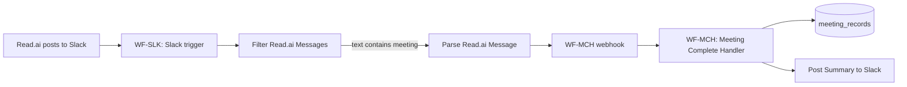

# Meeting Follow-Up Communications — How It Works

This guide describes how meeting-complete notifications and follow-up content are supposed to work, based on the **current n8n workflows** (WF-SLK, WF-MCH) and why you might not see a notification or draft after a meeting.

---

## 1. Trigger: Read.ai → **Slack** (not a folder)

There is **no “read.ai folder” trigger** in the app or in n8n. The trigger is:

- **Read.ai posts a meeting summary into a Slack channel**
- **WF-SLK: Slack Meeting Intake** listens to that channel and forwards the message to WF-MCH

So “meeting complete” is determined by: **Read.ai posting to Slack**. If Read.ai only writes to a folder (e.g. Google Drive) and does **not** post to Slack, nothing in this pipeline runs.

**Relevant workflow:** [WF-SLK: Slack Meeting Intake](https://n8n.amadutown.com) (id: `MEhNK36WMc34gua1`).

---

## 2. End-to-end flow

1. **Read.ai** is configured to post meeting summaries to a specific **Slack channel** (see WF-SLK sticky note: e.g. `#meeting-transcripts`).
2. **WF-SLK** runs when a **new message** appears in that channel (Slack Trigger; channel ID in the workflow is `C0ADFGBHJLE`).
3. **Filter Read.ai Messages:** only messages whose text **contains the word `"meeting"`** are processed. All others go to “Not a Read.ai Message” and the flow stops.
4. **Parse Read.ai Message** extracts title, summary, transcript, participants, duration, and infers `meeting_type` from the title (e.g. “discovery”, “kickoff”).
5. **Send to Meeting Handler** POSTs to `https://n8n.amadutown.com/webhook/meeting-complete` with the parsed body.
6. **WF-MCH** runs: extracts structured data with AI, writes to **meeting_records**, then **Post Summary to Slack** sends a formatted summary (summary, key decisions, action items, open questions, recording link) to a **Slack channel** that depends on meeting type (discovery vs others).

**What you get today:**

- **Notification:** A **Slack message** from WF-MCH with the meeting summary (type, duration, recording link, summary, key decisions, action items, open questions). This is the “draft” content you can use for follow-up; it is **not** sent by email in the current design.
- **Draft email template:** There is **no** node in WF-MCH that sends an email or creates an email draft. The only “draft” is the **Slack summary**. WF-AGE (Agenda Email Sender) sends **agenda emails for upcoming meetings** (daily check), not post-meeting follow-up.

---

## 3. Why you didn’t get a notification or draft yesterday

From n8n execution data:

- **WF-SLK** has **no executions** listed — so the Slack trigger has not fired for any message in the channel it watches (or executions were pruned). That usually means either:
  - Read.ai is **not** posting to the Slack channel that WF-SLK listens to (channel ID `C0ADFGBHJLE`), or
  - Read.ai’s message **does not contain the word “meeting”**, so the Filter step sends it to “Not a Read.ai Message” and the handler is never called.

If WF-SLK never calls the webhook, WF-MCH never runs, so you get no Slack summary and no new meeting record.

**Checklist:**

| Check | Where | What to verify |
|-------|--------|----------------|
| Read.ai → Slack | Read.ai app / integrations | Read.ai is connected to Slack and set to post meeting summaries to **the same channel** WF-SLK uses. |
| Channel ID | WF-SLK → “Slack Message Received” node | Channel ID is `C0ADFGBHJLE`. In Slack, confirm which channel that is (e.g. #meeting-transcripts) and ensure Read.ai posts there. |
| Word “meeting” | WF-SLK → “Filter Read.ai Messages” | Condition: message text **contains** “meeting”. If Read.ai’s post doesn’t include that word, the flow stops. E.g. “Discovery call summary” might not contain “meeting”; consider relaxing the filter (e.g. “call” or “summary”) or ensuring Read.ai includes “meeting” in the text. |
| WF-SLK active | n8n | Workflow is **Active** (toggle on). |
| WF-MCH webhook | n8n | WF-MCH is active so `POST /webhook/meeting-complete` is registered. |

---

## 4. Optional: add email (draft or send)

Currently there is **no email** in the meeting follow-up path. To get a **draft follow-up email** (or an actual email) after a meeting:

- Add a node (or sub-workflow) in **WF-MCH** after “Parse and Store” that:
  - Builds a follow-up email body (e.g. from `slackSummary` or from the structured output), and either
  - **Sends** it (e.g. Gmail node to yourself or to the client), or
  - **Creates a draft** (e.g. Gmail “create draft” if available, or write to a doc/queue for you to send manually).

That would be an enhancement to the existing flow; the current design only posts the summary to Slack.

---

## 5. WF-MCH RAG dependency (separate issue)

Some WF-MCH runs fail because the **Fetch RAG (MCH)** node calls `POST https://n8n.amadutown.com/webhook/amadutown-rag-query`, which returns 404 (webhook not registered). So even when WF-MCH is triggered, it can error before reaching “Post Summary to Slack”. Fix by either:

- Activating the workflow that exposes `amadutown-rag-query`, or
- Making the RAG step optional (e.g. continue on error) so the rest of MCH (Slack summary, meeting record) still runs.

---

## 6. Summary

| Your expectation | Actual design |
|------------------|----------------|
| Trigger when “read.ai folder” is populated | Trigger is **Read.ai posting to a Slack channel**. No folder watch. |
| Notification when meeting is complete | **Slack message** from WF-MCH with summary, decisions, action items, open questions. |
| Draft follow-up email in Slack and/or email | **Slack only** today. The Slack summary is the “draft” content. No email node in this flow. |

**Most likely reason you didn’t get anything:** Read.ai is not posting to the Slack channel WF-SLK watches, or the message doesn’t contain “meeting”, so WF-SLK never runs and never calls WF-MCH. Confirm Read.ai → Slack channel and the filter condition first.
