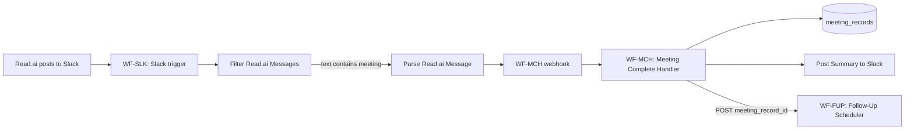

# Meeting Follow-Up Communications — How It Works

This guide describes how meeting-complete notifications, follow-up scheduling, and client email draft responses work, based on the **current n8n workflows** (WF-SLK, WF-MCH, WF-FUP, WF-GDR) and the app APIs.

---

## 1. Trigger: Read.ai → **Slack** (not a folder)

There is **no "read.ai folder" trigger** in the app or in n8n. The trigger is:

- **Read.ai posts a meeting summary into a Slack channel**
- **WF-SLK: Slack Meeting Intake** listens to that channel and forwards the message to WF-MCH

So "meeting complete" is determined by: **Read.ai posting to Slack**. If Read.ai only writes to a folder (e.g. Google Drive) and does **not** post to Slack, nothing in this pipeline runs.

**Relevant workflow:** [WF-SLK: Slack Meeting Intake](https://n8n.amadutown.com) (id: `MEhNK36WMc34gua1`).

---

## 2. End-to-end flow

1. **Read.ai** is configured to post meeting summaries to a specific **Slack channel** (see WF-SLK sticky note: e.g. `#meeting-transcripts`).
2. **WF-SLK** runs when a **new message** appears in that channel (Slack Trigger; channel ID in the workflow is `C0ADFGBHJLE`).
3. **Filter Read.ai Messages:** only messages whose text **contains the word `"meeting"`** are processed. All others go to "Not a Read.ai Message" and the flow stops.
4. **Parse Read.ai Message** extracts title, summary, transcript, participants, duration, and infers `meeting_type` from the title (e.g. "discovery", "kickoff").
5. **Send to Meeting Handler** POSTs to `https://n8n.amadutown.com/webhook/meeting-complete` with the parsed body.
6. **WF-MCH** runs: extracts structured data with AI, writes to **meeting_records**, posts summary to Slack, builds a follow-up email draft, and **calls WF-FUP** to schedule the next meeting.

**What you get today:**

- **Notification:** A **Slack message** from WF-MCH with the meeting summary (type, duration, recording link, summary, key decisions, action items, open questions).
- **Follow-up email draft:** WF-MCH creates a Gmail draft with a follow-up email for the client.
- **Follow-up meeting scheduling:** WF-FUP creates a Calendly scheduling link and notifies the client (Slack or email).
- **Action item tracking:** Action items from the meeting can be promoted to tasks (Admin > Meeting Tasks) and synced to Slack channels.

---

## 3. Why you didn't get a notification or draft yesterday

From n8n execution data:

- **WF-SLK** has **no executions** listed — so the Slack trigger has not fired for any message in the channel it watches (or executions were pruned). That usually means either:
  - Read.ai is **not** posting to the Slack channel that WF-SLK listens to (channel ID `C0ADFGBHJLE`), or
  - Read.ai's message **does not contain the word "meeting"**, so the Filter step sends it to "Not a Read.ai Message" and the handler is never called.

If WF-SLK never calls the webhook, WF-MCH never runs, so you get no Slack summary and no new meeting record.

**Checklist:**

| Check | Where | What to verify |
|-------|--------|----------------|
| Read.ai to Slack | Read.ai app / integrations | Read.ai is connected to Slack and set to post meeting summaries to **the same channel** WF-SLK uses. |
| Channel ID | WF-SLK "Slack Message Received" node | Channel ID is `C0ADFGBHJLE`. In Slack, confirm which channel that is (e.g. #meeting-transcripts) and ensure Read.ai posts there. |
| Word "meeting" | WF-SLK "Filter Read.ai Messages" | Condition: message text **contains** "meeting". If Read.ai's post doesn't include that word, the flow stops. |
| WF-SLK active | n8n | Workflow is **Active** (toggle on). |
| WF-MCH webhook | n8n | WF-MCH is active so `POST /webhook/meeting-complete` is registered. |

---

## 4. Follow-Up Meeting Scheduling (WF-FUP)

After each meeting is processed by WF-MCH, a follow-up meeting can be automatically scheduled via **WF-FUP: Follow-Up Meeting Scheduler** (n8n workflow ID: `HyVGDTStTaWYL4Do`).

### How it works

1. **WF-MCH** calls WF-FUP with `{ meeting_record_id }` after "Parse and Store".
2. **WF-FUP** calls `GET /api/meetings/[id]/follow-up-context` to get meeting details, project info, attendees, and next meeting type/agenda.
3. **Meeting type mapping** selects the correct Calendly booking URL based on the meeting lifecycle. If `next_meeting_type` is set, it uses that; otherwise it infers the next step in the lifecycle order.
4. **Notification** is sent to the client:
   - If the project has a `slack_channel`, posts a Slack message with the booking link.
   - Otherwise, creates a Gmail draft with the booking link.

### Meeting type to Calendly URL mapping

| Meeting Type | Calendly Event | URL |
|-------------|----------------|-----|
| discovery | ATAS Discovery Call | `calendly.com/amadutown/atas-discovery-call` |
| onboarding | ATAS Onboarding Call | `calendly.com/amadutown/atas-onboarding-call` |
| kickoff | ATAS Kick Off | `calendly.com/amadutown/atas-kick-off-meeting` |
| progress_checkin | ATAS Progress Check-in | `calendly.com/amadutown/atas-progress-check-in` |
| go_no_go | ATAS Go/No Go Review | `calendly.com/amadutown/go-no-go-meeting` |
| delivery_review | ATAS Delivery and Review | `calendly.com/amadutown/atas-delivery-and-review` |

**Lifecycle order:** discovery -> onboarding -> kickoff -> progress_checkin -> go_no_go -> delivery_review. If the current meeting type is "kickoff" and no `next_meeting_type` is set, the follow-up defaults to "progress_checkin".

### Configuration

| Item | Where | Value |
|------|-------|-------|
| WF-FUP webhook URL | n8n | `POST /webhook/follow-up-scheduler` |
| App API auth | Header Auth credential | `Authorization: Bearer <N8N_INGEST_SECRET>` |
| Slack credential | WF-FUP "Post to Slack" node | Same Slack API credential as other workflows |
| Gmail credential | WF-FUP "Create Gmail Draft" node | Same Gmail OAuth2 credential as WF-MCH |

### Env vars (n8n credentials, not $env)

- **App Ingest Secret** — Create an HTTP Header Auth credential in n8n with `Authorization: Bearer <N8N_INGEST_SECRET>`. Already used by other workflows.

---

## 5. Client Email Draft Responses (WF-GDR)

When a client sends an email, a draft reply is automatically generated and stored **in the app** (visible in Admin > Meeting Tasks > Client Update Drafts).

**Relevant workflow:** [WF-GDR: Gmail Draft Reply](https://n8n.amadutown.com) (id: `7dsXnjup9zi5rf8N`).

### How it works

1. **Gmail Trigger** fires on new unread messages.
2. **Extract Sender** parses the `from` field to get the sender email address.
3. **Fetch Client Context** via `GET /api/client-email-context?email=<sender>` — returns project status, milestones, last meeting summary, and action items.
4. **Is Known Client?** checks if `found === true`. If false, the flow stops (not a known client).
5. **Fetch Reply Prompt** via `GET /api/prompts/client_email_reply` — the configurable prompt from Admin > System Prompts.
6. **Build LLM Input** combines the system prompt, project context, and original email into a structured LLM request.
7. **Generate Draft Reply** calls OpenRouter (gpt-4.1-mini) to produce the reply text.
8. **Parse LLM Response** extracts the generated reply and builds a `Re:` subject line.
9. **Store Draft in App** via `POST /api/client-update-drafts` with `{ client_project_id, subject, body, client_email, client_name, source: 'gmail_reply' }`. This appears in the Client Update Drafts tab.
10. **Create Gmail Draft** creates a threaded Gmail draft so the reply is also available in Gmail.

### API endpoints

| Endpoint | Method | Auth | Purpose |
|----------|--------|------|---------|
| `/api/client-email-context?email=...` | GET | Bearer N8N_INGEST_SECRET | Project context for drafting replies |
| `/api/client-update-drafts` | POST | Bearer N8N_INGEST_SECRET | Create draft in app (subject + body mode) |
| `/api/prompts/client_email_reply` | GET | Public | Fetch the configurable email reply prompt |

### Configuration

| Item | Where | Value |
|------|-------|-------|
| Gmail credential | WF-GDR "Gmail Trigger" + "Create Gmail Draft" nodes | Gmail OAuth2 (same as WF-MCH) |
| App API auth | WF-GDR "Fetch Client Context" + "Store Draft in App" nodes | HTTP Header Auth: "App Ingest Secret" |
| OpenRouter API | WF-GDR "Generate Draft Reply" node | HTTP Header Auth: "OpenRouter API" with `Authorization: Bearer <your-openrouter-key>` |

### Configurable prompt

The LLM prompt used to generate draft replies is editable at **Admin > System Prompts** (key: `client_email_reply`). It is seeded with default messaging. Changes take effect immediately for the next email processed.

---

## 6. Meeting Action Tasks and Client Update Drafts

Action items from meetings are tracked as tasks and can trigger client update emails. See the **Admin > Meeting Tasks** page for:

- **Meeting Action Tasks**: Promoted from meeting records, synced to Slack channels (Kanban-style).
- **Client Update Drafts**: Generated from completed tasks or created directly (e.g. from Gmail reply workflow). Drafts can be edited and sent via the progress-update n8n webhook.

---

## 7. WF-MCH RAG dependency (separate issue)

Some WF-MCH runs fail because the **Fetch RAG (MCH)** node calls `POST https://n8n.amadutown.com/webhook/amadutown-rag-query`, which returns 404 (webhook not registered). So even when WF-MCH is triggered, it can error before reaching "Post Summary to Slack". Fix by either:

- Activating the workflow that exposes `amadutown-rag-query`, or
- Making the RAG step optional (e.g. continue on error) so the rest of MCH (Slack summary, meeting record) still runs.

---

## 8. Summary

| Your expectation | Actual design |
|------------------|----------------|
| Trigger when "read.ai folder" is populated | Trigger is **Read.ai posting to a Slack channel**. No folder watch. |
| Notification when meeting is complete | **Slack message** from WF-MCH with summary, decisions, action items, open questions. |
| Draft follow-up email | **Gmail draft** created by WF-MCH "Build Follow-Up Email" + "Create Follow-Up Draft" nodes. |
| Follow-up meeting scheduling | **WF-FUP** creates a Calendly scheduling link and notifies client via Slack or email. |
| Draft reply to client emails | **WF-GDR** (id: `7dsXnjup9zi5rf8N`) generates LLM-based draft replies stored in the app (Client Update Drafts) and as Gmail drafts. |
| Action item tracking | **Meeting Action Tasks** promoted from meeting records, synced to Slack Kanban channels. |
